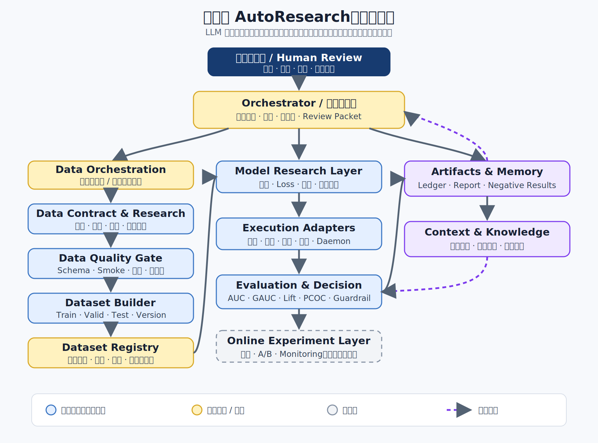
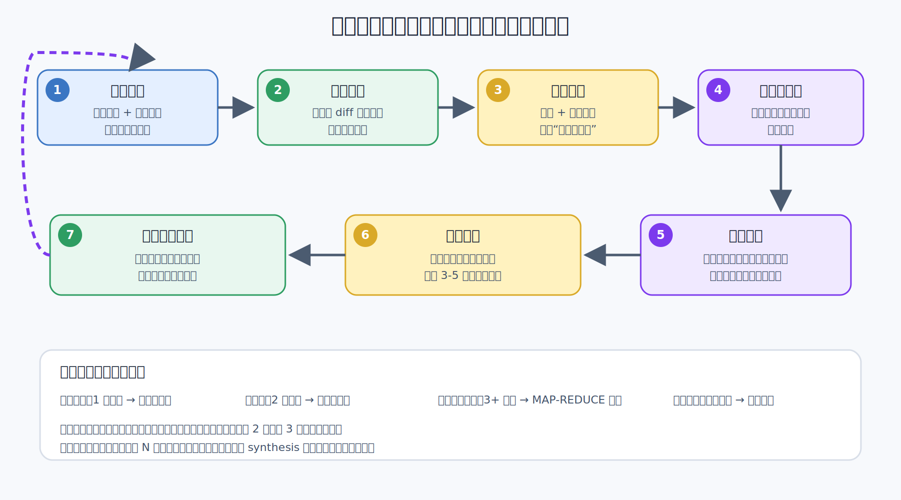
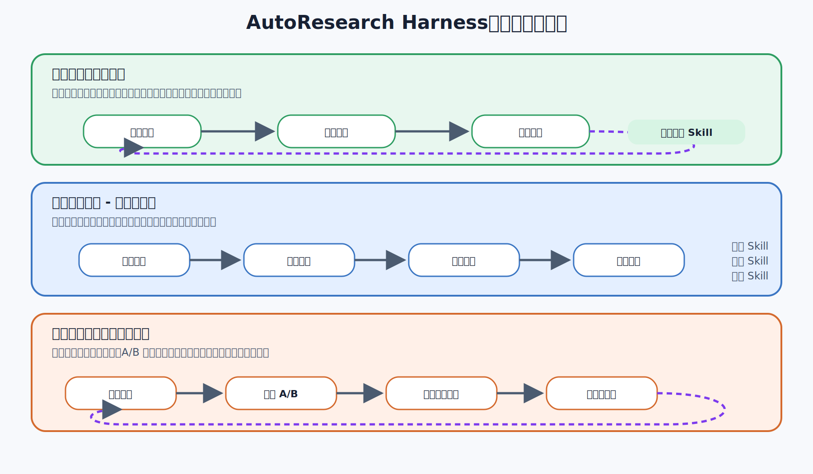
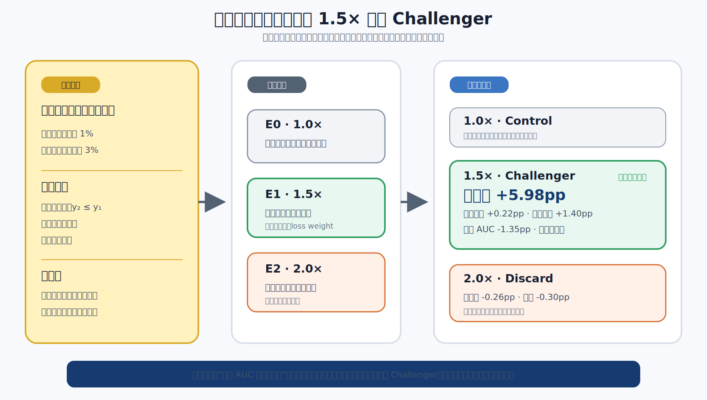
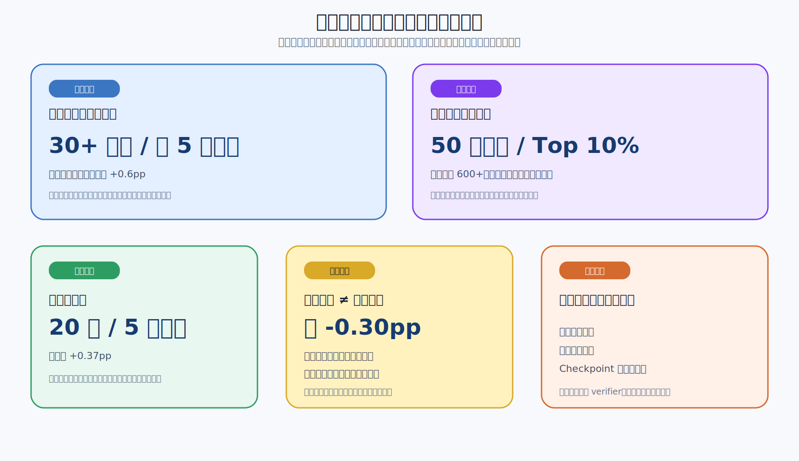
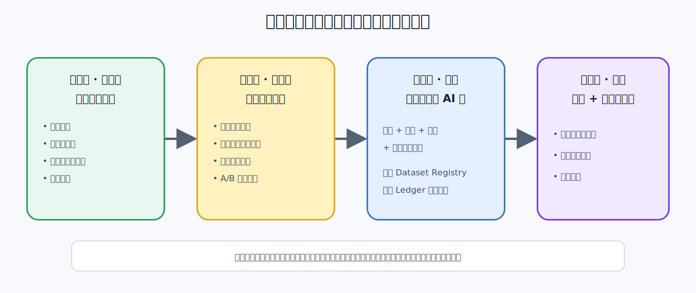

# 企业生产级 AutoResearch：从 Vibe Modeling 到可控的模型自主迭代

> [!note] 公开版说明
> 本文基于多组真实企业研发材料重构。为保护业务信息，公司、团队、渠道、产品、平台、内部仓库、绝对数据规模和精确时间窗口均已删除或泛化；保留的是可迁移的系统结构、相对量级、失败模式与工程结论。文中的“已验证”只表示材料所述范围内完成过真实任务验证，不代表所有模块均已进入无人值守生产。

## 摘要

让 Agent 在一个固定训练脚本上连续改代码、跑实验、读取指标，已经不是 AutoResearch 最难的部分。**真正困难的是把这个循环放进企业生产环境：一次实验会跨越数据、代码、远程训练、离线预测、评测、模型产物、部署和线上反馈；任一环节失真，自动化都会更快地产生错误结论。**

Vibe Modeling、AutoResearch 或“Agent 驱动的模型研发”，提供的是扩大研究搜索的能力。企业生产级系统还必须解决另一组更难的问题：数据和代码是否有完整血缘，评测器是否独立，实验能否在平台故障后恢复，并行任务是否相互隔离，资源是否可控，候选是否经过分群护栏，以及任何线上动作能否灰度、熔断和回滚。

本文的核心判断是：

> **企业生产级 AutoResearch 不是一个更大的 Agent，而是一套受治理的模型研发生产系统。Agent 负责扩大搜索和生成假设；Harness 负责让每次尝试可执行、可比较、可恢复、可审计；独立评测与人类门禁负责决定候选是否有资格进入下一层。**

> [!important] 本文所说的“生产级”
> 不是“脚本在生产集群上跑起来”，而是：连续运行不会污染基线，任何结果可以复现，失败可以恢复，副作用受到权限控制，离线候选不能绕过评测与审批，线上变更始终有观察窗口和回滚点。

## 0. 从一次真实优化看生产级问题

一个成熟的多场景转化模型要接入新的低频场景。新场景的自然训练样本不足 1%，直接沿用旧模型时，新场景区分能力有限；但如果粗暴放大新场景权重，又可能破坏存量场景。

团队没有让 Agent 自由改动所有东西，而是冻结数据、代码基线、训练预算和固定测试集，只开放一个变量：新场景 loss 权重。Agent 自动组织了 1.0×、1.5×、2.0× 三组实验。

- 1.5×：新场景分群指标约 +5.98pp，存量场景约 +0.22pp，业务核心分群指标约 +1.40pp；
- 但它的总体 AUC 约 -1.35pp，所以不能宣称“全局模型全面胜出”；
- 2.0×：新场景和存量场景都开始退化，说明收益并不随权重单调增加；
- 最终决策：保留 1.0× 为 Control，把 1.5× 作为新场景 Challenger 进入受控验证，拒绝 2.0×。

这就是企业 AutoResearch 的实际样子：不是 Agent 神奇地发明一个模型，而是它快速完成了**受约束的候选生成、批量执行、分群评测和实验归档**；生产系统则保证三组实验使用同一数据、同一基线和同一评测口径，失败不会污染已验证版本；人和门禁系统最终决定这组证据意味着什么。第 9 节会完整展开这轮优化。

## 1. 最难的不是生成候选，而是让循环进入生产系统

一个演示版 AutoResearch 可以只有三步：修改训练脚本、运行五分钟、比较一个指标。企业模型研发却不存在如此干净的边界。一个候选从想法走到可上线，至少要穿过数据生产、训练平台、离线预测、分群评测、模型登记、部署和线上监控；这些系统拥有不同权限、状态语义和失败方式。

| 维度 | 实验室中的默认假设 | 企业生产现实 | 生产级要求 |
|---|---|---|---|
| 数据 | 数据集已经准备好且固定 | 标签、特征、分区和样本口径持续演进 | 数据版本、血缘、质量门与防穿越 |
| 执行 | 本地进程成功退出即可 | 远程队列、配额、超时、抢占和平台故障 | 幂等提交、状态机、有限重试与断点恢复 |
| 并行 | 多开几个进程 | 共享缓存、表、checkpoint 和输出路径会互相污染 | 实验级 sandbox 与独立命名空间 |
| 评测 | 一个标量决定胜负 | 总体与分群指标冲突，小提升可能只是噪声 | 独立 evaluator、护栏、复跑与 `INCONCLUSIVE` |
| 状态 | 对话上下文记住上一轮 | 长任务跨小时或天，Agent 会重启、压缩或失联 | 结构化状态、事件日志与 artifact 哈希 |
| 权限 | 脚本可以修改一切 | 数据发布、部署和删除具有真实副作用 | 最小权限、审批门、审计与禁止区 |
| 线上 | 离线提升即完成 | 分布漂移、服务资源、持续训练和真实收益可能失败 | Shadow、灰度、监控、熔断和回滚 |

这张表说明，企业 AutoResearch 的主要工作量不在候选生成器，而在候选之外的**生产控制面**。LLM 可以被替换，控制面必须长期稳定。

### 1.1 生产中的实验是一份可恢复契约

第 $t$ 轮实验不再只是“一份新代码”，而是一组有血缘的证据：

$$
E_t = (H_t, D_t, C_t, B_t, M_t, A_t)
$$

其中：

- $H_t$ 是待验证的假设；
- $D_t$ 是冻结的数据版本与切片；
- $C_t$ 是代码、配置和运行环境；
- $B_t$ 是时间、算力与重试预算；
- $M_t$ 是主指标、护栏指标和健康检查；
- $A_t$ 是日志、模型、预测、报告与决策等 artifacts。

一次迭代只有在这些要素都可追溯时才构成“研究”。否则它只是又跑了一个作业。自然语言可以是提出方向的入口，但必须落成结构化假设；一个合格假设至少回答：

1. 观察到了什么证据？
2. 推测的机制是什么？
3. 这一轮只改变哪个主要变量？
4. 什么结果会证伪它？

因此，Vibe Modeling 的生产化不是让 Prompt 更长，而是**把模糊直觉编译成一串可执行、可证伪、可恢复的实验契约**。

### 1.2 生产系统优化的是有效研究吞吐

原始实验数不是目标。一个系统如果一天提交 100 个作业，其中一半因代码或数据问题失败，剩余实验又无法复现，它并没有比人工更高效。

更合理的目标是：

$$
\text{有效研究吞吐}
=
\frac{\text{完成验证且可复现的实验数}}
{\text{墙钟时间} \times \text{计算成本} \times \text{人工介入}}
$$

这一定义会自然地把本地冒烟、失败恢复、实验隔离、自动评估、资源成本和人工接管都纳入系统，而不只奖励“多跑任务”。

## 2. Karpathy AutoResearch：生产级系统的最小内核

Karpathy 的 [AutoResearch](https://github.com/karpathy/autoresearch/tree/228791fb499afffb54b46200aca536f79142f117) 给出了极小但完整的自主研究循环。它使用简化的单 GPU 语言模型训练任务，让 Agent 在固定时间预算内修改训练实现，以验证集 bits-per-byte 为唯一主指标，改善则保留，退化则丢弃，然后继续下一轮。

官方 [`program.md`](https://github.com/karpathy/autoresearch/blob/228791fb499afffb54b46200aca536f79142f117/program.md) 的关键约束可以压缩成下表：

| 要素 | AutoResearch 的做法 | 解决的问题 |
|---|---|---|
| 固定环境 | 数据准备、分词、加载与评测代码只读 | Agent 不能通过修改考题“获得提升” |
| 白名单改动 | 只允许修改训练文件 | 缩小搜索面，降低归因难度 |
| 固定预算 | 每次训练固定 5 分钟 | 让不同实验在近似物理预算下可比 |
| 唯一指标 | 以 `val_bpb` 越低越好为选择器 | 给循环一个明确的外部反馈 |
| 基线与血缘 | 首轮建立基线；每次实验先提交 Git | 结果能绑定到精确代码版本 |
| 实验账本 | 记录 commit、指标、显存、状态和描述 | 成功、失败与崩溃都成为历史 |
| 生存规则 | 改善则 keep，持平或退化则 discard | 让分支只沿已验证方向前进 |

它最值得迁移的不是“永远循环”，而是五条研究纪律：

```text
冻结裁判 + 限制改动面 + 固定预算
+ keep / discard + 可追溯实验账本
```

### 2.1 它证明了什么

在任务边界清楚、指标便宜且稳定、实验可快速回放时，代码 Agent 已经能够承担大量原本由研究者手工完成的尝试。人不必逐轮指定超参数；可以把精力上移到研究协议、搜索策略和评测设计。

### 2.2 它没有证明什么

这个最小实验室不等于企业模型生产系统：

- 单一 `val_bpb` 没有覆盖校准、分群、公平性、稳定性、延迟、成本与业务约束；
- 数据和评测固定，不包含标签研发、特征血缘、样本穿越与分布漂移；
- 单机脚本不需要处理远程训练、预测、权限、队列、配额和平台故障；
- keep/discard 假设指标噪声足够小，而生产实验经常需要复跑、显著性判断和多目标权衡；
- 离线变好不等于可以部署，更不等于线上价值一定提升。

企业生产级 AutoResearch 的工作，正是保留这个最小循环的清晰性，同时补齐它有意省略的数据、平台、治理和线上复杂度。Karpathy 的实现是内核，不是企业完成形态。

## 3. 生产控制面：把研究 Agent 放进可治理架构

下面这张图不是“组件大全”，而是在回答生产系统最关键的问题：**哪些责任可以交给 LLM，哪些必须留在确定性程序、独立评测器和更高权限层？**



*图 1：LLM 负责提出假设、解释证据与安排研究方向；状态机和平台适配器负责可重复执行；评测器、权限系统和人工 Review 位于 Agent 的决策边界之外。*

### 3.1 两层编排，而不是一个无所不能的 Agent

**研究编排层**处理开放问题：理解目标、诊断结果、检索知识、生成候选、解释为什么继续或停止。这些任务容许不确定性，适合由 LLM 承担。

**执行编排层**处理确定性动作：创建实验、提交作业、轮询状态、下载日志、运行评估、校验行数、写入账本、重试或终止。这些动作应由程序和状态机承担。

这种拆分十分关键。LLM 可以建议“再跑一次”，但是否满足复跑条件、还有多少预算、应该使用哪个数据版本、失败是否可重试，不能依赖它临场记忆。

### 3.2 五个不可缺少的平面

1. **研究控制面**：目标、假设、搜索策略、候选优先级和停止条件。
2. **数据面**：源数据、标签、特征、样本切分、质量门和 Dataset Registry。
3. **执行面**：本地容器、训练平台、离线预测、评估、部署与在线实验适配器。
4. **证据面**：实验 manifest、事件日志、代码与数据血缘、模型、预测和 Review Packet。
5. **治理面**：权限、配额、审批、隐私、安全熔断和回滚策略。

一个底层模型可以被替换；只要这五个平面仍在，组织积累的实验协议、历史证据和平台能力就不会跟着消失。这也是企业 Harness 比某个 Agent Prompt 更有长期价值的原因。

## 4. 生产运行中的一轮研究怎样闭合

材料中的七步闭环是一种可落地实现，而不是唯一流程。它的价值在于把“想一个新方案”拆成有输入、有产物、有校验的阶段。



*图 2：先从训练和代码证据出发，再做归因、检索和方案综合；代码生成位于后半段，而不是循环的起点。*

| 阶段 | 输入 | 必须产出的证据 | 主要门禁 |
|---|---|---|---|
| 训练诊断 | 曲线、日志、离线指标、资源记录 | 健康度判断与异常清单 | 训练是否完整、指标是否有效 |
| 代码分析 | 基线与候选 diff | 改动到设计意图的映射 | 是否只改变了声明范围 |
| 归因分析 | 数据切片、代码差异、结果差异 | “事实 / 推断 / 未知”三列表 | 不把相关性写成因果 |
| 内部检索 | 问题描述、失败模式、任务上下文 | 历史正负实验与相似机制 | 项目隔离、版本和适用条件 |
| 外部检索 | 本地知识缺口 | 论文方法、代码来源与证据边界 | 来源可信、许可证与供应链检查 |
| 方案综合 | 归因、历史、外部知识 | 少量可区分且可证伪的候选 | 单一主变量、预算可承受 |
| 实现与预检 | 候选协议、当前基线 | 独立代码版本与冒烟结果 | 语法、shape、依赖、最小数据回放 |

### 4.1 “一次只改一件事”是一种归因预算

模型研究并不要求永远只改单变量，但自动循环必须知道何时允许组合。早期探索可以并行尝试互相区分的方向；一旦出现胜者，就应围绕当前基线做递增式消融。若同时改变数据、特征、损失和网络，结果即使上涨，也无法知道下一轮应该保留什么。

### 4.2 并行的单位是隔离实验，不是共享目录中的多个进程

每个候选需要独立的工作目录、配置、随机种子、输出命名空间和资源配额。共享 checkpoint、缓存、临时表或输出路径会让一个实验读取另一个实验的未来状态，制造比代码错误更隐蔽的数据污染。

### 4.3 失败必须进入状态机

推荐的实验状态不是“运行中 / 完成”两种，而是：

```text
DRAFT -> READY -> RUNNING -> EVALUATING -> REVIEW_READY
                     |             |
                     v             v
              RETRYABLE_ERROR   DIAGNOSIS_REQUIRED
                                      |
                       PROMOTED / REJECTED / INCONCLUSIVE
```

`INCONCLUSIVE` 很重要。指标变化小于噪声、数据不完整或评测协议发生变化时，系统不应勉强做 keep/discard。

## 5. 三层证据与发布门：本地、离线与在线不能混为一个 Loop



*图 3：三层循环优化的对象和证据强度不同。下层用于廉价淘汰错误，上层才负责确认真实价值。*

### 5.1 本地微循环：先让失败足够便宜

本地小样本、少 step 冒烟可以拦截语法错误、导入失败、shape mismatch、显存估算异常和数据 schema 不兼容。它的目标不是证明模型有效，而是避免把明显错误送进昂贵训练。

### 5.2 离线训练—验证大循环：让候选可比较

全量或代表性训练必须绑定冻结的数据版本、统一预算和独立评测。作业完成后自动收集训练健康度、主指标、分群指标、资源消耗和模型产物，并把结果写回实验账本。只有这一层通过，候选才有资格进入人工 Review 或线上验证。

### 5.3 在线价值循环：让离线结论接受现实检验

部署、灰度、A/B、真实指标和回滚属于更慢、更高风险的外层循环。离线最优可能在增量训练、特征时效、服务内存、checkpoint 兼容或流量分布上失败。线上结果必须回流，但不能直接变成一个可被 Agent 任意优化的单一 Reward。

## 6. 数据生产是第一道生产门

企业模型的上限经常由数据决定。标签窗口、去重口径、join 偏移、特征覆盖、负采样和训练/测试切分，都可能比一次网络改动更重要。若 AutoResearch 只接管“拿到样本后的训练”，它自动化的只是后半段。

### 6.1 数据研究的最小链路

一条可控的数据研发链路通常是：

```text
目标与口径 -> 只读源数据探查 -> 标签 / 特征 / join 设计
-> 小窗口 smoke -> 人工 Review Gate -> 受控生产
-> 质量 postcheck -> Dataset Registry -> 固定切分
```

关键原则有三条：

- 先只读探查，再小范围试跑，最后才允许生产写入；
- 训练样本必须能回溯到源版本、时间口径和生成代码；
- 改数据定义与改模型结构默认属于两个实验维度，除非实验明确设计为联合干预。

### 6.2 一份企业实验 manifest 应记录什么

下面是抽象后的最小示例，字段名不对应任何内部平台：

```yaml
experiment_id: exp-20260723-017
parent_baseline: exp-20260722-031
hypothesis: "分段聚合能减少长短行为混合造成的信息稀释"
change_scope:
  primary: model-architecture
  allowed_files:
    - model.py

data:
  dataset_version: ds-042
  train_window: frozen
  holdout: holdout-2026q3
  leakage_checks: required

runtime:
  environment_digest: sha256:...
  max_gpu_hours: 4
  retry_budget: 1

evaluation:
  primary_metric: weighted-ranking-metric
  guardrails:
    - calibration
    - worst-segment-quality
    - peak-memory

decision:
  status: awaiting_evaluation
  reviewer: required-before-online
```

它的目的不是追求 YAML 完整，而是把每轮实验中不能漂移的事实从 Prompt 里拿出来，交给机器验证。

## 7. 独立评测是生产准入控制器

AutoResearch 能否可信，取决于评测能否独立地淘汰错误候选。生产系统至少需要四类指标：

| 指标层 | 回答的问题 | 例子 |
|---|---|---|
| 主指标 | 这轮是否实现核心优化目标 | 排序、误差、收益代理指标 |
| 护栏指标 | 是否以牺牲重要能力换取主指标 | 校准、长尾分群、老场景、延迟、显存 |
| 健康指标 | 这次运行本身是否可信 | 输出完整性、NaN、样本行数、随机基线 |
| 成本指标 | 这次改进是否值得 | GPU 小时、吞吐、参数量、服务成本 |

把不同指标先统一成“越大越好”的方向后，一个候选的晋级条件可以抽象为：

$$
\operatorname{Promote}(E_t)
=
[m_p(E_t)-m_p(E_b)>\delta]
\land
\bigwedge_j g_j(E_t) \in \mathcal{S}_j
\land R(E_t)
$$

其中 $m_p$ 是主指标，$\delta$ 是超过噪声地板的最小收益，$g_j$ 是各项护栏，$\mathcal{S}_j$ 是允许区间，$R$ 表示结果可复现。主指标提高但任一硬护栏失败，都不应自动晋级。

### 7.1 小提升必须对抗评测噪声

当收益接近运行波动时，应复跑基线与候选，尽量使用相同数据、环境和随机条件做配对比较。系统需要保留 `RETEST` 或 `INCONCLUSIVE`，而不是把小数点后的偶然差异写进知识库。

### 7.2 负向实验是资产，不是垃圾

真实探索中，大多数尝试不会改善。材料中的一个多场景任务累计 30 余个版本，真正保留的正向改进只有约 5 个。价值不仅在最后的胜者，也在知道哪些组合在什么条件下失败、退化多少、是否可能在另一分布下重启。

负向记录至少要包含：假设、最小 diff、数据版本、完整指标、失败类型、可能机制和重启条件。只有“没涨，已回滚”无法形成研究记忆。

### 7.3 需要监控 Harness 自己

除了模型指标，生产团队还应长期跟踪：

- 有效运行率与基础设施失败率；
- 实验复现率与结果漂移；
- keep、discard、retest 和 crash 的比例；
- 每个保留改进消耗的 GPU 小时与人工 Review 时间；
- 从提出假设到可审查结果的 P50 / P95 周期；
- 离线晋级后在线失败或回滚的比例；
- 负向知识被后续检索并避免重复实验的比例。

这些指标决定系统是否真的提高了研发效率，而不是只制造更多作业和报告。

## 8. 企业生产环境的安全边界

自动化的范围应由副作用和可恢复性决定，而不是由模型“看起来多聪明”决定。

| 动作 | 推荐默认策略 | 原因 |
|---|---|---|
| 修改隔离分支中的白名单代码 | 自动 | 可 diff、可丢弃 |
| 本地冒烟与只读数据探查 | 自动 | 副作用低，反馈快 |
| 配额内提交离线训练与预测 | 自动或策略授权 | 可终止，但有资源成本 |
| 改变标签定义、固定测试集或主指标 | 人工审批 | 会改变裁判，破坏历史可比性 |
| 大范围数据回填与跨域数据流转 | 人工审批 | 影响面大，涉及隐私与成本 |
| 模型部署、流量切换与线上实验 | 分级审批 + 灰度 | 直接影响真实系统 |
| 删除生产表、覆盖模型或其他不可逆动作 | 禁止 Agent 直接执行 | 失败难恢复 |

还需要以下基础设施保证：

- 每个实验使用独立 sandbox、工作目录和输出命名空间；
- 凭证按任务临时授予，默认只读和最小权限；
- 评测器、固定测试集与安全策略对候选生成 Agent 不可写；
- 远程动作具备幂等键、超时、有限重试和熔断；
- 事件日志只追加，关键 artifact 绑定哈希；
- 任何长任务都能从结构化状态恢复，不依赖上一段对话仍在上下文；
- 引入外部论文代码前检查来源、许可证、依赖和数据外发风险；
- 线上候选必须有观察窗口、自动告警和一键回滚点。

这套边界不会削弱自治，反而使低风险区域可以更大胆地自动化。

## 9. 一次具体优化：为稀疏新场景寻找可上线 Challenger

这个案例抽象自材料中的“成熟模型接入新产品特殊漏斗”实践。业务名称、平台、日期、绝对样本量和字段名已经移除；实验对照和指标差值来自材料中的同一张结果表，没有与其他项目拼接。

> [!warning] 证据边界
> 本文只有阶段性材料和配图，没有原始训练日志、数据集与线上实验明细。因此，下述离线结果属于“材料记录的实验事实”；原因分析属于“派生解释”；线上是否最终获益仍是开放问题。

### 9.1 场景：存量模型里来了一个低频但重要的新任务

原系统已经服务多个成熟场景，现在要接入一个样本稀疏的新场景。用户行为可以抽象成两阶段漏斗：

```text
曝光 / 点击 -> 关键中间行为 -> 最终转化
```

数据契约要求第二阶段正样本一定包含于第一阶段，即 $y_2 \le y_1$。材料记录中，新场景在训练集里的自然占比曾从约 0.8% 变化到约 2.7%，说明场景分布本身也在移动。训练集按时间窗口构建，测试集使用随后固定时间段，避免新旧实验因切分变化而不可比较。

这不是一个“总体 AUC 越高越好”的任务。真正的目标是：

- 提升新场景的分群排序能力；
- 存量场景不能明显退化；
- 同时观察业务核心加权指标、总体 AUC、校准和 Top lift；
- 离线候选只能获得 Challenger 资格，不能直接替换生产基线。

### 9.2 人先冻结裁判，Agent 才开始搜索

这一轮没有同时搜索网络、特征和采样策略，而是只开放一个变量：**新场景样本在 loss 中的权重**。把材料中的对照原则重构成通用的机器可执行协议，可以写成下面这样；字段名和随机性约束是本文的工程化表达，不是原始平台配置的逐字转录。

```yaml
fixed:
  dataset: same-version
  time-split: same-train-and-holdout
  model-code: same-baseline
  training-budget: same
  randomization-policy: same

search_space:
  new_scene_loss_weight: [1.0, 1.5, 2.0]

selection:
  primary: new-scene-weighted-ranking
  guardrails:
    - existing-scenes-weighted-ranking
    - overall-auc
    - calibration
    - top-lift
```

这里最重要的不是三个权重，而是可归因性：如果 1.5× 胜出，这一轮至少知道收益与 loss 重加权有关，而不是来自一份同时改了十处的代码。

### 9.3 这轮实验在 Harness 中怎样执行

材料给出了训练、评测和决策结果，但没有保留可公开的逐行运行日志。结合前文同一套 Harness 已实现的能力，可以把机器执行链还原为以下七步；这是对工程过程的结构化重构，而不是对某次内部日志的逐字复刻。

1. **读取数据契约**：检查两阶段标签包含关系、时间切分、新场景占比与关键字段完整性。
2. **建立 Control**：以 1.0× 重新跑当前基线，确认固定测试集和评测脚本可工作。
3. **生成候选**：从同一个父 commit 派生 1.5× 和 2.0× 两个最小配置 diff。
4. **本地冒烟**：用小样本验证数据 schema、loss 计算、shape 和指标输出。
5. **提交独立训练**：三个实验使用独立工作目录、作业标识和输出路径，并受相同预算约束。
6. **自动回收结果**：训练完成后运行总体与分群评测，检查预测完整性、校准和资源状态。
7. **生成 Review Packet**：把假设、diff、数据版本、指标表、异常和推荐决策写入实验账本。

机器负责重复执行，但标签定义、测试集冻结和晋级门槛在这一轮开始前就已由人确定。



*图 4：1.5× 在目标分群上产生明显收益，却没有在所有指标上获胜；它因此只获得 Challenger 资格，而不是直接替换全局 Control。*

### 9.4 三组结果：为什么不是总体 AUC 最大者获胜

下表以 1.0× 为基线，`pp` 表示绝对百分点；PCOC 保留材料中的近似绝对值，越接近 1 通常表示校准越好。

| 新场景权重 | 总体 AUC Δ | 业务核心加权指标 Δ | 新场景加权指标 Δ | 存量场景加权指标 Δ | PCOC | 决策 |
|---:|---:|---:|---:|---:|---:|---|
| 1.0× | 0 | 0 | 0 | 0 | 0.84 | 保留为 Control |
| 1.5× | -1.35pp | +1.40pp | +5.98pp | +0.22pp | 0.89 | 新场景 Challenger |
| 2.0× | -0.75pp | -0.32pp | -0.26pp | -0.30pp | 1.04 | Discard |

这张表给出了三个关键判断。

**第一，1.5× 的收益集中在预期的困难区域。** 新场景提升约 5.98pp，存量场景没有以退化换收益，业务核心加权指标也改善。这比“总体数字偶然涨了一点”更符合原假设。

**第二，总体 AUC 与业务目标发生了冲突。** 1.5× 的总体 AUC 下降约 1.35pp。一个合理的派生解释是：跨场景总体 AUC 会受到样本构成和场景间分数分布影响，未必能表达新场景内部排序是否改善；但材料没有提供足够消融来证明具体原因，所以不能把这段解释写成事实。

**第三，权重收益不是单调的。** 如果“给新场景更大权重”本身永远正确，2.0× 应继续改善；实际结果却是新旧场景同时下降。2.0× 因此构成了关键的边界证据：适度重加权可能有用，继续放大则可能破坏优化平衡。

### 9.5 最终决策：保留 Control，晋级 Challenger

这轮实验的决策不是“1.5× 全面优于 1.0×”，而是：

```text
1.0× -> 继续作为全局 Control
1.5× -> 作为稀疏新场景 Challenger，进入更严格的离线复跑与受控线上验证
2.0× -> Discard，记录“更高权重并不单调改善”的负向结论
```

为什么不直接全量替换？因为总体 AUC 和 Top lift 并不占优，而材料也没有给出线上收益证据。更稳妥的路径是先 Shadow 或小流量灰度，分别观察新场景、存量场景、整体收益、校准、内存和持续训练稳定性；任何硬护栏失败都回滚到 1.0×。

### 9.6 这一轮留下的不是一个数字，而是一组可复用知识

**材料事实：** 1.5× 在新场景和业务核心分群指标上胜出；2.0× 没有延续收益；1.5× 更适合作为冷启动 Challenger，而非长期固化基线。

**派生解释：** 新场景在自然分布中梯度贡献不足，适度加权可能让模型更充分学习该场景；权重过大又可能放大噪声或改变共享表示的优化平衡。材料没有直接测量梯度或噪声，因此这仍是假设。

**开放问题：** 收益来自 loss 权重本身，还是与采样比例共同作用？固定 1.5× 在持续训练中是否稳定？线上分数校准和真实收益是否一致？

下一轮不应把这些问题打包，而应生成互相可区分的实验：

1. 固定采样不变，对比恒定 1.5× 与从 1.5× 衰减到 1.0× 的权重日程；
2. 固定 loss 权重不变，单独比较不同采样比例；
3. 保持训练方案不变，只做分场景校准，判断总体 AUC 冲突是否来自跨场景分数尺度；
4. 在不同时间窗复跑 1.0× 与 1.5×，验证收益是否跨分布稳定。

这四个候选属于根据现有证据提出的后续研究建议，不是材料中已经完成的实验。

### 9.7 把整轮压缩成一条可恢复轨迹

```text
观察：新场景样本稀疏、分群能力不足
-> 假设：适度增加新场景梯度贡献可能改善排序
-> 实验：冻结其余变量，只比较 1.0× / 1.5× / 2.0×
-> 证据：1.5× 目标分群大涨，2.0× 转负，总体 AUC 与分群指标冲突
-> 决策：1.5× 进入 Challenger，Control 不动，2.0× 丢弃
-> 记忆：收益存在中间区间；总体指标不能替代场景护栏
-> 下一轮：拆分权重、采样、校准和时间稳定性
```

这比“Agent 自动调了几个参数”更准确：它把一次业务问题变成了机器可以连续推进、而人仍能审查因果边界的研究过程。

## 10. 其他脱敏实践证据

下面的案例继续只保留相对量级。它们支持的结论并不相同：有些证明搜索吞吐，有些证明迁移能力，有些只是在暴露边界。



*图 5：实验数量说明吞吐，离线提升说明候选有效，公开任务排名说明迁移，线上故障则是边界证据。*

### 10.1 多场景预测任务：规模尝试产生可上线候选

一个持续演进的多场景预测模型，在约一个月内形成 30 余个版本。除最初基线复现外，后续候选主要由 Agent 生成；约 5 个版本被保留，最终离线主指标相对基线提升约 0.6 个百分点，并进入受控线上实验。

这组材料最扎实的地方不是最终数字，而是完整保留了大量负向结果：删除已有主干能力会显著下降，简单拼接两个看似更强的模块没有收益，一套常见学习率策略反而退化，某些门控结构在持续训练中出现饱和。

### 10.2 外部陌生任务：证明流程可迁移，不证明生产成熟

同一研究方法迁移到一个与原业务不同的公开算法任务。人在完成数据接入和启动后没有逐版本编写模型代码，Agent 迭代约 50 个版本，在 600 余支队伍中进入前 10%。公开榜单仍是封闭离线环境，不能替代生产验证。

### 10.3 本地微循环：证明低成本筛选有效

另一组本地实验在 20 次迭代中保留 5 次改进，测试指标累计提高约 0.37 个百分点。它证明小样本并行可以快速淘汰明显无效方案，但不能给最终结论背书。

### 10.4 数据到模型：链路打通不等于指标上涨

一个新渠道冷启动任务完成了从源数据探查、标签与样本设计到首版基线的链路；随后“补齐统一特征”的尝试虽然通过工程验收，却让核心分群指标下降约 0.3 个百分点，因此没有替换基线。

### 10.5 离线赢、在线输：生产闭环仍然最难

一个离线胜出版本进入线上链路后，暴露了持续训练退化、服务内存不足、checkpoint 不兼容和中间分布异常。线上层是一个新的验证环境，而不是把离线赢家自动部署出去。

## 11. 目前仍做不到什么

### 11.1 目标不可计算时，循环无从选择

如果质量高度主观、反馈延迟很长、业务价值无法归因，Agent 仍能生成想法，却无法可靠地决定谁应该存活。此时更适合让它辅助分析和准备实验，而不是自动晋级。

### 11.2 后验归因不是因果证明

LLM 很擅长为涨跌生成合理故事。只有单变量对照、消融、复跑与分群证据能够提高因果可信度。归因报告必须把直接事实、派生解释和开放问题分开。

### 11.3 搜索量会放大 Goodhart 与多重比较

尝试越多，偶然“跑赢”基线的概率越高。固定 holdout 被反复用于选择也会逐渐过拟合。系统需要噪声地板、复跑、阶段性新鲜 holdout 和在线回验，而不是无限盯住同一组小数。

### 11.4 LLM 的创新常收敛到保守局部改动

长时间运行并不自动带来论文级创新。Agent 容易重复常见调参、拼接熟悉模块或为历史赢家做微小变体。可尝试的改进包括：

- 把论文拆成可重组的“问题—机制—适用条件—失败模式”设计模式；
- 从关键词检索升级到按失败机制和跨域结构检索；
- 为新方向保留探索配额，而不是让所有候选围绕当前赢家；
- 使用挑战者角色批判初版方案的保守性；
- 对候选做多样性约束，维护性能、复杂度与成本的 Pareto 前沿；
- 从负向实验提取“在什么条件下可能重启”，而不是永久拉黑一个方法。

这些机制可以改善搜索组织，却不能保证真正原创。

### 11.5 昂贵、缓慢或不稳定的任务仍不适合深循环

若单轮训练耗时数十小时、成本极高，或者训练框架和数据定义持续变化，反馈就太慢且不可比较。此时应先投资代理指标、缩小模型、可靠回放和平台稳定性，而不是急着增加自治轮数。

### 11.6 Agent 不能修改自己的裁判与安全边界

允许 Agent 同时修改模型、评测、权限和停止条件，不是自进化，而是失去可证伪性。评测协议可以由人版本化升级，但每个研究阶段开始后必须冻结；任何变更都应开启新的可比区间。

## 12. 一条现实的企业演进路线



*图 6：越靠后，系统优化的对象越接近真实价值，同时风险、反馈延迟和组织协同成本也越高。*

### 阶段一：模型自动迭代

先把固定数据上的训练诊断、方案生成、代码实现、本地冒烟、离线训练和评估闭合。此时最重要的是可比较和可恢复，不必一开始就追求全自动部署。

### 阶段二：实验链路闭环

接通远程训练、预测、评估回收和 Review Packet，使系统可以在预算内无人值守地连续运行。部署和线上实验仍经过审批与灰度。

### 阶段三：离线全链路 AI 化

把标签、特征、样本和模型都纳入研究空间，同时建立 Dataset Registry、数据质量门、统一血缘和跨实验账本。难点从代码生成转向口径治理与数据防穿越。

### 阶段四：离线 + 在线价值闭环

线上结果能够可靠归因到候选版本，系统具备安全熔断、自动回滚和资源控制后，才逐步允许策略在受控范围内自调优。生产不是开放式探索沙箱；它是最后一层、最昂贵的 verifier。

## 13. 生产级 Definition of Done

在宣布系统具备自主模型研究能力前，至少应通过以下检查：

- 同一个 commit、数据版本和环境能够复现主要结果；
- 固定测试集和 evaluator 对 Agent 只读；
- 每个候选都有父基线、单一主假设和最小可审查 diff；
- 训练失败、平台超时和上下文中断都能从状态恢复；
- 并行实验不会共享未来数据、checkpoint 或输出空间；
- 主指标之外有分群、稳定性、资源和安全护栏；
- 小提升经过噪声判断与必要复跑；
- 所有远程副作用可审计、可限额、可取消；
- 数据生产、评测变更、部署和不可逆动作有清晰的人类门禁；
- 负向实验进入可检索记忆，而不是只保留赢家；
- 线上候选具备灰度、监控、归因与回滚；
- 团队能量化有效研究吞吐、单位改进成本和人工介入率。

如果只具备“Agent 能改代码并自动提交训练”，它是一个有价值的原型，但还不是企业生产级系统。

## 14. 人的角色：从操作员上移为研究系统设计者

算法工程师不会因为自动实验而消失，角色会发生三次上移：

1. 从逐行写候选代码，上移到定义问题、基线、指标和禁止牺牲项；
2. 从手工盯作业，上移到设计状态机、失败策略、平台契约和 Review Packet；
3. 从复述单次结果，上移到判断证据强度、研究方向、业务合理性和生产风险。

Agent 更像一个高吞吐研究执行者：它能阅读大量材料、保持实验节奏、生成多种候选并整理证据；但“优化什么”“什么不能被优化掉”“何时允许进入生产”仍是组织决策。

这与知识库中 [[AI Coding研发中的Harness与Loop构建]] 的结论一致：模型能力决定局部上限，Harness 决定长程可靠性。它也与 [[Agent Self-Evolution：从反馈闭环到可验证的系统进化]] 互补：Vibe Modeling 优化的是模型与数据候选，而 Self-Evolution 讨论的是如何让 Skill、Tool、Prompt、Knowledge 和 Runtime 等 Agent 资产通过同样的证据闭环晋级。

## 15. 一周后应该记住什么

1. **让 Agent 自动改代码只是最小内核；跨数据、训练、评测和线上系统仍然可靠，才是企业生产级。**
2. **生产控制面必须位于 Agent 之外：状态、权限、评测、预算、终止和晋级不能依赖模型临场自觉。**
3. **Karpathy AutoResearch 最值得继承的是冻结裁判、限制改动面、固定预算、keep/discard 和实验账本。**
4. **本地通过、离线提升和线上有效是三道不同的生产门，任何一层都不能替下一层作结论。**
5. **规模尝试只有在可复现、可恢复、可审计、可回滚时才产生复利；否则只是更快地放大噪声和风险。**

把它压缩成一个公式：

$$
\text{Production AutoResearch}
=
\text{Search Policy}
\times \text{Execution Reliability}
\times \text{Verifier Isolation}
\times \text{Data Lineage}
\times \text{Governance}
$$

任何一项接近零，更多 Agent、更多论文和更多 GPU 都只会更快地产生不可相信的结果。

## 参考资料

- Andrej Karpathy, [AutoResearch repository](https://github.com/karpathy/autoresearch/tree/228791fb499afffb54b46200aca536f79142f117), pinned at commit `228791f`, 2026.
- Andrej Karpathy, [AutoResearch experiment protocol (`program.md`)](https://github.com/karpathy/autoresearch/blob/228791fb499afffb54b46200aca536f79142f117/program.md), pinned at commit `228791f`, 2026.
