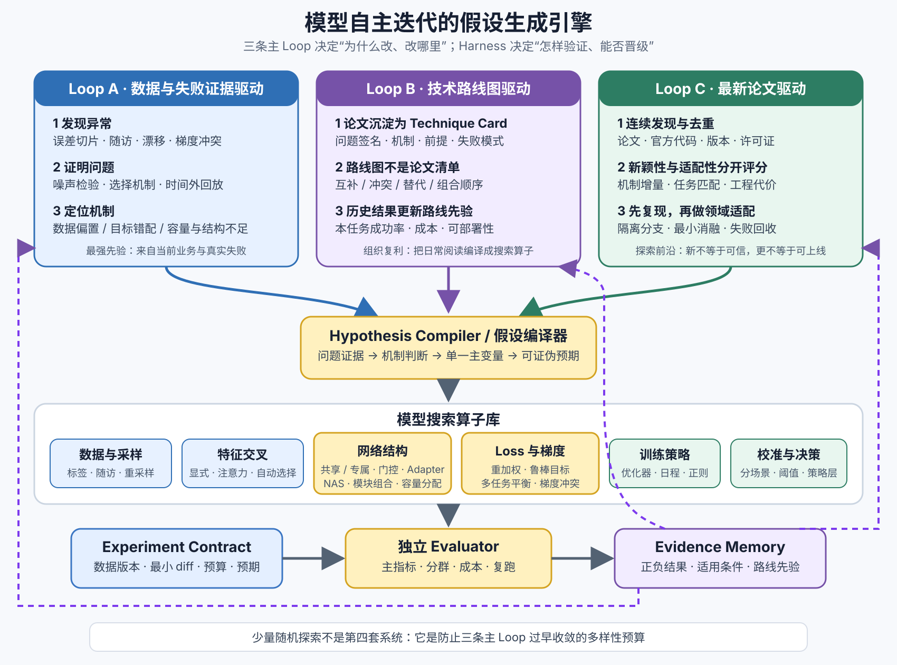
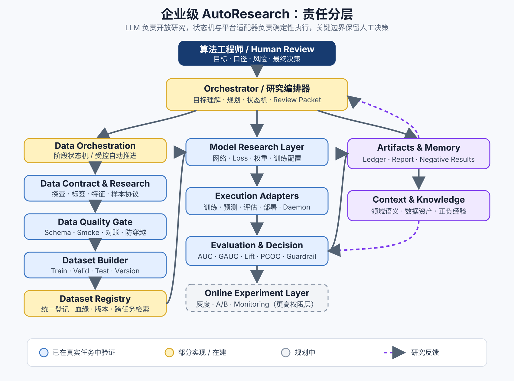
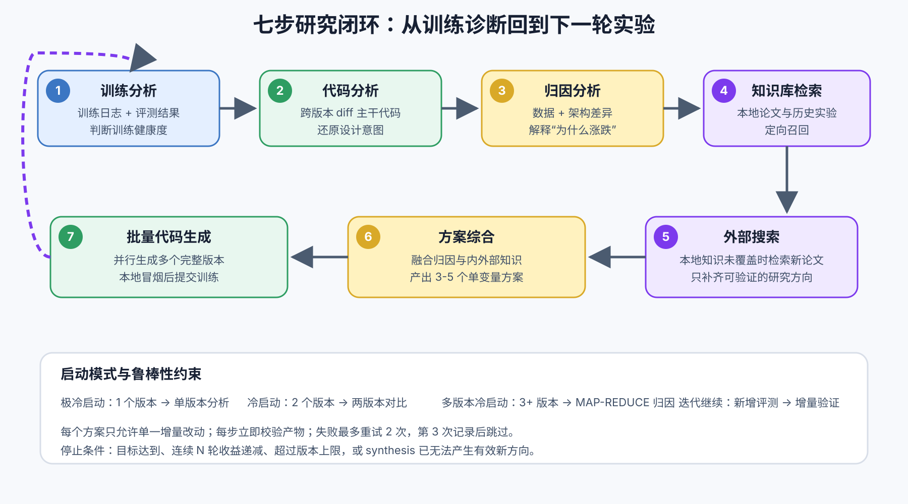
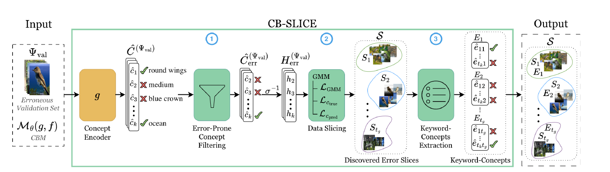
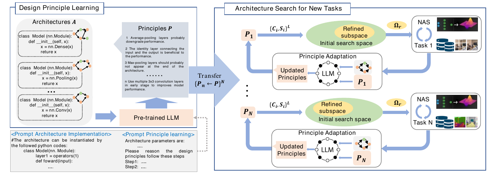
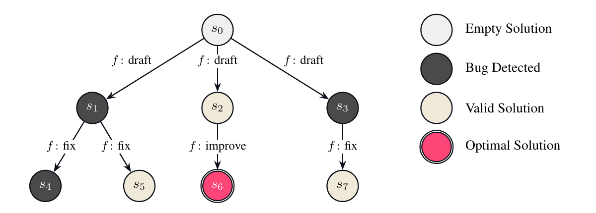
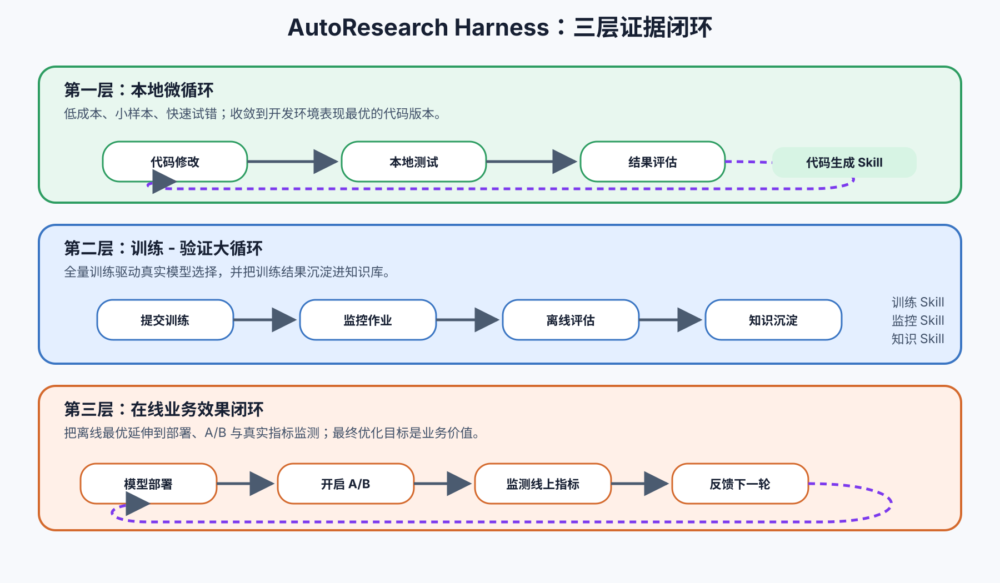
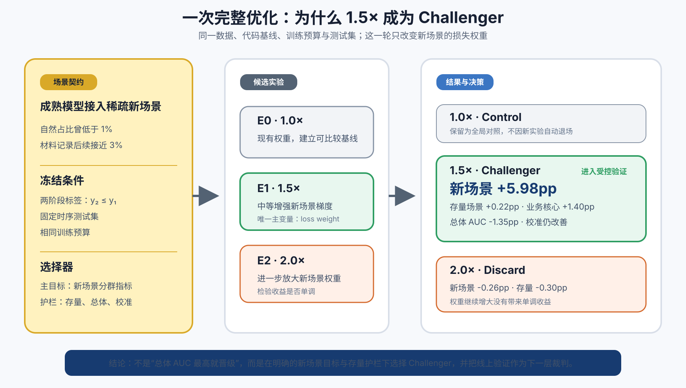
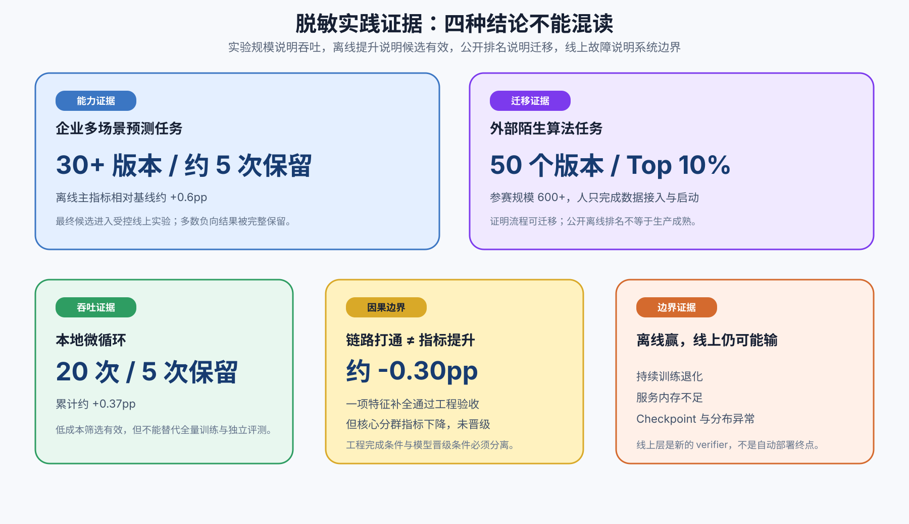
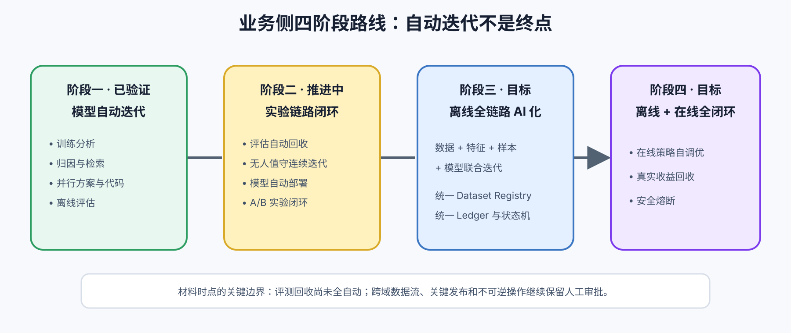

# 企业生产级 AutoResearch：从 Vibe Modeling 到可控的模型自主迭代

> [!note] 公开版说明
> 本文基于多组真实企业研发材料重构。为保护业务信息，公司、团队、渠道、产品、平台、内部仓库、绝对数据规模和精确时间窗口均已删除或泛化；保留的是可迁移的系统结构、相对量级、失败模式与工程结论。文中的“已验证”只表示材料所述范围内完成过真实任务验证，不代表所有模块均已进入无人值守生产。



*图 1　模型自主迭代不应只有一条“LLM 改代码”的线性循环。数据证据、技术路线图和最新论文负责产生不同先验的假设；特征交叉、Loss、网络结构与训练策略是可执行搜索面；Harness 负责把它们编译为可证伪实验并回收证据。本文归纳。*

## 摘要

让 Agent 在一个固定训练脚本上连续改代码、跑实验、读取指标，已经不是 AutoResearch 最难的部分。**真正困难的是把这个循环放进企业生产环境：一次实验会跨越数据、代码、远程训练、离线预测、评测、模型产物、部署和线上反馈；任一环节失真，自动化都会更快地产生错误结论。**

Vibe Modeling、AutoResearch 或“Agent 驱动的模型研发”，提供的是扩大研究搜索的能力。企业生产级系统还必须解决另一组更难的问题：数据和代码是否有完整血缘，评测器是否独立，实验能否在平台故障后恢复，并行任务是否相互隔离，资源是否可控，候选是否经过分群护栏，以及任何线上动作能否灰度、熔断和回滚。

本文的核心判断是：

> **企业生产级 AutoResearch 不是一个更大的 Agent，而是一套受治理的模型研发生产系统。Agent 负责扩大搜索和生成假设；Harness 负责让每次尝试可执行、可比较、可恢复、可审计；独立评测与人类门禁负责决定候选是否有资格进入下一层。**

但生产控制面只是必要条件，不是研究能力本身。**如果系统不知道为什么该试特征交叉、何时应该调整 Loss、何时共享网络已经发生负迁移、哪篇新论文值得复现，那么再可靠的 Harness 也只是一个高吞吐作业平台。** 模型自主迭代的核心引擎，是把数据中的失败证据、长期技术路线和最新研究，持续编译成有机制解释、有适用前提、有证伪条件的模型候选。

> [!important] 本文所说的“生产级”
> 不是“脚本在生产集群上跑起来”，而是：连续运行不会污染基线，任何结果可以复现，失败可以恢复，副作用受到权限控制，离线候选不能绕过评测与审批，线上变更始终有观察窗口和回滚点。

## 0. 从一次真实优化看生产级问题

一个成熟的多场景转化模型要接入新的低频场景。新场景的自然训练样本不足 1%，直接沿用旧模型时，新场景区分能力有限；但如果粗暴放大新场景权重，又可能破坏存量场景。

团队没有让 Agent 自由改动所有东西，而是冻结数据、代码基线、训练预算和固定测试集，只开放一个变量：新场景 loss 权重。Agent 自动组织了 1.0×、1.5×、2.0× 三组实验。

- 1.5×：新场景分群指标约 +5.98pp，存量场景约 +0.22pp，业务核心分群指标约 +1.40pp；
- 但它的总体 AUC 约 -1.35pp，所以不能宣称“全局模型全面胜出”；
- 2.0×：新场景和存量场景都开始退化，说明收益并不随权重单调增加；
- 最终决策：保留 1.0× 为 Control，把 1.5× 作为新场景 Challenger 进入受控验证，拒绝 2.0×。

这就是企业 AutoResearch 的实际样子：不是 Agent 神奇地发明一个模型，而是它快速完成了**受约束的候选生成、批量执行、分群评测和实验归档**；生产系统则保证三组实验使用同一数据、同一基线和同一评测口径，失败不会污染已验证版本；人和门禁系统最终决定这组证据意味着什么。第 10 节会完整展开这轮优化。

## 1. 最难的不是生成候选，而是让循环进入生产系统

一个演示版 AutoResearch 可以只有三步：修改训练脚本、运行五分钟、比较一个指标。企业模型研发却不存在如此干净的边界。一个候选从想法走到可上线，至少要穿过数据生产、训练平台、离线预测、分群评测、模型登记、部署和线上监控；这些系统拥有不同权限、状态语义和失败方式。

| 维度 | 实验室中的默认假设 | 企业生产现实 | 生产级要求 |
|---|---|---|---|
| 数据 | 数据集已经准备好且固定 | 标签、特征、分区和样本口径持续演进 | 数据版本、血缘、质量门与防穿越 |
| 执行 | 本地进程成功退出即可 | 远程队列、配额、超时、抢占和平台故障 | 幂等提交、状态机、有限重试与断点恢复 |
| 并行 | 多开几个进程 | 共享缓存、表、checkpoint 和输出路径会互相污染 | 实验级 sandbox 与独立命名空间 |
| 评测 | 一个标量决定胜负 | 总体与分群指标冲突，小提升可能只是噪声 | 独立 evaluator、护栏、复跑与 `INCONCLUSIVE` |
| 状态 | 对话上下文记住上一轮 | 长任务跨小时或天，Agent 会重启、压缩或失联 | 结构化状态、事件日志与 artifact 哈希 |
| 权限 | 脚本可以修改一切 | 数据发布、部署和删除具有真实副作用 | 最小权限、审批门、审计与禁止区 |
| 线上 | 离线提升即完成 | 分布漂移、服务资源、持续训练和真实收益可能失败 | Shadow、灰度、监控、熔断和回滚 |

这张表说明，企业 AutoResearch 的主要工作量不在候选生成器，而在候选之外的**生产控制面**。LLM 可以被替换，控制面必须长期稳定。

### 1.1 生产中的实验是一份可恢复契约

第 $t$ 轮实验不再只是“一份新代码”，而是一组有血缘的证据：

$$
E_t = (H_t, D_t, C_t, B_t, M_t, A_t)
$$

其中：

- $H_t$ 是待验证的假设；
- $D_t$ 是冻结的数据版本与切片；
- $C_t$ 是代码、配置和运行环境；
- $B_t$ 是时间、算力与重试预算；
- $M_t$ 是主指标、护栏指标和健康检查；
- $A_t$ 是日志、模型、预测、报告与决策等 artifacts。

一次迭代只有在这些要素都可追溯时才构成“研究”。否则它只是又跑了一个作业。自然语言可以是提出方向的入口，但必须落成结构化假设；一个合格假设至少回答：

1. 观察到了什么证据？
2. 推测的机制是什么？
3. 这一轮只改变哪个主要变量？
4. 什么结果会证伪它？

因此，Vibe Modeling 的生产化不是让 Prompt 更长，而是**把模糊直觉编译成一串可执行、可证伪、可恢复的实验契约**。

### 1.2 生产系统优化的是有效研究吞吐

原始实验数不是目标。一个系统如果一天提交 100 个作业，其中一半因代码或数据问题失败，剩余实验又无法复现，它并没有比人工更高效。

更合理的目标是：

$$
\text{有效研究吞吐}
=
\frac{\text{完成验证且可复现的实验数}}
{\text{墙钟时间} \times \text{计算成本} \times \text{人工介入}}
$$

这一定义会自然地把本地冒烟、失败恢复、实验隔离、自动评估、资源成本和人工接管都纳入系统，而不只奖励“多跑任务”。

## 2. Karpathy AutoResearch：生产级系统的最小内核

Karpathy 的 [AutoResearch](https://github.com/karpathy/autoresearch/tree/228791fb499afffb54b46200aca536f79142f117) 给出了极小但完整的自主研究循环。它使用简化的单 GPU 语言模型训练任务，让 Agent 在固定时间预算内修改训练实现，以验证集 bits-per-byte 为唯一主指标，改善则保留，退化则丢弃，然后继续下一轮。

官方 [`program.md`](https://github.com/karpathy/autoresearch/blob/228791fb499afffb54b46200aca536f79142f117/program.md) 的关键约束可以压缩成下表：

| 要素 | AutoResearch 的做法 | 解决的问题 |
|---|---|---|
| 固定环境 | 数据准备、分词、加载与评测代码只读 | Agent 不能通过修改考题“获得提升” |
| 白名单改动 | 只允许修改训练文件 | 缩小搜索面，降低归因难度 |
| 固定预算 | 每次训练固定 5 分钟 | 让不同实验在近似物理预算下可比 |
| 唯一指标 | 以 `val_bpb` 越低越好为选择器 | 给循环一个明确的外部反馈 |
| 基线与血缘 | 首轮建立基线；每次实验先提交 Git | 结果能绑定到精确代码版本 |
| 实验账本 | 记录 commit、指标、显存、状态和描述 | 成功、失败与崩溃都成为历史 |
| 生存规则 | 改善则 keep，持平或退化则 discard | 让分支只沿已验证方向前进 |

它最值得迁移的不是“永远循环”，而是五条研究纪律：

```text
冻结裁判 + 限制改动面 + 固定预算
+ keep / discard + 可追溯实验账本
```

### 2.1 它证明了什么

在任务边界清楚、指标便宜且稳定、实验可快速回放时，代码 Agent 已经能够承担大量原本由研究者手工完成的尝试。人不必逐轮指定超参数；可以把精力上移到研究协议、搜索策略和评测设计。

### 2.2 它没有证明什么

这个最小实验室不等于企业模型生产系统：

- 单一 `val_bpb` 没有覆盖校准、分群、公平性、稳定性、延迟、成本与业务约束；
- 数据和评测固定，不包含标签研发、特征血缘、样本穿越与分布漂移；
- 单机脚本不需要处理远程训练、预测、权限、队列、配额和平台故障；
- keep/discard 假设指标噪声足够小，而生产实验经常需要复跑、显著性判断和多目标权衡；
- 离线变好不等于可以部署，更不等于线上价值一定提升。

企业生产级 AutoResearch 的工作，正是保留这个最小循环的清晰性，同时补齐它有意省略的数据、平台、治理和线上复杂度。Karpathy 的实现是内核，不是企业完成形态。

## 3. 生产控制面：把研究 Agent 放进可治理架构

下面这张图不是“组件大全”，而是在回答生产系统最关键的问题：**哪些责任可以交给 LLM，哪些必须留在确定性程序、独立评测器和更高权限层？**



*图 2　LLM 负责提出假设、解释证据与安排研究方向；状态机和平台适配器负责可重复执行；评测器、权限系统和人工 Review 位于 Agent 的决策边界之外。*

### 3.1 两层编排，而不是一个无所不能的 Agent

**研究编排层**处理开放问题：理解目标、诊断结果、检索知识、生成候选、解释为什么继续或停止。这些任务容许不确定性，适合由 LLM 承担。

**执行编排层**处理确定性动作：创建实验、提交作业、轮询状态、下载日志、运行评估、校验行数、写入账本、重试或终止。这些动作应由程序和状态机承担。

这种拆分十分关键。LLM 可以建议“再跑一次”，但是否满足复跑条件、还有多少预算、应该使用哪个数据版本、失败是否可重试，不能依赖它临场记忆。

### 3.2 五个不可缺少的平面

1. **研究控制面**：目标、假设、搜索策略、候选优先级和停止条件。
2. **数据面**：源数据、标签、特征、样本切分、质量门和 Dataset Registry。
3. **执行面**：本地容器、训练平台、离线预测、评估、部署与在线实验适配器。
4. **证据面**：实验 manifest、事件日志、代码与数据血缘、模型、预测和 Review Packet。
5. **治理面**：权限、配额、审批、隐私、安全熔断和回滚策略。

一个底层模型可以被替换；只要这五个平面仍在，组织积累的实验协议、历史证据和平台能力就不会跟着消失。这也是企业 Harness 比某个 Agent Prompt 更有长期价值的原因。

## 4. 生产运行中的一轮研究怎样闭合

材料中的七步闭环是一种可落地实现，而不是唯一流程。它的价值在于把“想一个新方案”拆成有输入、有产物、有校验的阶段。



*图 3　先从训练和代码证据出发，再做归因、检索和方案综合；代码生成位于后半段，而不是循环的起点。*

| 阶段 | 输入 | 必须产出的证据 | 主要门禁 |
|---|---|---|---|
| 训练诊断 | 曲线、日志、离线指标、资源记录 | 健康度判断与异常清单 | 训练是否完整、指标是否有效 |
| 代码分析 | 基线与候选 diff | 改动到设计意图的映射 | 是否只改变了声明范围 |
| 归因分析 | 数据切片、代码差异、结果差异 | “事实 / 推断 / 未知”三列表 | 不把相关性写成因果 |
| 内部检索 | 问题描述、失败模式、任务上下文 | 历史正负实验与相似机制 | 项目隔离、版本和适用条件 |
| 外部检索 | 本地知识缺口 | 论文方法、代码来源与证据边界 | 来源可信、许可证与供应链检查 |
| 方案综合 | 归因、历史、外部知识 | 少量可区分且可证伪的候选 | 单一主变量、预算可承受 |
| 实现与预检 | 候选协议、当前基线 | 独立代码版本与冒烟结果 | 语法、shape、依赖、最小数据回放 |

### 4.1 “一次只改一件事”是一种归因预算

模型研究并不要求永远只改单变量，但自动循环必须知道何时允许组合。早期探索可以并行尝试互相区分的方向；一旦出现胜者，就应围绕当前基线做递增式消融。若同时改变数据、特征、损失和网络，结果即使上涨，也无法知道下一轮应该保留什么。

### 4.2 并行的单位是隔离实验，不是共享目录中的多个进程

每个候选需要独立的工作目录、配置、随机种子、输出命名空间和资源配额。共享 checkpoint、缓存、临时表或输出路径会让一个实验读取另一个实验的未来状态，制造比代码错误更隐蔽的数据污染。

### 4.3 失败必须进入状态机

推荐的实验状态不是“运行中 / 完成”两种，而是：

```text
DRAFT -> READY -> RUNNING -> EVALUATING -> REVIEW_READY
                     |             |
                     v             v
              RETRYABLE_ERROR   DIAGNOSIS_REQUIRED
                                      |
                       PROMOTED / REJECTED / INCONCLUSIVE
```

`INCONCLUSIVE` 很重要。指标变化小于噪声、数据不完整或评测协议发生变化时，系统不应勉强做 keep/discard。

## 5. 假设生成控制面：模型优化的三条主 Loop

前一节回答“一次实验怎样闭合”，这一节回答更根本的问题：**下一次实验为什么值得跑？** 当前很多 AutoResearch 系统把答案隐含在一次 LLM 调用里：给它代码、指标和日志，让它“想一个改进”。这会稳定地产生学习率、层数、dropout 和常见模块拼接，却很难形成长期研究能力。

更完整的系统应该维护三条证据来源不同的主循环：

1. **数据与失败证据驱动**：从当前任务的误差、随访、漂移和训练动力学里找到问题；
2. **技术路线图驱动**：把长期论文阅读与历史实验压缩成可检索、可组合的设计原则；
3. **最新论文驱动**：持续发现尚未进入路线库的新机制，在隔离环境中复现与适配。

它们不是三套训练平台，而是三种**候选来源 provenance**。三者最后都必须进入同一个 Hypothesis Compiler，落成“证据—机制—干预—证伪”四元组，再交给后续 Harness 执行。

### 5.1 先把模型搜索空间显式化

模型结构确实是 AutoResearch 中最宽、潜在收益最高的搜索面之一，但“模型优化”不应只等价于“改网络层”。一个企业预测模型的可执行研究算子至少包括六类：

| 搜索轴 | 典型问题签名 | 可执行动作 | 主要风险 |
|---|---|---|---|
| 数据与采样 | 标签缺失、选择偏置、长尾样本梯度不足、时间漂移 | 补随访、重采样、重要性加权、去噪、时间窗调整 | 数据泄漏、高方差、改变业务口径 |
| 特征与交叉 | 单特征信号弱，但特征组合上残差集中 | 领域交叉、聚合统计、DCN-V2、AutoInt、AutoFIS、自动特征生成 | 组合爆炸、伪相关、线上时延 |
| Loss 与梯度 | 少数群体被平均目标淹没，多任务梯度相斥 | 样本 / 场景权重、Group DRO、JTT、GradNorm、PCGrad、辅助目标 | 校准破坏、权重过拟合、训练不稳 |
| 网络结构 | 共享底座容量不足、负迁移、不同场景需要不同函数族 | MMoE / PLE、共享—专属塔、门控、Adapter、低秩专家、NAS | 参数和显存膨胀、持续训练不兼容 |
| 训练策略 | 收敛慢、方差大、早期赢家后期反转 | 优化器、学习率日程、正则、warm start、蒸馏、课程学习 | 代理训练排序与全量排序不一致 |
| 校准与决策 | 排序改善但跨场景分数不可比，离线与策略目标错位 | 分场景校准、阈值、策略层、约束优化 | 把模型问题推给后处理、线上漂移 |

这些轴允许组合，但候选必须声明**本轮的主干预轴**。例如“PLE + PCGrad + 新采样 + 新特征”可能有效，却不适合作为第一轮自动实验；系统应先用诊断证据决定是共享结构不足、梯度冲突还是样本贡献不足，再安排递进式消融。

### 5.2 Loop A：从数据与失败证据出发

这是最理想、也最难的一条循环，因为它不是从现成方法出发，而是从当前业务中发现值得解决的问题。它要求 Agent 同时理解数据生成过程、评测口径、模型残差和因果边界。

一个可控的顺序是：

```text
异常触发
-> 证明信号超过噪声
-> 区分数据生成问题与模型表达问题
-> 定位受影响切片和可能机制
-> 映射到一个最小干预
-> 复跑、消融与时间外验证
-> 更新问题签名和路线先验
```

#### 5.2.1 有偏场景：先证明“偏”在哪里

以“只有一部分样本能自然获得标签，但另有随访信息”的场景为例。定义：

- $X$：模型在线可用的特征；
- $Y$：真正关心的结果；
- $S=1$：常规流程中 $Y$ 可观测，$S=0$ 表示缺失；
- $Z$：只在训练或随访审计阶段可获得的附加信息。

记审计阶段可用的协变量为 $W=(X,Z)$。

第一步可以训练选择模型 $\hat{\pi}(X,Z)=P(S=1\mid X,Z)$。如果 $\hat{\pi}$ 在人群、时间或场景上明显变化，只能说明**谁会被观测存在系统性选择**；它还没有证明这个选择已经伤害模型。第二步需要在具有目标代表性的随访样本上检查：

- $P(Y\mid X,S=1)$ 与目标人群中的 $P(Y\mid X)$ 是否不同；
- 基线模型的损失、校准和排序残差是否随 $\hat{\pi}$ 系统变化；
- 低观测概率区域是否缺乏共同支持，即 $\hat{\pi}\approx 0$；
- 这种差异在时间外和独立 cohort 中是否复现。

若在“给定 $X$ 或训练期特权信息 $Z$ 后，标签是否观测与 $Y$ 条件独立”的假设下，可以用重要性加权、结果插补或双重稳健估计来估计目标风险。一个通用的双重稳健风险形式是：

$$
\widehat{R}_{\mathrm{DR}}
=
\frac{1}{n}
\sum_{i=1}^{n}
\left[
\hat m(W_i)
+
\frac{S_i}{\hat\pi(W_i)}
\left(
\ell(f(X_i),Y_i)-\hat m(W_i)
\right)
\right]
$$

其中 $\hat m(W)$ 估计给定审计协变量的期望损失，$\hat\pi(W)$ 估计标签可观测概率。在可忽略缺失、共同支持等条件成立时，二者有一个估计正确就可能保持一致性；它不是“只要套公式就自动无偏”的魔法。

2023 年的 [Correcting for selection bias and missing response in regression using privileged information](https://proceedings.mlr.press/v216/boeken23a.html) 进一步讨论了训练期特权信息如何把原本不可忽略的选择机制转化为可处理的 PMAR 情形，并比较了插补、加权与双重稳健组合。2026 年的 [Automatic debiased machine learning and sensitivity analysis for sample selection models](https://proceedings.mlr.press/v323/bjelac26a.html) 则把重点推进到更稳定的 Riesz 表示与未观测混杂敏感性分析。

> [!warning] “有随访”不等于“偏置已被识别”
> 如果随访本身仍是选择性的，或 $S$ 直接依赖未观测的 $Y$，仅凭观测数据通常无法点识别真实偏差。系统必须要求随机抽样随访、有效工具变量、可辩护的缺失假设或敏感性区间；否则实验状态应是 `DIAGNOSIS_REQUIRED`，不能直接自动晋级某个去偏 Loss。

#### 5.2.2 从“低指标切片”走到“可干预机制”

自动切片可以发现“哪些样本失败”，但不天然回答“为什么失败”。2026 年 5 月的预印本 CB-SLICE 提出在 Concept Bottleneck Model 中，先找容易出错的可解释概念，再在这些概念的 logit 空间形成错误切片，最后抽取每个切片的关键词概念。



*图 4　CB-SLICE 把“错误样本聚成一团”推进到“哪些模型内部概念共同出错”。原论文 Figure 1，裁剪自 [CB-SLICE: Concept-Based Interpretable Error Slice Discovery](https://arxiv.org/abs/2605.29836)，版权归原作者。它依赖 Concept Bottleneck Model，且截至 2026-07-29 仍是预印本；这里借用的是“切片必须连接可干预机制”的思想，不把它外推为任意模型的通用答案。*

对普通表格、排序或多场景模型，可以使用不同工具实现同一个责任分解：

1. **发现切片**：按业务维度、残差树、聚类或交互条件发现稳定错误群体；
2. **排除伪异常**：检查样本量、置信区间、时间外复现和数据质量；
3. **定位机制**：比较选择概率、特征覆盖、交互残差、梯度范数 / 夹角、专家门控和校准；
4. **选择干预轴**：数据、Loss、交叉、共享结构或后处理只能有一个首要解释；
5. **设计反证**：如果机制成立，哪个切片应该先改善，哪个护栏不应变化？

这一步把“数据分析能力要求很高”拆成了确定性管线与开放式推理的组合：统计检验、切片稳定性和共同支持由程序执行；机制归纳和候选映射由 Agent 生成；最终因果表述由实验决定。

#### 5.2.3 把诊断签名映射到模型动作

| 观测签名 | 首要机制假设 | 最便宜的确认实验 | 下一层模型候选 |
|---|---|---|---|
| 标签可观测概率在场景间悬殊，随访目标风险与原验证集不同 | 选择偏置 / 标签缺失机制 | 固定模型，先比较原始、加权、插补与 DR 评测 | 采样或 Loss 重加权；必要时引入随访辅助任务 |
| 单特征分桶正常，但某些组合条件下残差集中 | 缺失关键交互 | 冻结主干，只加少量人工交叉或浅层 cross block | DCN-V2、AutoInt、AutoFIS 或受约束自动特征生成 |
| 新旧场景 loss 都下降，但任务梯度长期负余弦 | 多任务梯度冲突 | 记录共享层逐任务梯度，比较静态权重与 PCGrad | GradNorm / PCGrad；再判断是否需要结构解耦 |
| 一个场景提升伴随另一个场景稳定退化，门控高度重叠 | 共享表示负迁移 / 专属容量不足 | 加最小专属塔或低秩 Adapter | MMoE、PLE、场景门控、共享—专属专家 |
| 离线排序提升，跨场景 PCOC 或线上阈值策略恶化 | 分数尺度 / 决策错配 | 不改训练，只做分场景校准对照 | 校准层、约束目标；不应先盲目加深网络 |
| 代理训练早期领先、全量训练后反转 | 代理排序不保真 / 优化动力学不同 | 同一候选延长预算并多种子复跑 | 改多保真调度器，而非把早停赢家写入路线库 |

这个表不是静态规则。每次实验结束后，系统都要记录“签名是否真的预测了某类改动有效”，让映射逐步从通用经验变成企业自己的条件概率。

### 5.3 Loop B：从技术路线图出发

第二条循环的关键不是维护一个越来越大的论文文档，而是把论文变成**机器可以检索和组合的 Technique Card**。论文标题、摘要和榜单结果不能直接充当搜索算子；系统至少要抽取它解决的失败模式、改变模型的哪个位置、依赖什么条件、会牺牲什么，以及如何做最小实现。

LAPT 把“设计原则迁移”显式用于神经架构搜索：先从一批已知架构中归纳结构组件对性能的影响，再用这些原则收缩新任务的搜索空间，并由新任务结果持续修正规则。



*图 5　技术路线图真正有价值的形态，是“已验证架构 → 可读设计原则 → 新任务候选子空间 → 新结果反向修正规则”。原论文 Figure 1，裁剪自 [Design Principle Transfer in Neural Architecture Search via Large Language Models](https://arxiv.org/abs/2408.11330)，版权归原作者。LAPT 的实验位于标准 NAS 空间，企业系统仍需重新验证它能否迁移到自身模型、数据与服务约束。*

一张可执行 Technique Card 可以长这样：

```yaml
route_id: feature-cross/dcn-v2-low-rank-moe
evidence:
  paper: "DCN V2, 2020"
  internal_experiments: []
  last_verified: 2026-07-29

problem_signature:
  - "组合条件上的稳定残差无法由单特征解释"
  - "全连接主干学习交叉的参数效率偏低"

mechanism:
  intervention_axis: model-architecture
  change: "增加显式 cross layers，并以低秩 mixture 限制成本"
  expected_effect: "目标组合切片先改善，参数与延迟增量受控"

preconditions:
  - "关键输入特征在线可用且无穿越"
  - "基线已完成相同预算复跑"

counterevidence:
  - "随机置换交互后收益不消失"
  - "提升只来自参数量增加"
  - "线上特征延迟或显存超过硬护栏"

compatibility:
  complements: ["scene-adapter", "calibration"]
  conflicts: ["unbounded-manual-cross-enumeration"]

implementation:
  allowed_modules: ["cross_block.py", "model_config.yaml"]
  cheap_proxy: "frozen-embedding + short-train"
  full_gate: "multi-seed + temporal-holdout + serving-profile"
```

#### 5.3.1 模型路线图至少覆盖四棵主树

对多场景转化、排序或表格预测模型，第一版路线图可以先覆盖四棵主树，而不是追求收录所有论文：

| 路线树 | 问题主线 | 代表性可组合节点 | 自动化时最重要的门禁 |
|---|---|---|---|
| 特征交叉 | 从人工组合到显式、注意力和自动选择 | [DCN-V2](https://arxiv.org/abs/2008.13535)、[AutoInt](https://arxiv.org/abs/1810.11921)、[AutoFIS](https://arxiv.org/abs/2003.11235)、[OCTree](https://arxiv.org/abs/2406.08527) | 交叉必须可在线计算；收益不能只来自参数增长；限制候选阶数和数量 |
| Loss 与鲁棒性 | 从静态权重到困难样本、最坏群体与缺失机制校正 | [Group DRO](https://arxiv.org/abs/1911.08731)、[JTT](https://arxiv.org/abs/2107.09044)、重要性加权、双重稳健估计 | 先证明群体 / 选择问题；监控权重方差、校准与总体退化 |
| 多任务梯度 | 从固定加权到速率平衡和冲突投影 | [GradNorm](https://proceedings.mlr.press/v80/chen18a.html)、[PCGrad](https://papers.nips.cc/paper/2020/hash/3fe78a8acf5fda99de95303940a2420c-Abstract.html) | 先记录梯度范数与夹角；不能把结构负迁移全部解释为优化问题 |
| 共享—专属结构 | 从 shared-bottom 到专家、门控与场景适配 | [MMoE](https://dl.acm.org/doi/10.1145/3219819.3220007)、[PLE](https://doi.org/10.1145/3383313.3412236)、场景塔、Adapter、低秩专家 | 参数 / 显存 / 延迟预算；持续训练与 checkpoint 兼容；门控是否塌缩 |

[FeatLLM](https://arxiv.org/abs/2404.09491) 和 OCTree 说明 LLM 可以把领域语义与历史结果用于特征生成；但 2024 年的 [Large Language Models Engineer Too Many Simple Features For Tabular Data](https://arxiv.org/abs/2410.17787) 也发现 LLM 容易偏向加法等简单算子，忽略“分组后聚合”这类复杂变换。工程结论不是“让 LLM 自由发明特征”，而是**用路线库保证算子覆盖，用数据与资源门禁负责淘汰**。

#### 5.3.2 路线图怎样进入自动调度

每轮研究开始时，系统先根据问题签名检索少量 Technique Cards，然后按以下顺序安排：

1. **同机制的低成本区分实验**：例如先测梯度冲突，再决定 PCGrad 还是 PLE；
2. **同路线的复杂度递增**：人工二阶交叉 → 显式 cross block → 注意力交互，而不是一次堆满；
3. **互补路线的析因组合**：单点胜出后再测“结构 + Loss”是否有增益；
4. **失败回写适用条件**：不是把整条路线永久拉黑，而是记录在哪个数据分布、模型容量和成本约束下失败。

2025 年的 [SEKI](https://arxiv.org/abs/2502.20422) 把这种思路用于 LLM-NAS：先根据性能反馈自迭代架构，再从高性能架构库归纳模式并产生新候选。它仍是标准 benchmark 上的研究结果，不等同于企业多场景模型上的可迁移证据；但它支持一个重要设计：**实验记忆应当参与生成下一代结构，而不只是用于检索“以前跑过什么”。**

### 5.4 Loop C：从最新论文出发

第三条循环追求的是技术前沿，而不是当前问题的最强先验。它适合发现路线库尚未覆盖的新机制，但风险也最高：论文可能没有代码，复现条件不完整，提升依赖特定 benchmark，或与线上 serving 约束冲突。

一条生产化的论文 intake pipeline 应该是：

```text
论文 / 官方代码发现
-> 版本与重复项归一化
-> 机制增量抽取
-> 任务匹配、许可证与工程成本评分
-> 原任务最小复现
-> 本任务隔离适配
-> 消融与护栏
-> 通过后晋升为 Technique Card
```

“机制增量抽取”必须回答：它相对当前路线库到底新增了什么？如果只是换数据集、放大模型或重命名模块，不应获得高探索优先级。一个可解释的候选优先级可以写成：

$$
\operatorname{Priority}(c)
=
w_m M(c)
+
w_e E(c)
+
w_n N(c)
+
w_r R(c)
-
w_k K(c)
-
w_s S(c)
$$

其中 $M$ 是问题匹配度，$E$ 是证据强度，$N$ 是相对内部路线库的新颖性，$R$ 是可复现性，$K$ 是计算与工程成本，$S$ 是安全和供应链风险。权重不是全公司统一常数，而应随任务阶段与预算改变。

通过 intake 的论文也不应只有一次线性尝试。AIDE 把机器学习工程写成代码空间中的树搜索：从空解 draft，失败分支进入 fix，有效分支继续 improve，并保留不同父节点。



*图 6　论文适配不是“复现失败就结束”，也不是永远在当前最好版本上做局部修改；它应保留可修复失败和多样化有效分支。原论文 Figure 1，裁剪自 [AIDE: AI-Driven Exploration in the Space of Code](https://arxiv.org/abs/2502.13138)，版权归原作者。*

截至 2026-07-29，公开系统给出了几种值得吸收但不能过度外推的信号：

- [AIDE](https://arxiv.org/abs/2502.13138) 用 solution tree 组织 draft、debug 和 improve，并在多个 ML engineering benchmark 上报告结果；
- [The AI Scientist-v2](https://arxiv.org/abs/2504.08066) 用 experiment manager 与 progressive agentic tree search 扩展假设和实验分支，并报告一篇全自动生成论文达到 workshop 接受水平，但另外两篇投稿被拒；
- Google DeepMind 的 [AlphaEvolve](https://deepmind.google/blog/alphaevolve-a-gemini-powered-coding-agent-for-designing-advanced-algorithms/) 将 LLM 生成、自动 evaluator 与演化式程序数据库结合，并报告了数据中心、硬件、AI 训练和算法发现中的应用；其 [2026 年进展更新](https://deepmind.google/blog/alphaevolve-impact/) 继续报告科学与算法领域的扩展，但这些仍是官方自报案例，不是通用模型优化成功率；
- [MLGym](https://arxiv.org/abs/2502.14499) 的 13 个开放式 AI 研究任务显示，当时的前沿模型通常能通过更好超参数超过基线，却没有稳定地产生新假设、新算法、新架构或显著提升。

因此，最新论文 Loop 的正确角色是**扩大探索前沿**，而不是替代问题诊断或技术积累。论文自己的实验是“外部 paper fact”；在本任务复现成功是“内部可复现事实”；通过时间外、成本和线上门禁后，才是“可晋级的项目事实”。三者必须分栏记录。

### 5.5 三条 Loop 怎样汇流

最终，每个候选都应带上统一的 provenance：

```yaml
hypothesis_id: hyp-20260729-042
source_loop: data-diagnosis   # technique-map | frontier-paper
source_refs:
  - followup-audit-2026q2
problem_signature:
  - "低观测概率切片上的校准与排序同时恶化"
mechanism: "选择机制导致该切片的训练梯度贡献不足"
intervention_axis: loss
change: "仅加入裁剪后的 propensity weight"
expected_effect:
  improve_first: ["low-observation-propensity-slice"]
  stay_flat: ["high-propensity-control-slice", "serving-latency"]
falsified_if:
  - "时间外 cohort 不复现"
  - "收益只存在于原固定 holdout"
  - "权重方差或校准超过护栏"
```

候选调度不能简单地让三条 Loop 按同一个指标竞速：

- 数据 Loop 的候选优先级高，因为它有当前任务证据，但诊断成本也高；
- 路线图 Loop 最适合稳定地产生结构化候选，是组织可复利的主干；
- 最新论文 Loop 应有独立探索预算，避免被历史先验永远压制；
- 随机尝试不是第四套知识系统，而是一小部分多样性预算，用于发现三条主 Loop 没覆盖的区域。

这也重新定义了“模型结构优化最重要”这句话：**结构搜索应是 AutoResearch 的核心能力，但结构候选必须由问题证据或技术机制驱动，并和特征、Loss、数据、训练及校准共同构成搜索空间。** 如果所有问题最终都被编译成“再加一个网络模块”，系统会自动化地重复人类最常见的归因错误。

## 6. 三层证据与发布门：本地、离线与在线不能混为一个 Loop



*图 7　三层循环优化的对象和证据强度不同。下层用于廉价淘汰错误，上层才负责确认真实价值。*

### 6.1 本地微循环：先让失败足够便宜

本地小样本、少 step 冒烟可以拦截语法错误、导入失败、shape mismatch、显存估算异常和数据 schema 不兼容。它的目标不是证明模型有效，而是避免把明显错误送进昂贵训练。

### 6.2 离线训练—验证大循环：让候选可比较

全量或代表性训练必须绑定冻结的数据版本、统一预算和独立评测。作业完成后自动收集训练健康度、主指标、分群指标、资源消耗和模型产物，并把结果写回实验账本。只有这一层通过，候选才有资格进入人工 Review 或线上验证。

### 6.3 在线价值循环：让离线结论接受现实检验

部署、灰度、A/B、真实指标和回滚属于更慢、更高风险的外层循环。离线最优可能在增量训练、特征时效、服务内存、checkpoint 兼容或流量分布上失败。线上结果必须回流，但不能直接变成一个可被 Agent 任意优化的单一 Reward。

## 7. 数据生产是第一道生产门

企业模型的上限经常由数据决定。标签窗口、去重口径、join 偏移、特征覆盖、负采样和训练/测试切分，都可能比一次网络改动更重要。若 AutoResearch 只接管“拿到样本后的训练”，它自动化的只是后半段。

### 7.1 数据研究的最小链路

一条可控的数据研发链路通常是：

```text
目标与口径 -> 只读源数据探查 -> 标签 / 特征 / join 设计
-> 小窗口 smoke -> 人工 Review Gate -> 受控生产
-> 质量 postcheck -> Dataset Registry -> 固定切分
```

关键原则有三条：

- 先只读探查，再小范围试跑，最后才允许生产写入；
- 训练样本必须能回溯到源版本、时间口径和生成代码；
- 改数据定义与改模型结构默认属于两个实验维度，除非实验明确设计为联合干预。

### 7.2 一份企业实验 manifest 应记录什么

下面是抽象后的最小示例，字段名不对应任何内部平台：

```yaml
experiment_id: exp-20260623-017
parent_baseline: exp-20260622-031
hypothesis: "分段聚合能减少长短行为混合造成的信息稀释"
change_scope:
  primary: model-architecture
  allowed_files:
    - model.py

data:
  dataset_version: ds-042
  train_window: frozen
  holdout: holdout-2026q2
  leakage_checks: required

runtime:
  environment_digest: sha256:...
  max_gpu_hours: 4
  retry_budget: 1

evaluation:
  primary_metric: weighted-ranking-metric
  guardrails:
    - calibration
    - worst-segment-quality
    - peak-memory

decision:
  status: awaiting_evaluation
  reviewer: required-before-online
```

它的目的不是追求 YAML 完整，而是把每轮实验中不能漂移的事实从 Prompt 里拿出来，交给机器验证。

## 8. 独立评测是生产准入控制器

AutoResearch 能否可信，取决于评测能否独立地淘汰错误候选。生产系统至少需要四类指标：

| 指标层 | 回答的问题 | 例子 |
|---|---|---|
| 主指标 | 这轮是否实现核心优化目标 | 排序、误差、收益代理指标 |
| 护栏指标 | 是否以牺牲重要能力换取主指标 | 校准、长尾分群、老场景、延迟、显存 |
| 健康指标 | 这次运行本身是否可信 | 输出完整性、NaN、样本行数、随机基线 |
| 成本指标 | 这次改进是否值得 | GPU 小时、吞吐、参数量、服务成本 |

把不同指标先统一成“越大越好”的方向后，一个候选的晋级条件可以抽象为：

$$
\operatorname{Promote}(E_t)
=
[m_p(E_t)-m_p(E_b)>\delta]
\land
\bigwedge_j g_j(E_t) \in \mathcal{S}_j
\land R(E_t)
$$

其中 $m_p$ 是主指标，$\delta$ 是超过噪声地板的最小收益，$g_j$ 是各项护栏，$\mathcal{S}_j$ 是允许区间，$R$ 表示结果可复现。主指标提高但任一硬护栏失败，都不应自动晋级。

### 8.1 小提升必须对抗评测噪声

当收益接近运行波动时，应复跑基线与候选，尽量使用相同数据、环境和随机条件做配对比较。系统需要保留 `RETEST` 或 `INCONCLUSIVE`，而不是把小数点后的偶然差异写进知识库。

### 8.2 负向实验是资产，不是垃圾

真实探索中，大多数尝试不会改善。材料中的一个多场景任务累计 30 余个版本，真正保留的正向改进只有约 5 个。价值不仅在最后的胜者，也在知道哪些组合在什么条件下失败、退化多少、是否可能在另一分布下重启。

负向记录至少要包含：假设、最小 diff、数据版本、完整指标、失败类型、可能机制和重启条件。只有“没涨，已回滚”无法形成研究记忆。

### 8.3 需要监控 Harness 自己

除了模型指标，生产团队还应长期跟踪：

- 有效运行率与基础设施失败率；
- 实验复现率与结果漂移；
- keep、discard、retest 和 crash 的比例；
- 每个保留改进消耗的 GPU 小时与人工 Review 时间；
- 从提出假设到可审查结果的 P50 / P95 周期；
- 离线晋级后在线失败或回滚的比例；
- 负向知识被后续检索并避免重复实验的比例。

这些指标决定系统是否真的提高了研发效率，而不是只制造更多作业和报告。

## 9. 企业生产环境的安全边界

自动化的范围应由副作用和可恢复性决定，而不是由模型“看起来多聪明”决定。

| 动作 | 推荐默认策略 | 原因 |
|---|---|---|
| 修改隔离分支中的白名单代码 | 自动 | 可 diff、可丢弃 |
| 本地冒烟与只读数据探查 | 自动 | 副作用低，反馈快 |
| 配额内提交离线训练与预测 | 自动或策略授权 | 可终止，但有资源成本 |
| 改变标签定义、固定测试集或主指标 | 人工审批 | 会改变裁判，破坏历史可比性 |
| 大范围数据回填与跨域数据流转 | 人工审批 | 影响面大，涉及隐私与成本 |
| 模型部署、流量切换与线上实验 | 分级审批 + 灰度 | 直接影响真实系统 |
| 删除生产表、覆盖模型或其他不可逆动作 | 禁止 Agent 直接执行 | 失败难恢复 |

还需要以下基础设施保证：

- 每个实验使用独立 sandbox、工作目录和输出命名空间；
- 凭证按任务临时授予，默认只读和最小权限；
- 评测器、固定测试集与安全策略对候选生成 Agent 不可写；
- 远程动作具备幂等键、超时、有限重试和熔断；
- 事件日志只追加，关键 artifact 绑定哈希；
- 任何长任务都能从结构化状态恢复，不依赖上一段对话仍在上下文；
- 引入外部论文代码前检查来源、许可证、依赖和数据外发风险；
- 线上候选必须有观察窗口、自动告警和一键回滚点。

这套边界不会削弱自治，反而使低风险区域可以更大胆地自动化。

## 10. 一次具体优化：为稀疏新场景寻找可上线 Challenger

这个案例抽象自材料中的“成熟模型接入新产品特殊漏斗”实践。业务名称、平台、日期、绝对样本量和字段名已经移除；实验对照和指标差值来自材料中的同一张结果表，没有与其他项目拼接。

> [!warning] 证据边界
> 本文只有阶段性材料和配图，没有原始训练日志、数据集与线上实验明细。因此，下述离线结果属于“材料记录的实验事实”；原因分析属于“派生解释”；线上是否最终获益仍是开放问题。

### 10.1 场景：存量模型里来了一个低频但重要的新任务

原系统已经服务多个成熟场景，现在要接入一个样本稀疏的新场景。用户行为可以抽象成两阶段漏斗：

```text
曝光 / 点击 -> 关键中间行为 -> 最终转化
```

数据契约要求第二阶段正样本一定包含于第一阶段，即 $y_2 \le y_1$。材料记录中，新场景在训练集里的自然占比曾从约 0.8% 变化到约 2.7%，说明场景分布本身也在移动。训练集按时间窗口构建，测试集使用随后固定时间段，避免新旧实验因切分变化而不可比较。

这不是一个“总体 AUC 越高越好”的任务。真正的目标是：

- 提升新场景的分群排序能力；
- 存量场景不能明显退化；
- 同时观察业务核心加权指标、总体 AUC、校准和 Top lift；
- 离线候选只能获得 Challenger 资格，不能直接替换生产基线。

### 10.2 人先冻结裁判，Agent 才开始搜索

这一轮没有同时搜索网络、特征和采样策略，而是只开放一个变量：**新场景样本在 loss 中的权重**。把材料中的对照原则重构成通用的机器可执行协议，可以写成下面这样；字段名和随机性约束是本文的工程化表达，不是原始平台配置的逐字转录。

```yaml
fixed:
  dataset: same-version
  time-split: same-train-and-holdout
  model-code: same-baseline
  training-budget: same
  randomization-policy: same

search_space:
  new_scene_loss_weight: [1.0, 1.5, 2.0]

selection:
  primary: new-scene-weighted-ranking
  guardrails:
    - existing-scenes-weighted-ranking
    - overall-auc
    - calibration
    - top-lift
```

这里最重要的不是三个权重，而是可归因性：如果 1.5× 胜出，这一轮至少知道收益与 loss 重加权有关，而不是来自一份同时改了十处的代码。

### 10.3 这轮实验在 Harness 中怎样执行

材料给出了训练、评测和决策结果，但没有保留可公开的逐行运行日志。结合前文同一套 Harness 已实现的能力，可以把机器执行链还原为以下七步；这是对工程过程的结构化重构，而不是对某次内部日志的逐字复刻。

1. **读取数据契约**：检查两阶段标签包含关系、时间切分、新场景占比与关键字段完整性。
2. **建立 Control**：以 1.0× 重新跑当前基线，确认固定测试集和评测脚本可工作。
3. **生成候选**：从同一个父 commit 派生 1.5× 和 2.0× 两个最小配置 diff。
4. **本地冒烟**：用小样本验证数据 schema、loss 计算、shape 和指标输出。
5. **提交独立训练**：三个实验使用独立工作目录、作业标识和输出路径，并受相同预算约束。
6. **自动回收结果**：训练完成后运行总体与分群评测，检查预测完整性、校准和资源状态。
7. **生成 Review Packet**：把假设、diff、数据版本、指标表、异常和推荐决策写入实验账本。

机器负责重复执行，但标签定义、测试集冻结和晋级门槛在这一轮开始前就已由人确定。



*图 8　1.5× 在目标分群上产生明显收益，却没有在所有指标上获胜；它因此只获得 Challenger 资格，而不是直接替换全局 Control。*

### 10.4 三组结果：为什么不是总体 AUC 最大者获胜

下表以 1.0× 为基线，`pp` 表示绝对百分点；PCOC 保留材料中的近似绝对值，越接近 1 通常表示校准越好。

| 新场景权重 | 总体 AUC Δ | 业务核心加权指标 Δ | 新场景加权指标 Δ | 存量场景加权指标 Δ | PCOC | 决策 |
|---:|---:|---:|---:|---:|---:|---|
| 1.0× | 0 | 0 | 0 | 0 | 0.84 | 保留为 Control |
| 1.5× | -1.35pp | +1.40pp | +5.98pp | +0.22pp | 0.89 | 新场景 Challenger |
| 2.0× | -0.75pp | -0.32pp | -0.26pp | -0.30pp | 1.04 | Discard |

这张表给出了三个关键判断。

**第一，1.5× 的收益集中在预期的困难区域。** 新场景提升约 5.98pp，存量场景没有以退化换收益，业务核心加权指标也改善。这比“总体数字偶然涨了一点”更符合原假设。

**第二，总体 AUC 与业务目标发生了冲突。** 1.5× 的总体 AUC 下降约 1.35pp。一个合理的派生解释是：跨场景总体 AUC 会受到样本构成和场景间分数分布影响，未必能表达新场景内部排序是否改善；但材料没有提供足够消融来证明具体原因，所以不能把这段解释写成事实。

**第三，权重收益不是单调的。** 如果“给新场景更大权重”本身永远正确，2.0× 应继续改善；实际结果却是新旧场景同时下降。2.0× 因此构成了关键的边界证据：适度重加权可能有用，继续放大则可能破坏优化平衡。

### 10.5 最终决策：保留 Control，晋级 Challenger

这轮实验的决策不是“1.5× 全面优于 1.0×”，而是：

```text
1.0× -> 继续作为全局 Control
1.5× -> 作为稀疏新场景 Challenger，进入更严格的离线复跑与受控线上验证
2.0× -> Discard，记录“更高权重并不单调改善”的负向结论
```

为什么不直接全量替换？因为总体 AUC 和 Top lift 并不占优，而材料也没有给出线上收益证据。更稳妥的路径是先 Shadow 或小流量灰度，分别观察新场景、存量场景、整体收益、校准、内存和持续训练稳定性；任何硬护栏失败都回滚到 1.0×。

### 10.6 这一轮留下的不是一个数字，而是一组可复用知识

**材料事实：** 1.5× 在新场景和业务核心分群指标上胜出；2.0× 没有延续收益；1.5× 更适合作为冷启动 Challenger，而非长期固化基线。

**派生解释：** 新场景在自然分布中梯度贡献不足，适度加权可能让模型更充分学习该场景；权重过大又可能放大噪声或改变共享表示的优化平衡。材料没有直接测量梯度或噪声，因此这仍是假设。

**开放问题：** 收益来自 loss 权重本身，还是与采样比例共同作用？固定 1.5× 在持续训练中是否稳定？线上分数校准和真实收益是否一致？

下一轮不应把这些问题打包，而应生成互相可区分的实验：

1. 固定采样不变，对比恒定 1.5× 与从 1.5× 衰减到 1.0× 的权重日程；
2. 固定 loss 权重不变，单独比较不同采样比例；
3. 保持训练方案不变，只做分场景校准，判断总体 AUC 冲突是否来自跨场景分数尺度；
4. 在不同时间窗复跑 1.0× 与 1.5×，验证收益是否跨分布稳定。

这四个候选属于根据现有证据提出的后续研究建议，不是材料中已经完成的实验。

### 10.7 把整轮压缩成一条可恢复轨迹

```text
观察：新场景样本稀疏、分群能力不足
-> 假设：适度增加新场景梯度贡献可能改善排序
-> 实验：冻结其余变量，只比较 1.0× / 1.5× / 2.0×
-> 证据：1.5× 目标分群大涨，2.0× 转负，总体 AUC 与分群指标冲突
-> 决策：1.5× 进入 Challenger，Control 不动，2.0× 丢弃
-> 记忆：收益存在中间区间；总体指标不能替代场景护栏
-> 下一轮：拆分权重、采样、校准和时间稳定性
```

这比“Agent 自动调了几个参数”更准确：它把一次业务问题变成了机器可以连续推进、而人仍能审查因果边界的研究过程。

## 11. 其他脱敏实践证据

下面的案例继续只保留相对量级。它们支持的结论并不相同：有些证明搜索吞吐，有些证明迁移能力，有些只是在暴露边界。



*图 9　实验数量说明吞吐，离线提升说明候选有效，公开任务排名说明迁移，线上故障则是边界证据。*

### 11.1 多场景预测任务：规模尝试产生可上线候选

一个持续演进的多场景预测模型，在约一个月内形成 30 余个版本。除最初基线复现外，后续候选主要由 Agent 生成；约 5 个版本被保留，最终离线主指标相对基线提升约 0.6 个百分点，并进入受控线上实验。

这组材料最扎实的地方不是最终数字，而是完整保留了大量负向结果：删除已有主干能力会显著下降，简单拼接两个看似更强的模块没有收益，一套常见学习率策略反而退化，某些门控结构在持续训练中出现饱和。

### 11.2 外部陌生任务：证明流程可迁移，不证明生产成熟

同一研究方法迁移到一个与原业务不同的公开算法任务。人在完成数据接入和启动后没有逐版本编写模型代码，Agent 迭代约 50 个版本，在 600 余支队伍中进入前 10%。公开榜单仍是封闭离线环境，不能替代生产验证。

### 11.3 本地微循环：证明低成本筛选有效

另一组本地实验在 20 次迭代中保留 5 次改进，测试指标累计提高约 0.37 个百分点。它证明小样本并行可以快速淘汰明显无效方案，但不能给最终结论背书。

### 11.4 数据到模型：链路打通不等于指标上涨

一个新渠道冷启动任务完成了从源数据探查、标签与样本设计到首版基线的链路；随后“补齐统一特征”的尝试虽然通过工程验收，却让核心分群指标下降约 0.3 个百分点，因此没有替换基线。

### 11.5 离线赢、在线输：生产闭环仍然最难

一个离线胜出版本进入线上链路后，暴露了持续训练退化、服务内存不足、checkpoint 不兼容和中间分布异常。线上层是一个新的验证环境，而不是把离线赢家自动部署出去。

## 12. 目前仍做不到什么

### 12.1 目标不可计算时，循环无从选择

如果质量高度主观、反馈延迟很长、业务价值无法归因，Agent 仍能生成想法，却无法可靠地决定谁应该存活。此时更适合让它辅助分析和准备实验，而不是自动晋级。

### 12.2 后验归因不是因果证明

LLM 很擅长为涨跌生成合理故事。只有单变量对照、消融、复跑与分群证据能够提高因果可信度。归因报告必须把直接事实、派生解释和开放问题分开。

### 12.3 搜索量会放大 Goodhart 与多重比较

尝试越多，偶然“跑赢”基线的概率越高。固定 holdout 被反复用于选择也会逐渐过拟合。系统需要噪声地板、复跑、阶段性新鲜 holdout 和在线回验，而不是无限盯住同一组小数。

### 12.4 LLM 的创新常收敛到保守局部改动

长时间运行并不自动带来论文级创新。Agent 容易重复常见调参、拼接熟悉模块或为历史赢家做微小变体。可尝试的改进包括：

- 把论文拆成可重组的“问题—机制—适用条件—失败模式”设计模式；
- 从关键词检索升级到按失败机制和跨域结构检索；
- 为新方向保留探索配额，而不是让所有候选围绕当前赢家；
- 使用挑战者角色批判初版方案的保守性；
- 对候选做多样性约束，维护性能、复杂度与成本的 Pareto 前沿；
- 从负向实验提取“在什么条件下可能重启”，而不是永久拉黑一个方法。

这些机制可以改善搜索组织，却不能保证真正原创。

### 12.5 昂贵、缓慢或不稳定的任务仍不适合深循环

若单轮训练耗时数十小时、成本极高，或者训练框架和数据定义持续变化，反馈就太慢且不可比较。此时应先投资代理指标、缩小模型、可靠回放和平台稳定性，而不是急着增加自治轮数。

### 12.6 Agent 不能修改自己的裁判与安全边界

允许 Agent 同时修改模型、评测、权限和停止条件，不是自进化，而是失去可证伪性。评测协议可以由人版本化升级，但每个研究阶段开始后必须冻结；任何变更都应开启新的可比区间。

## 13. 一条现实的企业演进路线



*图 10　越靠后，系统优化的对象越接近真实价值，同时风险、反馈延迟和组织协同成本也越高。*

### 阶段一：模型自动迭代

先把固定数据上的训练诊断、方案生成、代码实现、本地冒烟、离线训练和评估闭合。此时最重要的是可比较和可恢复，不必一开始就追求全自动部署。

### 阶段二：实验链路闭环

接通远程训练、预测、评估回收和 Review Packet，使系统可以在预算内无人值守地连续运行。部署和线上实验仍经过审批与灰度。

### 阶段三：离线全链路 AI 化

把标签、特征、样本和模型都纳入研究空间，同时建立 Dataset Registry、数据质量门、统一血缘和跨实验账本。难点从代码生成转向口径治理与数据防穿越。

### 阶段四：离线 + 在线价值闭环

线上结果能够可靠归因到候选版本，系统具备安全熔断、自动回滚和资源控制后，才逐步允许策略在受控范围内自调优。生产不是开放式探索沙箱；它是最后一层、最昂贵的 verifier。

## 14. 生产级 Definition of Done

在宣布系统具备自主模型研究能力前，至少应通过以下检查：

- 数据诊断、技术路线图和最新论文候选都保留明确的 `source_loop` 与证据来源；
- 每个候选都声明问题签名、机制、主干预轴、预期先改善的切片和证伪条件；
- Technique Card 记录适用前提、互补 / 冲突关系、实现范围、成本与内部正负实验；
- 同一个 commit、数据版本和环境能够复现主要结果；
- 固定测试集和 evaluator 对 Agent 只读；
- 每个候选都有父基线、单一主假设和最小可审查 diff；
- 训练失败、平台超时和上下文中断都能从状态恢复；
- 并行实验不会共享未来数据、checkpoint 或输出空间；
- 主指标之外有分群、稳定性、资源和安全护栏；
- 小提升经过噪声判断与必要复跑；
- 所有远程副作用可审计、可限额、可取消；
- 数据生产、评测变更、部署和不可逆动作有清晰的人类门禁；
- 负向实验进入可检索记忆，而不是只保留赢家；
- 线上候选具备灰度、监控、归因与回滚；
- 团队能量化有效研究吞吐、单位改进成本和人工介入率。

如果只具备“Agent 能改代码并自动提交训练”，它是一个有价值的原型，但还不是企业生产级系统。

## 15. 人的角色：从操作员上移为研究系统设计者

算法工程师不会因为自动实验而消失，角色会发生四次上移：

1. 从逐行写候选代码，上移到定义问题、基线、指标和禁止牺牲项；
2. 从临时翻论文，上移到维护问题签名、Technique Card、路线依赖和探索组合；
3. 从手工盯作业，上移到设计状态机、失败策略、平台契约和 Review Packet；
4. 从复述单次结果，上移到判断证据强度、研究方向、业务合理性和生产风险。

Agent 更像一个高吞吐研究执行者：它能阅读大量材料、保持实验节奏、生成多种候选并整理证据；但“优化什么”“什么不能被优化掉”“何时允许进入生产”仍是组织决策。

这与知识库中 [[AI Coding研发中的Harness与Loop构建]] 的结论一致：模型能力决定局部上限，Harness 决定长程可靠性。它也与 [[Agent Self-Evolution：从反馈闭环到可验证的系统进化]] 互补：Vibe Modeling 优化的是模型与数据候选，而 Self-Evolution 讨论的是如何让 Skill、Tool、Prompt、Knowledge 和 Runtime 等 Agent 资产通过同样的证据闭环晋级。

## 16. 一周后应该记住什么

1. **企业 AutoResearch 同时需要假设生成引擎和生产控制面：前者决定为什么改、改哪里，后者保证结果可信。**
2. **数据诊断、技术路线图和最新论文是三条主 Loop；随机尝试只是防止过早收敛的少量探索预算。**
3. **模型结构是核心搜索面，但必须与特征交叉、Loss、数据、训练和校准共同接受机制诊断，不能把所有问题都编译成“加一个模块”。**
4. **生产控制面必须位于 Agent 之外：状态、权限、评测、预算、终止和晋级不能依赖模型临场自觉。**
5. **Karpathy AutoResearch 最值得继承的是冻结裁判、限制改动面、固定预算、keep/discard 和实验账本。**
6. **本地通过、离线提升和线上有效是三道不同的生产门；规模尝试只有可复现、可恢复、可审计、可回滚时才产生复利。**

把它压缩成一个公式：

$$
\text{Production AutoResearch}
=
\text{Search Policy}
\times \text{Execution Reliability}
\times \text{Verifier Isolation}
\times \text{Data Lineage}
\times \text{Governance}
$$

任何一项接近零，更多 Agent、更多论文和更多 GPU 都只会更快地产生不可相信的结果。

## 参考资料

- Andrej Karpathy, [AutoResearch repository](https://github.com/karpathy/autoresearch/tree/228791fb499afffb54b46200aca536f79142f117), pinned at commit `228791f`, 2026.
- Andrej Karpathy, [AutoResearch experiment protocol (`program.md`)](https://github.com/karpathy/autoresearch/blob/228791fb499afffb54b46200aca536f79142f117/program.md), pinned at commit `228791f`, 2026.
- Zhengyao Jiang et al., [AIDE: AI-Driven Exploration in the Space of Code](https://arxiv.org/abs/2502.13138), 2025.
- Deepak Nathani et al., [MLGym: A New Framework and Benchmark for Advancing AI Research Agents](https://arxiv.org/abs/2502.14499), 2025.
- Yutaro Yamada et al., [The AI Scientist-v2: Workshop-Level Automated Scientific Discovery via Agentic Tree Search](https://arxiv.org/abs/2504.08066), 2025.
- Google DeepMind, [AlphaEvolve: A Gemini-powered coding agent for designing advanced algorithms](https://deepmind.google/blog/alphaevolve-a-gemini-powered-coding-agent-for-designing-advanced-algorithms/), 2025.
- Google DeepMind, [AlphaEvolve: How our Gemini-powered coding agent is scaling impact across fields](https://deepmind.google/blog/alphaevolve-impact/), 2026.
- P Boeken et al., [Correcting for selection bias and missing response in regression using privileged information](https://proceedings.mlr.press/v216/boeken23a.html), UAI 2023.
- Jakob Bjelac et al., [Automatic debiased machine learning and sensitivity analysis for sample selection models](https://proceedings.mlr.press/v323/bjelac26a.html), CLeaR 2026.
- Yael Konforti et al., [CB-SLICE: Concept-Based Interpretable Error Slice Discovery](https://arxiv.org/abs/2605.29836), arXiv preprint, 2026.
- Xun Zhou et al., [Design Principle Transfer in Neural Architecture Search via Large Language Models](https://arxiv.org/abs/2408.11330), 2024.
- Zicheng Cai et al., [SEKI: Self-Evolution and Knowledge Inspiration based Neural Architecture Search via Large Language Models](https://arxiv.org/abs/2502.20422), 2025.
- Ruoxi Wang et al., [DCN V2: Improved Deep & Cross Network and Practical Lessons for Web-scale Learning to Rank Systems](https://arxiv.org/abs/2008.13535), 2020.
- Weiping Song et al., [AutoInt: Automatic Feature Interaction Learning via Self-Attentive Neural Networks](https://arxiv.org/abs/1810.11921), 2018.
- Bin Liu et al., [AutoFIS: Automatic Feature Interaction Selection in Factorization Models for Click-Through Rate Prediction](https://arxiv.org/abs/2003.11235), 2020.
- Jaehyun Nam et al., [Optimized Feature Generation for Tabular Data via LLMs with Decision Tree Reasoning](https://arxiv.org/abs/2406.08527), 2024.
- Sungwon Han et al., [Large Language Models Can Automatically Engineer Features for Few-Shot Tabular Learning](https://arxiv.org/abs/2404.09491), 2024.
- Jaris Küken et al., [Large Language Models Engineer Too Many Simple Features For Tabular Data](https://arxiv.org/abs/2410.17787), 2024.
- Shiori Sagawa et al., [Distributionally Robust Neural Networks for Group Shifts](https://arxiv.org/abs/1911.08731), ICLR 2020.
- Evan Zheran Liu et al., [Just Train Twice: Improving Group Robustness without Training Group Information](https://arxiv.org/abs/2107.09044), ICML 2021.
- Zhao Chen et al., [GradNorm: Gradient Normalization for Adaptive Loss Balancing in Deep Multitask Networks](https://proceedings.mlr.press/v80/chen18a.html), ICML 2018.
- Tianhe Yu et al., [Gradient Surgery for Multi-Task Learning](https://papers.nips.cc/paper/2020/hash/3fe78a8acf5fda99de95303940a2420c-Abstract.html), NeurIPS 2020.
- Jiaqi Ma et al., [Modeling Task Relationships in Multi-task Learning with Multi-gate Mixture-of-Experts](https://dl.acm.org/doi/10.1145/3219819.3220007), KDD 2018.
- Hongyan Tang et al., [Progressive Layered Extraction: A Novel Multi-Task Learning Model for Personalized Recommendations](https://doi.org/10.1145/3383313.3412236), RecSys 2020.
