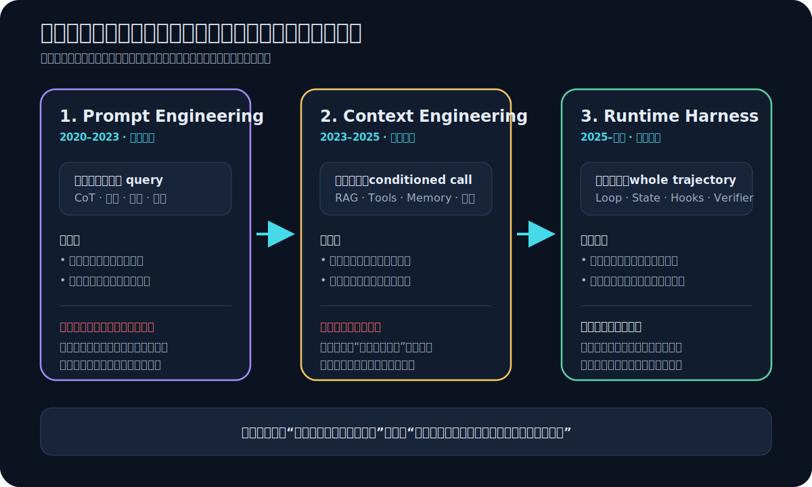
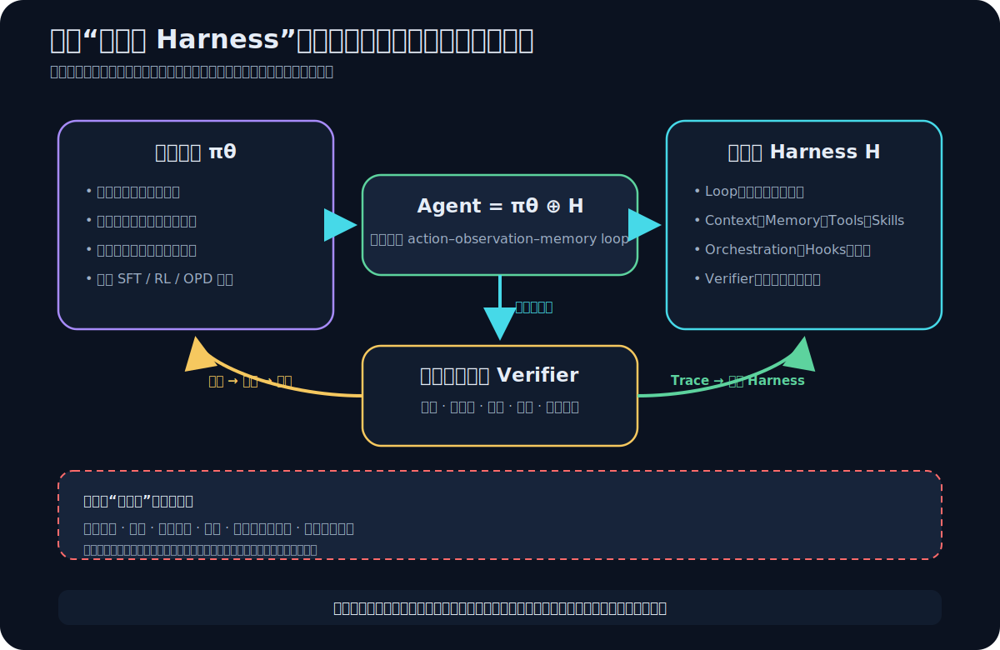
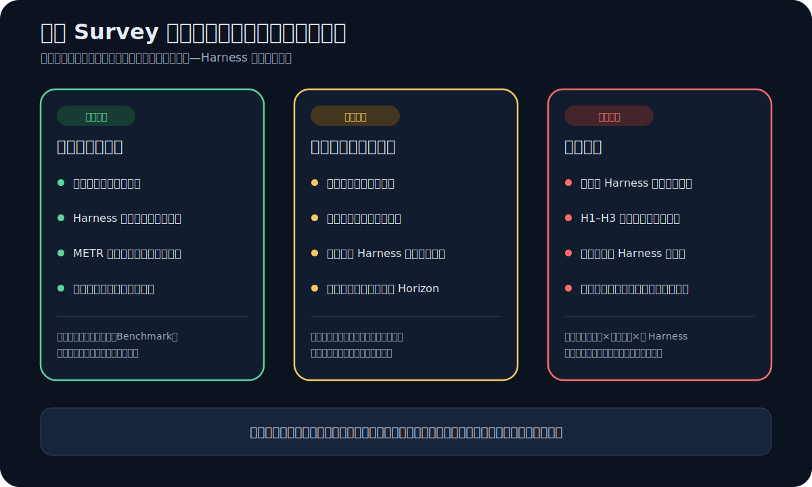

# 论文解读：Towards Long-Horizon Agents: A Survey

> [!abstract] 核心结论
> **长程智能不是模型独自拥有的一项能力，而是策略模型、运行时 Harness、外部环境与验证反馈共同形成的系统属性。**
>
> 这篇综述最重要的贡献，不是又列出一批 Agent 技术，而是把研究问题从“怎样让模型生成更好的下一步”，提升为“怎样让一条跨越许多决策、上下文乃至任务的轨迹，持续保持目标、状态、反馈与可恢复性”。
>
> 但要注意：这是一篇规模很大、更新很快的**叙事型研究地图**，不是通过受控实验验证出来的统一理论。它擅长建立语言和版图，不足以单独证明某种 Harness 或训练方法必然导致长程能力。

## 0. 论文定位与阅读契约

《Towards Long-Horizon Agents: A Survey》是一篇面向长程智能体的超大规模综述。论文 PDF 约 149 页，主体覆盖概念定义、能力层级、运行时基础设施、训练管线、应用与开放问题，参考文献达到 906 条。OpenReview 上的版本提交于 2026 年 7 月；截至本文写作时，应把它视为**尚未完成同行评议背书的预印本**，而不是已经稳定下来的领域共识。[1]

我对参考文献做了一次机器辅助统计：按年份字段启发式解析，约 669/906，即 73.8% 的条目来自 2025—2026 年；约 486 条带有 CoRR 或 arXiv 标记。这个数字不是论文作者报告的结果，解析也可能受重复条目和格式影响，但它揭示了一个重要事实：**这篇综述刻画的是高速移动中的研究前沿，而不是成熟、收敛的教科书知识。**

| 阅读对象 | 本文如何处理 |
|---|---|
| 论文明确提出的定义、框架与分类 | 标记为“论文主张” |
| 根据论文框架得出的工程含义 | 标记为“本文推论” |
| 论文尚未用实验证明的因果关系 | 放入“证据边界”或“开放问题” |
| 具体模型、Benchmark 的最新排名 | 不作为主线；这些信息很快会过期 |
| 论文的真正用途 | 作为研究地图、系统设计语言和问题清单 |

> [!tip] 如果只记住一句话
> **Long horizon 描述的不是任务经过了多久，而是正确行动必须依赖多远之前的目标、状态、反馈和经验。**

---

## 1. 为什么“跑得久”不等于“长程智能”

设想一个 Coding Agent：

1. 它理解需求，修改了多个文件；
2. 中途遇到测试失败，于是重构一层接口；
3. 上下文压缩时漏掉了最初的兼容性约束；
4. 后续测试只覆盖新路径，它据此宣告完成；
5. 数小时后，人类才发现旧接口已经被破坏。

失败不是因为某一步完全不会做，而是因为五件事没有贯穿整条轨迹：

- 原始目标没有被持续保真；
- 世界状态没有被可靠保存；
- 局部反馈没有被正确归因；
- 不可逆改动缺少门禁和回滚；
- “完成”只是模型的语言判断，而不是外部证明。

这就是论文讨论 long horizon 时真正关注的东西：**跨步骤依赖的长度和强度**。一个任务即使只运行十分钟，只要最后一步必须正确整合很早以前的约束，它也可能是长程任务；相反，一个持续数小时、但每一步几乎独立的批处理流程，并不必然要求长程智能。

### 1.1 三种随轨迹增长而放大的失败

论文把长程任务的困难归结为一组互相耦合的问题。用工程语言重写，可以看到三个核心故障面：

| 故障面 | 表面症状 | 深层原因 | 典型补救 |
|---|---|---|---|
| 目标漂移与误差累积 | 越做越偏、局部看似合理 | 早期小误差进入后续状态，成为新的前提 | 里程碑、状态重估、回滚、分支探索 |
| Context rot 与上下文压力 | 忘记约束、关注错误信息 | 有效信息密度下降，旧证据与新状态混杂 | 结构化状态、压缩、检索、上下文重建 |
| 稀疏延迟奖励与不可逆性 | 很晚才知道做错，代价已产生 | 缺少中间验证器，行动改变环境后难以撤销 | 分级门禁、沙箱、检查点、可执行验证 |

误差累积可以用一个极简玩具模型建立直觉。假设 100 个关键决策相互依赖，每一步独立正确率都高达 99%，那么整条链全部正确的概率只有：

$$
0.99^{100} \approx 36.6\%
$$

现实中的错误并不独立：一次错误摘要会污染后续所有判断，因此真实轨迹往往比这个玩具模型更脆弱。这里的公式不是论文给出的性能模型，而是**本文用于说明乘法式可靠性问题的推论**。

> [!important] 亮点一：问题单位发生了变化
> 短任务常把“一个调用”当作优化单位；长程任务必须把**状态转移和整条轨迹**当作优化单位。平均每步表现很好，不等于任务最终可靠。

---

## 2. 论文的统一形式化：Agent = 模型策略 ⊕ Harness

论文用部分可观测马尔可夫决策过程（POMDP）描述智能体与环境的交互。环境存在不能被模型直接看见的真实状态 $s_t$，智能体只能接收观测 $o_t$，再根据当前上下文 $c_t$ 产生动作 $a_t$。

关键不是 POMDP 本身——这是智能体研究中的标准工具——而是论文把上下文如何形成单独交给 Harness：

$$
c_t = \mathcal{H}(o_{0:t}, a_{0:t-1}, Q)
$$

$$
a_t \sim \pi_\theta(\cdot \mid c_t)
$$

因此，一个可运行 Agent 被写成：

$$
\text{Agent} = \pi_\theta \oplus \mathcal{H}
$$

其中：

- $\pi_\theta$ 是模型策略，负责理解、推理与生成下一步动作；
- $\mathcal{H}$ 是 Harness，负责筛选观测、组织上下文、调用工具、编排循环、施加规则与检查结果；
- $Q$ 是任务或查询；
- $\oplus$ 不是严格定义的代数运算，而是在强调二者协同构成智能体。

这个表达式最大的价值，是阻止我们把线上 Agent 的结果简单归因给“底座模型”。同一个模型放入不同 Harness，会看到完全不同的状态保真度、行动空间、验证强度和失败恢复能力。反过来，同一套 Harness 换模型，也会改变推理质量、工具选择与异常恢复策略。

> [!warning] 形式化的边界
> 这套写法提供了一个很好的概念接口，但尚未形成可直接证伪的理论：$\mathcal{H}$ 包含哪些机制、$\oplus$ 如何组合、模型与 Harness 各贡献多少，论文没有通过自己的 model × harness 析因实验给出答案。

---

## 3. H1—H3：长程能力其实跨越了三种尺度

论文用 H1、H2、H3 表示逐步扩展的 horizon，并分别对应 C1、C2、C3 三类能力。这个层级是全文的主干。

| 层级 | 依赖跨越哪里 | 核心能力 | 典型问题 | 工程抓手 |
|---|---|---|---|---|
| H1：intra-context | 同一上下文窗口内部 | C1：交互式推理 | 下一步做什么，怎样分解和纠错 | 推理、规划、工具使用、局部反思 |
| H2：cross-context | 同一任务的多个上下文之间 | C2：状态与记忆 | 压缩或重启后怎样保留目标与进度 | 外部状态、情景记忆、检索、检查点 |
| H3：cross-task stream | 连续任务和交互流之间 | C3：经验积累 | 怎样从过去轨迹中持续变强 | 经验库、技能抽取、训练、策略更新 |

### 3.1 H1：不是“想很久”，而是保持交互推理闭环

H1 关注上下文窗口内的多步决策。Agent 需要把推理变成动作，再读取环境反馈，修正计划。它比静态 Chain-of-Thought 更接近一个闭环：

$$
\text{observe} \rightarrow \text{reason} \rightarrow \text{act} \rightarrow \text{verify} \rightarrow \text{revise}
$$

推理预算、规划、测试时搜索、工具调用和局部自我修正都主要服务这一层。H1 的典型风险是：模型能生成很长的推理文本，却没有得到新的外部信息；轨迹长度增加了，认知增益没有增加。

### 3.2 H2：上下文窗口之外，状态必须成为一等公民

一旦任务跨过单个窗口，原始对话就不再是可靠状态。摘要可能丢失约束，检索可能带回过时证据，模型也无法仅靠语言记忆区分“计划”“已执行动作”和“已验证事实”。

因此 H2 的关键不只是 memory，而是**状态重建**：

- 哪些是始终有效的目标与约束；
- 当前世界事实是什么；
- 哪些动作已经执行，结果是什么；
- 哪些结论已经由外部证据验证；
- 下一次恢复时，最小充分上下文是什么。

这也是为什么长上下文不能自动解决 long horizon。窗口变长只扩大了可见材料；如果信息没有分层、去重、失效和重建，更多 token 反而可能加重 context rot。

### 3.3 H3：从完成一个任务，走向跨任务积累经验

H3 讨论的是连续任务流中的学习：过去的成功和失败如何变成未来可复用的知识、技能、策略乃至模型参数。这里的 horizon 已经从“单任务依赖长度”转向“跨任务的经验时间尺度”。

这一步很有启发，但也是层级中最需要警惕的地方：**H1 → H2 主要在扩展单个任务的依赖范围，H2 → H3 却改变了分析轴，进入持续学习。** 因此 H3 可以视为更广的时间尺度，却不一定是与 H1、H2 严格同构的第三层。

> [!important] 亮点二：三个层级对应三个不同的瓶颈
> H1 主要解决“当前怎么想和做”，H2 解决“跨窗口如何不失真”，H3 解决“跨任务如何真的学会”。把三者都笼统叫 memory 或 reasoning，会掩盖完全不同的系统责任。

---

## 4. 最关键的迁移：从 Prompt 到 Context，再到 Runtime Harness

论文回顾的技术演进可以压缩为一次**控制面迁移**：

### 4.1 Prompt engineering：控制模型如何解释指令

Prompt 把任务、角色、格式和少量示例写进模型输入。它主要控制一次生成的行为边界，适合回答“怎样让下一次调用更像我想要的”。

### 4.2 Context engineering：控制模型此刻能看到什么

Context engineering 开始主动管理信息：检索什么、压缩什么、保留什么、以何种结构注入。这相当于从控制语言转向控制证据和状态。

### 4.3 Runtime Harness：控制整条轨迹怎样演化

长程任务最终要求系统对循环、动作权限、中断恢复、工具结果、验证门槛和任务终止施加控制。Harness 不再只是“装 Prompt 的壳”，而是一个轨迹级控制系统。

这与 [[AI Coding研发中的Harness与Loop构建]] 和 [[Agent OS：把 Agent Core 变成可持续工作的生产系统]] 的工程结论相互印证：模型负责提出动作，运行时负责决定动作能否进入现实世界、执行后如何记录、失败后从哪里恢复，以及何时才有资格宣布完成。

> [!important] 亮点三：Harness 的核心不是“包住模型”，而是“闭合反馈”
> 一个只会反复调用 LLM 的 while loop 不是高质量 Harness。Harness 的价值取决于它是否让观测、状态、行动、验证和恢复形成可靠闭环。

---

## 5. 六类 Harness：把长程智能拆成可工程化的控制部件

论文把外部基础设施整理为六类。它们不是六个互斥模块，而是六种系统责任。

### 5.1 Loop 与 Workflow：谁决定下一步

Loop 决定 Agent 如何在观察—行动—反馈之间迭代；Workflow 则把部分路径固定为显式流程。前者增加适应性，后者增加可控性。

关键设计问题包括：

- 什么时候由模型自由选择动作；
- 什么时候必须进入确定性状态机；
- 失败是否重试、改计划、回滚或升级给人；
- 什么证据满足终止条件。

### 5.2 Context 与 Memory：系统下一刻相信什么

Context 管理当前决策所需的信息，Memory 管理跨上下文或跨任务的可恢复信息。二者都必须处理来源、时间、置信度和失效，而不能只是把旧文本重新塞给模型。

一个实用分层是：

| 状态类型 | 示例 | 推荐载体 |
|---|---|---|
| 不变约束 | 用户目标、安全规则、接口兼容性 | 任务契约、策略层 |
| 当前事实 | 文件版本、网页状态、执行结果 | 结构化状态、环境快照 |
| 轨迹记录 | 做过什么、为何做、得到什么 | 事件日志、检查点 |
| 可复用经验 | 某类故障的修复方式 | 经验证的技能或经验库 |

### 5.3 Tools、MCP 与 Skills：把语言意图接到真实环境

工具扩展了 Agent 的行动空间，也扩大了事故面。Skill 则把多步知识和调用模式封装为可复用程序。标准协议降低接入成本，但**能调用不等于会正确调用，更不等于调用结果可信**。

长程系统中的工具层至少要回答：输入是否经过校验、动作是否幂等、结果来自哪个版本、失败能否重放、危险副作用能否隔离。

### 5.4 Orchestration：把认知和责任分配出去

多 Agent、子任务分解和角色编排可以增加并行性与专业化，但也会引入协调损耗：重复工作、状态分叉、责任不清和错误传播。Orchestration 的目标不是 Agent 越多越好，而是让每个边界都有清晰的输入、输出和验收条件。

### 5.5 Hooks 与 Middleware：动作发生前后，系统允许什么

Hooks 和中间件负责在模型动作进入环境之前或之后施加横切规则，例如权限、限额、审计、脱敏和审批。它们回答的是：

> **这个动作允许发生吗？**

这是政策问题，不应完全交给会被当前上下文影响的模型自行裁决。

### 5.6 Verification：结果是否真的正确

验证器负责测试、编译、规则检查、证据核对、Judge 或人类复核。它回答的是：

> **这一步或这个任务真的做对了吗？**

Hook 与 verifier 常被混为一谈，但前者约束行动合法性，后者判断结果正确性。长程系统需要二者同时存在：合法的动作可能得到错误结果，正确的结果也不能为越权过程辩护。

| Harness 责任 | 直接控制对象 | 最关键的观测信号 |
|---|---|---|
| Loop / Workflow | 轨迹拓扑与终止 | 步数、分支、重试、退出原因 |
| Context / Memory | 决策所见状态 | 来源、时效、压缩损失、命中率 |
| Tools / Skills | 环境行动空间 | 参数、结果、延迟、副作用、幂等性 |
| Orchestration | 任务与责任分配 | 交接次数、重复率、依赖阻塞 |
| Hooks / Middleware | 权限与政策边界 | 拒绝、审批、限额、审计事件 |
| Verification | 正确性与完成证明 | 测试、证据、评分、反例 |

---

## 6. 模型与 Harness 共演化：先外置，再选择性内化

论文另一个重要叙事，是外部基础设施与内部模型能力的双向促进。Harness 先把复杂能力外置为可观察机制；这些机制产生大量带反馈的轨迹；训练再把其中稳定、通用的模式内化进模型。

### 6.1 外置为什么常常是第一步

当一种能力还不稳定时，把它放在外部更容易：

- 观察它有没有执行；
- 修改规则而不重新训练模型；
- 做 A/B 测试和消融；
- 在故障时回滚；
- 对高风险动作进行硬拦截。

规划模板、工具路由、检查点、验证器和技能库都可以先以 Harness 机制出现。

### 6.2 什么条件下值得内化

一类外部策略要进入微调、强化学习、蒸馏或持续学习，至少应满足：

1. 轨迹结果有可信 verifier，而不是模型自评；
2. 经验跨任务可复用，不只是一次性补丁；
3. 训练数据保留失败上下文和归因，而不只保留成功答案；
4. 内化后在未见任务上有受控评测；
5. 能比较“模型变强”与“Harness 改进”的独立贡献。

论文梳理的优化管线覆盖架构设计、数据与环境合成、预训练/中训练、微调、Agentic RL、on-policy distillation 与 self-evolution。把它们放在同一条线上看，真正的共同瓶颈是：**从哪里得到足够可信、带过程反馈的长程经验。**

### 6.3 哪些东西不该轻易内化

安全边界、权限、资金上限、数据隔离、审批规则和合规约束需要保持外部可审计。即使模型学会了“通常不要做某件事”，运行时仍应拥有确定性的硬门禁。

> [!important] 亮点四：共演化不是“最终删掉 Harness”
> 更合理的终局是责任重新分配：高频、通用、可验证的模式逐渐内化；需要审计、快速修改或硬保证的边界继续留在外部。

---

## 7. 应用版图背后的统一变量：反馈和可验证性

论文覆盖软件工程、信息检索、计算机使用、多模态和通用智能体等应用。比按行业罗列更有解释力的方式，是观察每个环境能提供多强的反馈。

| 应用环境 | 反馈特征 | 长程难点 | 典型 Harness |
|---|---|---|---|
| 软件工程 | 测试、编译器等强 oracle 较多 | 大仓库状态、跨文件依赖、回归风险 | 沙箱、版本控制、测试、代码审查 |
| 信息搜索与研究 | 证据存在但答案常无唯一 oracle | 来源冲突、时效性、综合与引用 | 检索日志、来源评级、交叉核验 |
| GUI / Computer use | 局部可见、反馈延迟、界面会变 | 状态识别、误点击、不可逆操作 | 截图状态、动作确认、检查点 |
| 多模态任务 | 反馈稀疏且常隐式 | 跨模态对齐、物理状态、长视频记忆 | 感知缓存、时间索引、模拟器 |
| 通用助理 | 反馈类型混合 | 目标含糊、跨应用权限、长期个性化 | 策略层、用户确认、长期记忆治理 |

由此可以得到一个比“模型参数更大”更实用的推论：

> **Agent 能走多远，很大程度上取决于环境能否在走错太远之前，提供可执行、可归因的反馈。**

这也解释了为什么软件工程常成为长程 Agent 的先行试验场：不是代码天然简单，而是编译器、测试、静态分析和版本控制为自动验证与回滚提供了丰富接口。信息研究和开放世界 GUI 的难点，则经常不是缺少动作，而是缺少可靠 oracle。

---

## 8. 怎样理解“任务时间跨度”指标：METR 图表的价值与陷阱

论文引用 METR 的 time horizon 研究来说明前沿模型可完成任务的复杂度在快速提升。[2][3] 这个指标很有传播力，但最容易被误读。

METR 的时间跨度大致指：**一个具备相关技能的人类专家完成同一任务所需的时间，并在聚合后估计 AI 达到某个成功率（常见为 50%）时对应的任务时长。** 它不是 Agent 自己连续运行了多久，也不是墙钟时间，更不是“模型已经可以自主工作多少小时”。

还要考虑四个限制：

- 任务集偏重软件、机器学习和网络安全等可自动评测领域；
- suite 逐渐饱和后，不同版本数据需要拼接或校准；
- 模型通常与某种脚手架一起评测，结果包含 Harness 贡献；
- 人类耗时只是一种任务复杂度代理，不能覆盖组织协调、开放目标和现实风险。

所以，更准确的表述是：

> “在这一组可评测任务与给定 Harness 下，模型能以约 50% 成功率完成那些人类专家通常需要某个时长的任务。”

而不是：

> “模型已经能可靠自主工作这么久。”

> [!note] 这反而支持论文的系统观点
> 如果评测结果依赖模型与脚手架的组合，那么能力曲线测到的本来就是一个系统，而不是孤立模型。问题是：我们仍需要 model × harness 消融，才能知道增益来自哪里。

---

## 9. 证据边界：这篇综述证明了什么，没有证明什么

### 9.1 证据阶梯

| 判断 | 证据类型 | 强度 | 主要限制 |
|---|---|---|---|
| 长程 Agent 已形成涵盖 Harness、训练与应用的活跃研究群 | 906 篇参考文献与大范围分类 | 中等偏强 | 文献选择方法不透明，前沿预印本比例高 |
| 长程失败同时涉及模型、状态、工具与反馈 | 跨领域文献的共同问题模式 | 中等 | 仍是综合性解释，不是统一实验结论 |
| Harness 是独立且关键的研究对象 | 大量系统与评测都使用外部脚手架 | 中等 | 缺少论文自己的统一消融 |
| 外部能力会逐渐内化为模型能力 | 多条训练路线和系统趋势 | 启发性 | 共演化方向合理，但非已证实定律 |
| H1、H2、H3 构成统一递进层级 | 作者提出的概念框架 | 启发性 | H3 切换到跨任务学习，严格嵌套性存疑 |
| 更长任务时间跨度意味着通用长期自主 | 不成立 | 弱 | Benchmark 范围、成功率、Harness 和风险条件都有限 |

### 9.2 五个需要带着批判性读的问题

#### 问题一：没有系统综述式的方法学透明度

论文规模巨大，但没有像系统性文献综述那样明确报告数据库、检索式、纳入/排除标准、去重流程与质量分级。这意味着它很适合作为 curated map，却不适合据此断言“领域全部证据的比例”或“某方向已经占据共识”。

#### 问题二：形式化统一了语言，没有统一测量

$\pi_\theta \oplus \mathcal{H}$ 很有解释力，但没有给出 Harness 复杂度、状态保真度、轨迹可恢复性或责任归因的标准测量。它更像研究纲领，而不是预测性理论。

#### 问题三：分类之间存在重叠

外部 Harness 和内部能力不是互斥集合。例如 memory 可以是检索系统、上下文策略、模型参数记忆，也可以同时跨越三者；planning 既可能由模型生成，也可能由 workflow 强制。分类的价值在于帮助提问，不在于为每项工作指定唯一抽屉。

#### 问题四：缺少因果归因

论文展示了模型、训练和 Harness 同时演进，但“同时发生”不等于“相互导致”。要验证共演化，至少需要固定模型比较 Harness、固定 Harness 比较模型，再检查交互项和跨任务泛化。

#### 问题五：自我进化不能绕开可信反馈

Self-evolution 很容易形成循环论证：模型产生经验，再用自己的判断筛选经验，最后宣称自己变强。如果没有环境 oracle、独立 verifier 或人类审计，错误会被包装成训练信号并固化。

> [!warning] 最危险的误读
> 把这篇综述当成“自主 Agent 已经成熟”的证据。更准确的结论恰好相反：论文列出的 context rot、不可逆行动、稀疏奖励、持续学习与可信验证，说明长程可靠性仍是一个尚未闭合的系统问题。

---

## 10. 从综述落到工程：构建长程 Agent 的优先级

如果把论文转成一套系统设计顺序，我会按下面的优先级推进，而不是先追求更长的自由运行时间。

### 第一步：写清任务契约和完成证明

- 目标、非目标和不可违反的约束是什么；
- 哪些结果必须由测试、证据或人类确认；
- 什么条件允许系统说“完成”；
- 失败时允许造成多大影响。

### 第二步：把状态从对话中剥离出来

- 区分目标、事实、计划、动作、证据和猜测；
- 给状态加来源、时间和版本；
- 支持检查点、恢复和过期；
- 用原始制品作为事实来源，摘要只作索引。

### 第三步：在扩大自治前提高验证密度

- 每个关键状态转移都产生机器可读证据；
- 在不可逆动作前设置审批或模拟；
- 把长任务拆成可验收里程碑；
- 记录失败属于模型判断、工具、上下文还是环境。

### 第四步：让恢复成为正常路径

- 重试必须知道是否幂等；
- 恢复时能够重建最小充分上下文；
- 把超时、模型切换、网络错误视为预期事件；
- 高风险动作支持回滚或补偿事务。

### 第五步：只从可信轨迹中学习

- 成功必须由外部证据确认；
- 失败轨迹要保留分叉点与归因；
- 新技能先在沙箱复现，再进入共享库；
- 模型、Harness 和数据更新分别版本化、分别评测。

### 一组比“平均得分”更有用的指标

| 维度 | 可观察指标示例 |
|---|---|
| 目标保真 | 关键约束召回率、里程碑偏离率 |
| 状态保真 | 恢复一致率、过期记忆命中率、压缩损失 |
| 验证强度 | 有外部证据覆盖的关键动作比例 |
| 可恢复性 | 检查点恢复成功率、平均回滚代价 |
| 轨迹效率 | 无效循环率、重复工具调用率、验证成本 |
| 责任归因 | 失败可定位比例、模型/Harness/环境分布 |
| 风险控制 | 越权阻断率、不可逆动作审批覆盖率 |

这些指标的共同点是：它们测量的不是“模型说得像不像”，而是**系统能否在真实轨迹中保持正确性和可控性**。

---

## 11. 我认为这篇论文最有价值的四个思想

### 11.1 Long horizon 是依赖结构，不是墙钟时间

这一定义把“跑得久”的表演性指标，重新拉回到目标、状态与反馈能否跨步骤保持一致。

### 11.2 Harness 是能力的一部分，不是评测噪声

模型在什么上下文里决策、能调用什么工具、怎样验证和恢复，都会直接改变有效能力。发布 Agent 能力结论时，应同时报告模型、Harness 和环境。

### 11.3 下一代优化单位是轨迹，不只是响应

长程 Agent 的数据、训练与评测都要保留状态转移、工具反馈、失败分支和完成证据。只有最终答案，无法支撑可靠的长程学习。

### 11.4 真正的共演化依赖 verifier

外部 Harness 只有产生可信经验，才可能反哺模型；模型只有输出可审计动作，Harness 才能安全扩大自治。连接二者的不是更多 token，而是可归因反馈。

---

## 12. 记忆胶囊

> [!summary] 三句话复述全文
> 1. **长程能力是跨越许多决策的依赖保持能力，不是单纯运行时长。**
> 2. **有效 Agent = 模型策略 + Harness；Harness 管理的是上下文、行动、验证和恢复组成的整条轨迹。**
> 3. **先把能力外置为可观察机制，用 verifier 产生可信经验，再选择性内化；安全硬边界始终保留在外部。**

### 留给后续研究的三个问题

1. 能否定义与具体模型无关的“轨迹状态保真度”和“可恢复性”指标？
2. 在固定预算下，提升模型、增强 Harness 与提高 verifier 密度，各自的边际收益如何？
3. 如何避免跨任务记忆和 self-evolution 把历史错误、隐私或策略偏差永久固化？

---

## 参考资料

1. Dong et al., [Towards Long-Horizon Agents: A Survey](https://openreview.net/pdf?id=HyhfhlbWGh), OpenReview, 2026。配套资料库：[Awesome Long-Horizon Agents](https://github.com/RUC-NLPIR/Awesome-Long-Horizon-Agents)。
2. METR, [Measuring AI Ability to Complete Long Tasks](https://metr.org/time-horizons/)。
3. METR, [Time Horizon 1.1](https://metr.org/blog/2026-1-29-time-horizon-1-1/), 2026。
4. Kwa et al., [Measuring AI Ability to Complete Long Software Tasks](https://arxiv.org/abs/2503.14499), NeurIPS 2025。
5. Pan et al., [Natural-Language Agent Harnesses](https://arxiv.org/abs/2603.25723), 2026。

> [!info] 版本说明
> 本文基于 2026-07-16 提交的 OpenReview 版本撰写。由于该领域更新极快，文中的论文数量统计和平台状态只对应本次阅读时点；核心概念应结合后续修订与原始研究重新核验。
