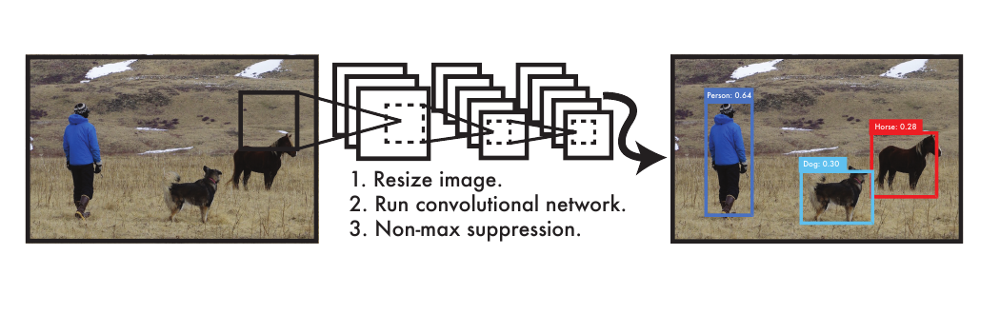
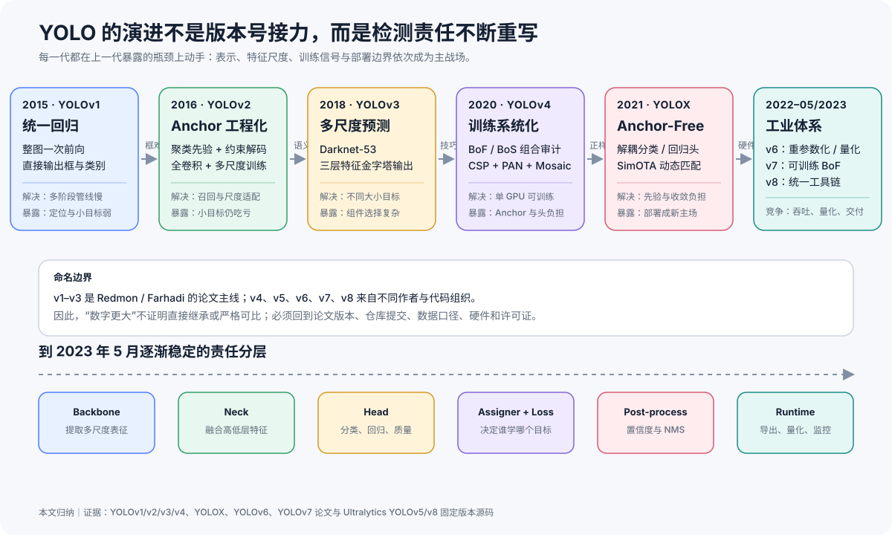
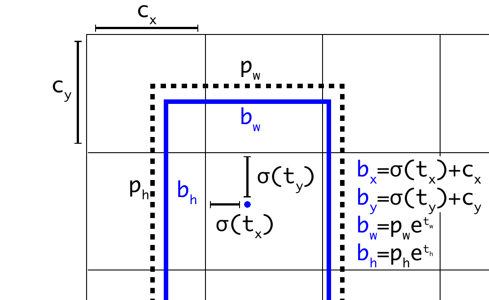
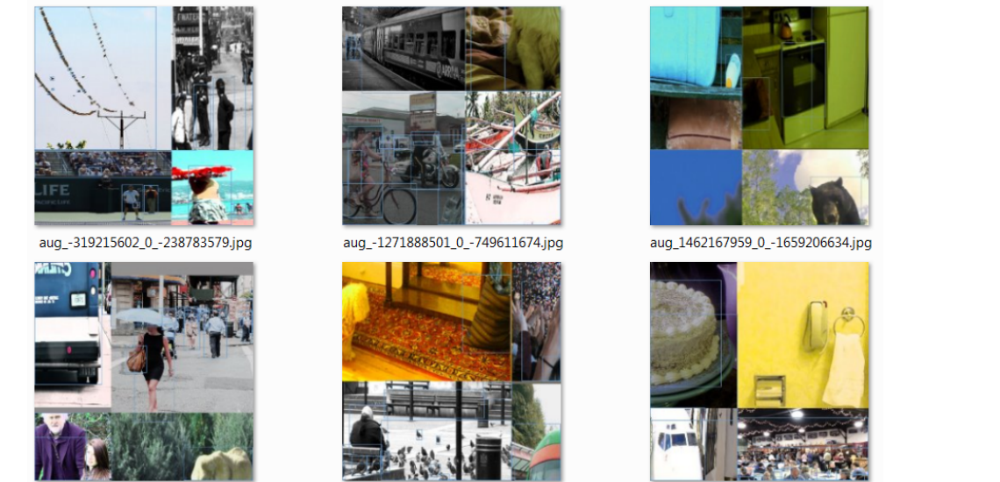
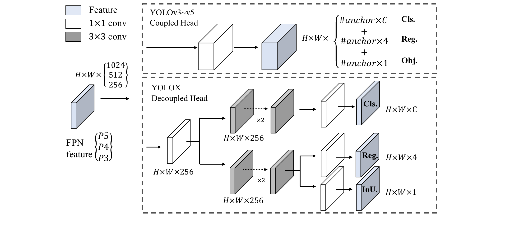
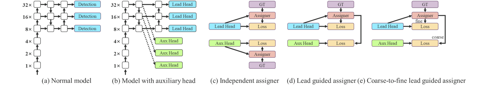
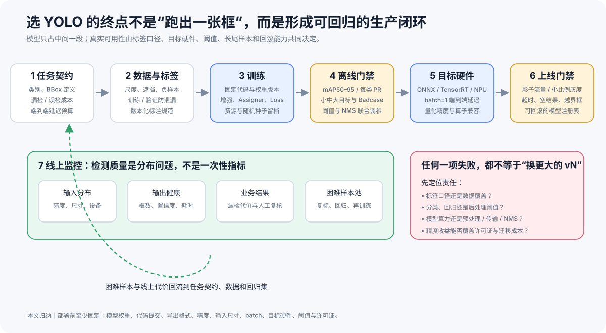

# YOLO 演进：从统一回归到实时检测工程体系

## YOLO 到底是什么：先看它接收什么、返回什么

**YOLO 的全称是 You Only Look Once，中文可直译为“你只看一次”。** 它是一族以实时性著称的**目标检测器**：给它一张图片或视频中的一帧，它要找出画面里有哪些目标、每个目标在哪里，并为每个结果给出类别和分数。

名字里的 “Only Look Once” 不是说整个系统完全没有预处理或后处理，而是说原始 YOLO 把**整张图像只送入同一个神经网络做一次前向计算**，同时预测目标位置和类别。经典 YOLO 在网络之后仍要解码候选框、过滤低分结果，并用非极大值抑制（Non-Maximum Suppression，NMS）删除同一目标周围的重复框。

先看一个最小例子。输入是一张 `640×640` 的 RGB（红、绿、蓝）图片，画面里有一只狗和一个球。推理程序通常先把它整理成形状为 `1×3×640×640` 的张量，也就是一块按多个维度排列的数字数组；其中 `1` 是批量大小（batch size），表示这次只送入一张图片，`3` 是三个颜色通道。最终返回的结果可以写成：

```text
狗   bbox=[84, 126, 418, 592]   score=0.94
球   bbox=[452, 331, 529, 407]  score=0.88
```

这里的 `bbox` 是 Bounding Box，即包住目标的矩形框；四个数字依次是左上角和右下角的像素坐标。`score` 用来排序和过滤检测结果，但不应未经校准就解释成“目标真实存在的概率”。不同 YOLO 版本在网络内部组合类别分数、目标存在性和定位质量的方式并不完全相同。

把推理链路拆开，输入输出会更清楚：

| 阶段 | 输入 | 输出 | 这一阶段回答的问题 |
|---|---|---|---|
| 图像进入模型 | 一张 RGB 图片、视频帧，或一批图片 | 统一尺寸的图像张量 | 模型实际看到了哪些像素？ |
| 神经网络前向 | 图像张量 | 分布在一个或多个特征尺度上的大量原始候选 | 哪些位置可能有目标，框和类别分数是多少？ |
| 解码与后处理 | 原始候选、分数阈值、NMS 阈值 | 去掉低分和高度重复结果后的候选 | 哪些候选值得保留？ |
| 业务输出 | 保留下来的候选 | 零个、一个或多个 `(框, 类别, 分数)` | 目标是什么、在哪里、结果有多可信？ |

现在再给出统一记号。令 $I$ 表示高度为 $H$、宽度为 $W$ 的三通道输入图像；$N$ 表示后处理后保留的检测数量，画面里没有目标时可以是 0；$b_i=(x_1,y_1,x_2,y_2)$ 表示第 $i$ 个矩形框；$c_i$ 表示类别；$s_i$ 表示用于排序和阈值过滤的分数。最终检测结果就是：

$$
\mathcal{D}(I)=\{(b_i,c_i,s_i)\}_{i=1}^{N}.
$$

训练时，输入不只有图片，还要有人工或数据流程提供的正确类别与正确框。模型通过比较预测框和标注框、预测类别和标注类别来更新参数；推理时才只输入图片并返回上面的检测集合。

下面这张 YOLOv1 原论文图把边界画得很直白。先从左往右看数据流：整张图片进入一个卷积网络，网络一次产生许多候选检测，NMS 再消除重复框，最终留下人、狗和马的位置与类别。中间网络具体有多少层暂时不重要，先记住“输入一张图，输出一组带类别和分数的框”。



*图 1　YOLOv1 的完整检测路径。原论文 Figure 1，裁剪自 [You Only Look Once: Unified, Real-Time Object Detection](https://arxiv.org/abs/1506.02640v5)，版权归原作者。它证明的是“单网络前向 + 后处理”的系统边界，不是“完全没有 NMS”。*

这也界定了 YOLO 默认**没有**解决什么：图像分类只给整张图一个类别；语义或实例分割需要逐像素 Mask；多目标跟踪还要为跨帧的同一对象维护身份。目标检测位于它们之间，只承诺“框、类别、分数”。

## 参数量是什么：模型里究竟存了多少可学习的数字

知道输入输出以后，下一个自然问题是：同样接收图片并返回检测框，为什么还要区分 YOLOv8n、YOLOv8s、YOLOv8m、YOLOv8l 和 YOLOv8x？这些字母表示同一家族的不同规模，通常读作 nano、small、medium、large 和 extra large。最先看到的规模指标往往是**参数量**。

一个参数就是模型在训练中可以被更新、在推理时保持固定的数值。可以把它理解成网络内部的一只“旋钮”：训练程序先计算预测和正确答案之间的误差，再沿着产生这次预测的计算路径，求出每只旋钮应当向哪个方向微调；训练结束后，数百万只旋钮共同决定图像特征怎样被提取、组合并变成框和类别分数。这个逐层回算调整方向的过程才叫反向传播。

### 用一个卷积层算一次参数量

先只看最普通的二维卷积。卷积核是一小块可学习数字：它覆盖图像的一个局部区域，把这块区域里的输入数字加权组合成一个新数字，再在整张图上滑动并重复同一种计算。一组卷积核产生一个输出通道；想同时提取多种局部模式，就需要多组卷积核和多个输出通道。

设卷积核高、宽分别是 $k_h$ 和 $k_w$，输入通道数是 $C_{in}$，输出通道数是 $C_{out}$。每个输出通道都需要一组覆盖全部输入通道的卷积核，所以权重数量是：

$$
k_h\times k_w\times C_{in}\times C_{out}.
$$

如果每个输出通道还带一个偏置值，就再增加 $C_{out}$ 个参数。总参数量为：

$$
P_{conv}
=k_hk_wC_{in}C_{out}+C_{out}.
$$

例如，一层卷积接收 RGB 图像的 3 个通道，使用 16 个 `3×3` 卷积核产生 16 个输出通道：

$$
P_{conv}
=3\times3\times3\times16+16
=432+16
=448.
$$

最容易忽略的一点是：这 448 个参数会在整张图片的不同位置**重复使用**。卷积核从左上角滑到右下角不会复制出新参数。因此，把输入从 `640×640` 放大到 `1280×1280`，这一层的参数量仍是 448，但需要处理的空间位置约变为 4 倍，计算量和中间特征内存会显著增加。

现代 YOLO 的卷积模块经常关闭卷积偏置，再接批归一化（Batch Normalization）：它利用一批中间特征的统计量稳定训练，并为每个输出通道学习缩放与平移值。这时精确参数量还要计入这两个可学习数值。上面的 448 是为了建立计算方法的最小例子，不是对某个 YOLO 模块的源码审计结果。

### 参数量不等于权重文件、计算量、显存或延迟

下面五个量经常一起出现，但回答的是不同问题：

| 量 | 它在数什么 | 主要受什么影响 | 不能直接推出什么 |
|---|---|---|---|
| 参数量 | 模型有多少个可学习数值 | 层数、通道宽度、卷积核和检测头设计 | 真实推理速度、准确率 |
| 权重存储 | 把参数保存下来需要多少字节 | 参数量与每个数值使用的位数 | 运行时总内存 |
| 浮点运算次数（FLOPs） | 给定输入执行一次前向需要多少次浮点计算 | 参数复用次数、输入分辨率、特征图大小和算子 | 某台设备上的实际毫秒数 |
| 峰值内存或显存 | 运行时同时驻留多少权重、中间特征与工作区 | batch、分辨率、精度、引擎；训练还要保留梯度和优化器状态 | 仅由参数量决定的固定值 |
| 延迟 | 从输入到结果实际花了多久 | 硬件、推理引擎、算子实现、精度、batch、预处理和 NMS | 跨设备直接比较的模型属性 |

例如，32 位浮点数格式 FP32 为每个参数使用 32 bit，也就是 4 字节。`3.2M` 参数的纯参数存储约为 `3.2×10⁶×4=12.8 MB`；换成 16 位浮点数或 8 位整数，参数本身可以更小，但还要考虑量化方式和算子支持。实际 `.pt` 文件也可能包含结构或元数据，运行时还要保存输入和中间特征，所以“3.2M 参数”绝不等于“只需要 12.8 MB 内存”。

### 用 YOLOv8 模型族建立量级感

YOLO 模型通常从两个方向放大：**加深**是在路径上增加更多层，**加宽**是让每层同时保留更多输出通道。加深造成的参数增长大致随新增层数累积；加宽往往更快，因为卷积权重同时乘以输入通道和输出通道。如果一层的输入、输出通道都扩大为 2 倍，权重项会从 $C_{in}C_{out}$ 变成 $(2C_{in})(2C_{out})$，也就是约 4 倍。`n/s/m/l/x` 本质上是在调整这类深度与宽度配置。

截至本文证据截止日所固定的 Ultralytics `8.0.111`，官方在相同的 COCO val2017 验证集、`640×640` 输入口径下列出了下面的检测模型。COCO 是常用的目标检测基准数据集，val2017 是它的验证划分。表中的 `M` 表示百万参数，FLOPs 的 `B` 表示十亿次浮点运算；这些 FLOPs 应按同一工具口径比较。$AP_{50:95}$ 是 COCO 的综合检测准确率指标，数值越高越好，具体计算在后文性能小节展开。延迟列是在一张 NVIDIA A100 图形处理器（GPU）上使用 TensorRT 推理引擎、每批一张图时的官方报告值。

| 模型 | 参数量 | FLOPs | COCO $AP_{50:95}$ | A100 TensorRT 延迟，batch=1 |
|---|---:|---:|---:|---:|
| YOLOv8n | 3.2M | 8.7B | 37.3 | 0.99 ms |
| YOLOv8s | 11.2M | 28.6B | 44.9 | 1.20 ms |
| YOLOv8m | 25.9M | 78.9B | 50.2 | 1.83 ms |
| YOLOv8l | 43.7M | 165.2B | 52.9 | 2.39 ms |
| YOLOv8x | 68.2M | 257.8B | 53.9 | 3.53 ms |

数据来自 [Ultralytics `8.0.111` 固定提交的 Detection 表](https://github.com/ultralytics/ultralytics/tree/fd94d312da626f9557e43adb7b339afa459e497f#detection)。这些数字是官方在特定软硬件条件下报告的结果，不是本文实测。

从 `n` 到 `x`，参数量约增加到 21.3 倍，FLOPs 约增加到 29.6 倍，COCO AP 则增加 16.6 个点。A100 TensorRT 表中的延迟只增加到约 3.6 倍，并不与参数量同比增长。这正说明四件事：

1. 更大的模型通常有更强的表示容量，但参数增加不会按比例兑换成准确率；
2. 参数量相同的两种架构，也可能因为特征图大小和算子不同而有不同 FLOPs；
3. FLOPs 相近的模型，也可能因为内存访问和硬件支持不同而有不同延迟；
4. `n/s/m/l/x` 改变的是内部容量与成本，最终输出仍是同一种“框、类别、分数”契约。

所以选 YOLO 规模时，不应先问“最大的型号是什么”，而应先固定允许的延迟、内存、功耗与准确率下限，再在目标硬件上实测满足约束的最小型号。后文出现参数量、FLOPs 或速度数字时，都沿用这组区别。

## 一、为什么实时检测不是“把分类器多跑几次”

假设一条视频流每秒送来 30 帧。系统不只要回答“画面里有狗”，还要在每帧给出狗的位置、类别和分数；如果同一只狗产生十个重叠框，还要在帧预算内消重。

一种直觉做法是先在图中提出许多可能含有物体的区域，再把每块区域裁出来交给分类器，最后修正矩形框。每个步骤单独看都合理，串起来却有三个问题：同一片像素被重复计算，候选区域生成与分类难以联合训练，而且候选数量会随场景变复杂而膨胀。

于是实时检测器必须同时回答五个问题：

1. 在哪里产生候选框，候选数量怎样受控？
2. 大目标和小目标由哪一层特征负责？
3. 一个正确标注框应该监督哪些预测位置？
4. 分类正确与定位准确怎样进入同一个训练目标？
5. 模型离线指标很好时，能否在目标图形处理器（GPU）、中央处理器（CPU）或神经网络处理器（NPU）上按时交付结果？

YOLO 的每次重要转向，都在重写其中一项责任。下面的路线图先给出全貌；后文再逐代解释每次变化为什么发生。

读图前只需要认识五个模块：

| 模块 | 可以先怎样理解 |
|---|---|
| Backbone，主干网络 | 把像素逐层变成边缘、纹理、形状等视觉特征 |
| Neck，特征融合层 | 把不同分辨率的特征汇合，让大目标和小目标都保留可用信息 |
| Head，检测头 | 把融合后的特征变成框的位置和类别分数 |
| Assigner，样本分配器 | 只在训练时决定“哪个预测位置负责学习哪个正确标注框” |
| Runtime，运行时 | 在具体 GPU、CPU 或其他芯片上完成模型加载、前向计算和后处理 |

路线图里的 Anchor 是预设框形状，Anchor-Free 是不再预设框的宽高；它们的具体计算在 v2 和 YOLOX 小节分别展开。



*图 2　YOLO 的因果演进。时间线不是按数字大小排队，而是标出每一代解决的瓶颈及随之暴露的新问题；底部是截至 2023 年 5 月已逐渐稳定的检测系统责任分层。本文依据 YOLOv1/v2/v3/v4、YOLOX、YOLOv6、YOLOv7 论文以及 YOLOv5/v8 固定版本源码归纳。*

> **核心判断：YOLO 最持久的贡献不是某一版主干网络，而是不断缩短并联合优化“像素 → 特征 → 检测框”的整条路径。** v1 取消候选区域与分类器串联；v2 让模型在预设框形状附近修正位置；v3 让不同分辨率的特征分别照顾大小目标；v4 把数据增强、损失和网络组件变成可组合的训练系统；YOLOX 又删除预设框宽高、拆开分类与定位，并在训练中动态决定哪个位置学习哪个目标。到 v6、v7、v8，竞争主场已经从单个网络结构迁移到训练结构如何折叠、低精度计算、模型导出、许可证与整条工具链。

## 二、先拆掉一个误解：v1 到 v8 不是同一团队的线性版本

YOLOv1、YOLO9000/YOLOv2、YOLOv3 是 Joseph Redmon 等人的直接论文序列。YOLOv4 由 Alexey Bochkovskiy、Chien-Yao Wang、Hong-Yuan Mark Liao 提出；YOLOv5 与 YOLOv8 来自 Ultralytics 的代码和产品体系；YOLOX 来自旷视；YOLOv6 来自美团；YOLOv7 又回到 Wang、Bochkovskiy、Liao 团队。

因此，**“v8 一定继承 v7，v7 一定继承 v6”在学术谱系上并不成立。** 数字标签更像多个团队争夺同一工程范式的品牌语言。比较时必须固定论文版本或代码提交，并同时对齐数据集、输入尺寸、精度、batch、硬件、推理引擎和是否包含后处理。

截至 2023 年 5 月，可把主线压成下表：

| 节点 | 一手证据 | 主要变化 | 它真正解决了什么 | 新的代价 |
|---|---|---|---|---|
| YOLOv1，2015/2016 | CVPR 论文 | 整图到框和类别的统一回归 | 取消候选区域流水线，获得实时性 | 粗网格、定位误差、成群小目标 |
| YOLOv2 / YOLO9000，2016/2017 | CVPR 论文 | Anchor、聚类先验、全卷积、多尺度训练、WordTree | 提高召回，允许同一权重在多分辨率运行 | Anchor 需要数据集相关调参 |
| YOLOv3，2018 | 技术报告 | Darknet-53、三尺度预测、独立 Logistic 类别 | 更好覆盖小中大目标与多标签类别 | Head 和训练配方继续复杂化 |
| YOLOv4，2020 | arXiv 论文 | CSPDarknet53 + SPP + PAN；BoF/BoS；Mosaic、CIoU 等 | 把大量技巧放进可复验组合，强调单 GPU 训练 | 组件多、结果依赖完整配方 |
| YOLOv5，2020– | 官方仓库 / Release | PyTorch 工具链、训练验证导出、检测/分割等任务 | 降低落地门槛，工程迭代速度快 | 没有同名同行评议论文；版本持续漂移 |
| YOLOX，2021 | arXiv 论文 | Anchor-Free、解耦头、SimOTA | 减少先验和输出负担，让正样本动态匹配 | 训练分配器成为新的复杂核心 |
| YOLOv6，2022 | 技术报告与官方仓库 | 重参数化、TAL、自蒸馏、量化 | 面向 T4/CPU 等目标硬件设计整套模型族 | 训练、量化与部署路径更强绑定 |
| YOLOv7，2022/2023 | arXiv / CVPR 论文 | E-ELAN、计划式重参数化、辅助头标签分配 | 不增加推理成本地增强训练 | 论文结构和训练细节理解成本高 |
| YOLOv8，2023-01 至 05 | 固定源码 `8.0.111` | Anchor-Free 解耦头、DFL、TAL、统一 CLI/API | 把检测、分割、姿态、导出收进一套体验 | 学术主张只能从固定源码审计，不能假装有论文 |

## 三、第一次责任迁移：YOLOv1 把检测改写为单次回归

### 3.1 从“候选框之后再分类”变成“整张图一次输出”

开头图 1 已经展示了系统边界。这里进一步解释 v1 怎样把“整张图一次输出”落成一个可训练的张量：候选区域生成、特征提取、分类和框回归不再由独立模块串联，整张图只执行一次卷积网络；NMS 仍在网络之后消除重复框。

YOLOv1 把图像的横向和纵向都分成 $S$ 格，共得到 $S\times S$ 个网格。若对象中心落在某个网格，该网格负责预测对象。令 $B$ 表示每格预测的候选框数量，$C$ 表示数据集中的类别数量；每个框需要 4 个坐标和 1 个置信度，所以输出张量为：

$$
\mathbf{Y}\in\mathbb{R}^{S\times S\times(B\cdot5+C)}.
$$

在 PASCAL VOC 设置中，$S=7$、$B=2$、$C=20$，最终是 $7\times7\times30$。每个框预测 $(x,y,w,h)$：$x,y$ 表示框中心位置，$w,h$ 表示框的宽和高。

框的位置还不够，系统还需要判断“这个框里真的有对象吗”以及“预测框和正确框重合得怎样”。令 $b$ 为预测框，$\hat b$ 为正确标注框。交并比（Intersection over Union，IoU）用两个框的重叠面积除以合并后的总面积：

$$
\operatorname{IoU}(b,\hat b)
=\frac{|b\cap\hat b|}{|b\cup\hat b|}.
$$

IoU 等于 0 表示两个框完全不重叠，等于 1 表示完全重合。再令 $P(\text{Object})$ 表示当前框含有对象的预测概率，YOLOv1 论文把置信度定义为：

$$
\operatorname{conf}=P(\text{Object})\cdot\operatorname{IoU}(b,\hat b),
$$

令 $P(c\mid\text{Object})$ 表示“已经知道框里有对象时，它属于类别 $c$ 的概率”。把它与置信度相乘，就得到类别 $c$ 对应的排序分数：

$$
P(c\mid\text{Object})\cdot\operatorname{conf}
=P(c)\cdot\operatorname{IoU}(b,\hat b).
$$

这一步把“这里有没有东西”“它是什么”“框得准不准”压进同一分数，也埋下了后续分类质量与定位质量是否对齐的问题。

### 3.2 v1 的损失为何会预测出它自己的失败模式

训练需要把不同类型的预测错误合在一起。令 $\mathcal{L}_{xywh}$ 表示框中心与宽高误差，$\mathcal{L}_{obj}$ 表示负责预测对象的框的置信度误差，$\mathcal{L}_{noobj}$ 表示空位置的置信度误差，$\mathcal{L}_{cls}$ 表示类别误差。原始损失可概括为：

$$
\mathcal{L}
=\lambda_{coord}\mathcal{L}_{xywh}
+\mathcal{L}_{obj}
+\lambda_{noobj}\mathcal{L}_{noobj}
+\mathcal{L}_{cls},
$$

其中 $\lambda_{coord}$ 和 $\lambda_{noobj}$ 是人工设定的权重，用来调节不同错误对总损失的影响；论文取 $\lambda_{coord}=5$、$\lambda_{noobj}=0.5$。宽高使用平方根后再做平方误差，以降低大框绝对误差的支配。一个正确标注框只分配给当前 IoU 最高的框预测器。

论文自己已经明确列出三类局限：每格只能给出有限框且共享一组类别概率，因此拥挤的小目标容易漏；多次下采样导致定位特征粗；平方误差与最终 AP/IoU 并不完全对齐。换句话说，v1 的 45 FPS 与 Fast YOLO 的 155 FPS 证明了统一回归的速度潜力，但 63.4 mAP（VOC 2007）不能掩盖定位仍是主要错误来源。

下一代必须保留“只看一次”，又要让框更容易学。

## 四、第二次责任迁移：YOLOv2 用 Anchor 把任意框变成先验附近的偏移

### 4.1 Anchor 不是多画几个框，而是改变回归坐标系

Anchor 可以先理解为一组预设的框形状：模型不再从零猜测任意宽高，而是在某个预设宽高附近预测修正量。YOLOv2 删除全连接检测层，在每个卷积位置为若干 Anchor 预测偏移。先验宽高不是手工挑选，而是对训练集中的框做 k-means 聚类；令 $b$ 表示某个训练框，$c$ 表示某个聚类中心框，两者的距离定义为：

$$
d(b,c)=1-\operatorname{IoU}(b,c).
$$

这样聚类关心形状重合，而不是大框在普通坐标距离中天然占优。读下图时，虚线框是预设宽高 $(p_w,p_h)$，蓝框是解码后的预测。当前网格左上角的坐标记为 $(c_x,c_y)$；网络并不直接输出最终框，而是输出四个没有范围限制的修正量 $(t_x,t_y,t_w,t_h)$。



*图 3　YOLOv2 的 Anchor 解码。原论文 Figure 3，裁剪自 [YOLO9000: Better, Faster, Stronger](https://arxiv.org/abs/1612.08242v1)，版权归原作者。图中的 $c_x,c_y$ 是网格偏移，$p_w,p_h$ 是聚类得到的先验；它解释了参数化，不等于证明 Anchor 在所有数据集上都优于 Anchor-Free。*

为了不让框中心轻易跑到很远的网格，Sigmoid 函数 $\sigma(\cdot)$ 把任意中心修正量压到 0 和 1 之间，再加上网格坐标。为了让宽高始终为正，指数函数把 $t_w,t_h$ 变成正数后乘以预设宽高。最终解码公式为：

$$
\begin{aligned}
b_x&=\sigma(t_x)+c_x, & b_y&=\sigma(t_y)+c_y,\\
b_w&=p_w e^{t_w}, & b_h&=p_h e^{t_h}.
\end{aligned}
$$

这比从零回归绝对宽高稳定，但也把数据集形状分布写进了 Anchor。换到长条 Logo、遥感小目标或极端纵横比数据时，先验常需重聚类；这正是后来 Anchor-Free 路线要删除的人工结构。

### 4.2 v2 不只是 Anchor：它第一次把速度—精度变成运行时旋钮

YOLOv2 还加入 BatchNorm、高分辨率分类器预训练、Darknet-19、细粒度 passthrough，并采用多尺度训练。由于网络全卷积且总下采样为 32，训练中每 10 个 batch 在 $\{320,352,\ldots,608\}$ 之间更换输入尺寸。相同权重可以在 288、416 或 544 等分辨率运行：论文在 VOC 2007 上分别报告 91 FPS/69.0 mAP、67 FPS/76.8 mAP、40 FPS/78.6 mAP。

这是一项长期保留下来的工程思想：**速度—精度不一定要靠换整套模型，有时可以先调输入尺寸。** 但分辨率提高会近似按像素面积增加计算，也不能凭空恢复训练集中没有的小目标证据。

YOLO9000 的另一条线用 WordTree 联合训练 COCO 检测与 ImageNet 分类，扩到 9000 多类。它证明分类数据能扩展类别语义，却没有解决所有类别都缺少精确框监督的问题；这条开放类别路线与后来视觉语言检测并非同一个机制。

## 五、第三次责任迁移：YOLOv3 让多个特征尺度共同负责检测

YOLOv2 仍主要在较粗特征图上输出。小目标经过多次下采样后只剩几个激活，很难靠更好的 Anchor 补回空间信息。YOLOv3 用 Darknet-53 主干，在三个尺度上分别预测，并通过上采样和横向连接把深层语义与较细位置结合，形成类似特征金字塔的路径。

同时，它做了三项容易被版本号掩盖的修改：

- 每个尺度使用分配到该尺度的 Anchor；
- 类别从 Softmax 改为独立 Logistic，使一个框可以具有多个非互斥标签；
- Objectness 与框回归仍按负责的先验训练，推理继续使用 NMS。

YOLOv3 在 COCO 的 $AP_{50:95}$ 上不一定压倒当时所有方法，但在旧的 $AP_{50}$ 口径和延迟上形成了强折中：论文报告 608 输入时 $33.0$ AP、$57.9$ $AP_{50}$；320 输入时 22 ms、28.2 AP。这里不能把 57.9 与 28.2 直接比较成“翻倍”，因为它们不是同一 IoU 口径。

到这一阶段，YOLO 已经出现后来长期稳定的三段式骨架：Backbone 提特征、Neck 融合尺度、Head 做密集预测。下一个瓶颈不再是缺少单个模块，而是好用的模块和训练技巧太多，怎样组合才真的有效。

## 六、第四次责任迁移：YOLOv4 把“技巧”变成系统设计对象

YOLOv4 的方法论价值高于它的版本号。论文把不会增加推理成本的训练技巧称为 Bag of Freebies（BoF），把只带来少量推理成本的插件称为 Bag of Specials（BoS），再用消融实验筛组合。最终系统以 CSPDarknet53 为 Backbone、SPP 扩大感受野、PAN 聚合多尺度特征，并结合 Mosaic、SAT、DropBlock、CmBN、CIoU、Mish 等方法。

读下面的 Mosaic 图，重点不是“四张图拼在一起”这个视觉效果，而是一次训练样本同时改变对象尺度、上下文和裁切边界；一个 batch 中出现更多场景，也缓解了单 GPU 小 mini-batch 下 BatchNorm 统计不足的问题。



*图 4　Mosaic 数据增强。原论文 Figure 3，裁剪自 [YOLOv4: Optimal Speed and Accuracy of Object Detection](https://arxiv.org/abs/2004.10934v1)，版权归原作者。它支持“多上下文、变尺度、降低大 batch 依赖”的机制解释；它不证明 Mosaic 对任意小数据集都必然增益。*

YOLOv4 特别强调普通硬件可训练：论文称在单张 GTX 1080 Ti 或 RTX 2080 Ti、8–16 GB 显存上完成训练，并在检测实验中使用 batch 64、mini-batch 4 或 8 的多尺度方案。论文报告 COCO 上 43.5 AP、65.7 $AP_{50}$，约 65 FPS（Tesla V100）。但这些数字仍不能和 YOLOv2 的 VOC mAP 横比，也不能把 V100 模型时间当作摄像头到业务结果的端到端延迟。

更重要的是，v4 之后“YOLO 改进”越来越少是一个孤立模块，越来越多是**结构、数据、损失、正样本分配和硬件实现的共同配方**。

## 七、第五次责任迁移：YOLOX 删除 Anchor，并拆开分类与定位

### 7.1 为什么分类和回归不该挤在同一个头里

分类需要对平移和局部形变相对不敏感，定位却恰恰要保留精确位置。YOLOX 将每个 FPN 层先用 $1\times1$ 卷积统一到 256 通道，再分成分类支路和回归/IoU 支路。图中上半是 YOLOv3–v5 的耦合头，下半是解耦头。



*图 5　YOLOX 解耦头。原论文 Figure 2，裁剪自 [YOLOX: Exceeding YOLO Series in 2021](https://arxiv.org/abs/2107.08430v2)，版权归原作者。论文消融中解耦头让基线 AP 从 38.5 升至 39.6，并更快收敛，但在 V100、batch=1 下增加约 1.1 ms；“解耦”不是无成本。*

YOLOX 随后把每个位置的预测从多个 Anchor 减为一个 Anchor Point，直接预测框相对位置。Anchor-Free 并不意味着“没有参考点”，而是没有预设宽高模板。若参考点为 $a=(a_x,a_y)$，预测到四边距离 $d=(l,t,r,b)$，则：

$$
\hat b=(a_x-l,\ a_y-t,\ a_x+r,\ a_y+b).
$$

这样减少了每位置预测数量与先验调参，但也让另一个问题更突出：一个目标附近有很多位置，究竟哪些位置应该作为正样本？

### 7.2 SimOTA：把“谁负责谁”从固定规则改成动态匹配

YOLOX 先扩大中心区域的候选，再根据分类和回归损失计算预测 $p_j$ 与真值 $g_i$ 的匹配代价：

$$
c_{ij}=\mathcal{L}^{cls}_{ij}+\lambda\mathcal{L}^{reg}_{ij}.
$$

每个真值根据候选 IoU 动态确定 $k$，再选择代价最低的 top-$k$ 位置作为正样本。它保留 OTA 的质量感知和全局视角，却省掉 Sinkhorn-Knopp 最优传输求解。YOLOX 的逐步消融显示：Anchor-Free 本身把 42.0 AP 提到 42.9，中心多正样本到 45.0，SimOTA 再到 47.3。真正的大增益来自**表示变化与分配策略配合**，不能只把功劳归给“删除 Anchor”。

论文训练配置也揭示了代价：主实验在 COCO 上训练 300 epoch、默认总 batch 128、典型 8 GPU，输入在 448–832 间变化；速度以 V100、FP16、batch=1 且不含后处理测量。报告称单 GPU 也能训练，不等于所有型号都在单卡上经济可复现。

## 八、从模型到体系：v5、v6、v7、v8 分别补了什么

### 8.1 YOLOv5：没有同名论文，但工程影响不能被“无论文”抹掉

截至本文证据边界，YOLOv5 的一手材料是 Ultralytics 仓库和 Release，而不是一篇名为 YOLOv5 的同行评议论文。它的重要性在于 PyTorch 训练、验证、推理、导出与模型尺度形成稳定工作流，并把检测之外的分割等任务收进同一仓库。[v7.0 Release](https://github.com/ultralytics/yolov5/releases/tag/v7.0) 固定于提交 [`915bbf2`](https://github.com/ultralytics/yolov5/tree/915bbf294bb74c859f0b41f1c23bc395014ea679)。

因此评价 YOLOv5 时应说“这个固定版本的代码与权重做了什么”，不能虚构论文贡献，也不能拿持续更新的 `master` 结果回填到 2020 年。

### 8.2 YOLOv6：训练时多分支，推理时折叠成硬件友好单路

YOLOv6 将结构重参数化用于 Backbone 和 Neck：训练时 RepVGG 式多分支更易优化，推理前把卷积和 BN 等价折叠到单个 $3\times3$ RepConv；小模型使用 EfficientRep/Rep-PAN，大模型改用 CSPStackRep，Head 则采用更轻的解耦结构。报告进一步把 TAL、蒸馏、PTQ/QAT 与 TensorRT 图优化放进同一框架。

这代表一个重要边界变化：模型不再只对 FLOPs 负责，还要对目标算子、内存访问、量化敏感层和推理引擎负责。报告的训练使用 8 张 A100，速度在 T4 + TensorRT 上测试；YOLOv6-S 的 43.5 AP、batch=32 下 495 FPS，以及量化版本 869 FPS 都是特定吞吐条件，不是边缘设备 batch=1 延迟。

### 8.3 YOLOv7：让更强监督只存在于训练期

YOLOv7 继续研究“可训练的 Bag of Freebies”：E-ELAN 扩展特征基数但维持梯度路径；计划式重参数化根据残差或拼接结构决定 RepConv 是否保留 identity；辅助头只在训练期提供深监督，推理仍由 Lead Head 输出。

下图从左到右依次是无辅助头、有辅助头、独立分配、Lead Head 引导，以及粗到细分配。最后一种方案让能力较弱的辅助头学习更宽松、偏召回的 coarse 标签，让最终 Lead Head 学更严格的 fine 标签。



*图 6　YOLOv7 辅助头标签分配。原论文 Figure 5，裁剪自 [YOLOv7: Trainable Bag-of-Freebies Sets New State-of-the-Art for Real-Time Object Detectors](https://arxiv.org/abs/2207.02696v1)，版权归原作者。图中辅助头是训练结构，不能据此推断部署时必须保留多个输出头。*

论文在 COCO 上从零训练、不使用额外检测数据，报告 YOLOv7 640 输入为 51.4 AP / 161 FPS，YOLOv7-E6E 1280 输入为 56.8 AP / 36 FPS。速度表以 V100 为主；大模型的高 AP 与普通模型的高 FPS代表两个不同服务点，不是一项模型同时达到。

### 8.4 YOLOv8：把论文结论和源码事实分开

按 Asia/Shanghai 时区截至 2023-05-31，Ultralytics 仓库最新提交为 [`fd94d31`](https://github.com/ultralytics/ultralytics/tree/fd94d312da626f9557e43adb7b339afa459e497f)，版本号 `8.0.111`。它没有同名论文可供归因，因此下面只陈述固定源码事实：

- [`Detect`](https://github.com/ultralytics/ultralytics/blob/fd94d312da626f9557e43adb7b339afa459e497f/ultralytics/nn/modules/head.py) 用独立 `cv2` 和 `cv3` 分支预测框分布与类别；输出通道为 $4\cdot reg\_max+C$，没有单独 Objectness 通道；
- `reg_max=16`，四条边各预测 16 档分布，再经 DFL 期望解码；
- [`v8DetectionLoss`](https://github.com/ultralytics/ultralytics/blob/fd94d312da626f9557e43adb7b339afa459e497f/ultralytics/yolo/utils/loss.py) 使用 Box、Class、DFL 三项损失；
- [`TaskAlignedAssigner`](https://github.com/ultralytics/ultralytics/blob/fd94d312da626f9557e43adb7b339afa459e497f/ultralytics/yolo/utils/tal.py) 以分类分数和 CIoU 共同选择 top-$k$ 正样本，检测损失中配置为 $topk=10,\alpha=0.5,\beta=6.0$。

这个固定实现先把 CIoU 截断到非负质量 $q_{ij}$，再计算对齐度：

$$
q_{ij}=\max\!\left(\operatorname{CIoU}(b_j,g_i),0\right),
\qquad
m_{ij}=s_{ij}^{\alpha}q_{ij}^{\beta}.
$$

这意味着“分类相信它”与“框确实贴合”必须同时成立。v1 已经尝试把类别、Objectness 与 IoU 组合为分数；v8 的变化是把这种对齐深入正样本分配和分布式框回归。

## 九、统一数学视角：七代变化其实集中在三件事

### 9.1 框怎样表示

| 路线 | 预测变量 | 优点 | 代价 |
|---|---|---|---|
| v1 直接网格回归 | 相对网格中心 $x,y$，相对整图 $w,h$ | 简单、输出少 | 异常形状难学，粗网格限制强 |
| v2–v5 Anchor-Based | 相对先验的 $t_x,t_y,t_w,t_h$ | 先验降低回归难度 | 聚类与每尺度 Anchor 是超参数 |
| YOLOX/v6 Anchor-Point | 相对参考点的偏移或 $l,t,r,b$ | 减少预测数和形状先验 | 更依赖正样本分配 |
| v8 DFL | 每条边的离散距离分布 | 表达不确定性并提供更细梯度 | 通道数和解码计算增加 |

DFL 将一条边的连续距离 $d$ 表示为 $K$ 个离散桶概率 $p_k$，解码为期望：

$$
\hat d=\sum_{k=0}^{K-1}k\cdot\operatorname{softmax}(z)_k.
$$

下面的可运行骨架只复现“Anchor Point + DFL 期望 + 四边距离解码”，不包含 Backbone、标签分配、损失权重或 NMS：

```python
import torch
from torch import Tensor


def dfl_expectation(logits: Tensor) -> Tensor:
    """logits: [batch, points, 4, reg_max] -> ltrb distances."""
    if logits.ndim != 4 or logits.shape[2] != 4:
        raise ValueError("expected [batch, points, 4, reg_max]")
    bins = torch.arange(logits.shape[-1], device=logits.device,
                        dtype=logits.dtype)
    return (logits.softmax(dim=-1) * bins).sum(dim=-1)


def dist2bbox(anchor_xy: Tensor, ltrb: Tensor, stride: Tensor) -> Tensor:
    """anchor_xy: [points, 2]; ltrb: [batch, points, 4]."""
    if anchor_xy.ndim != 2 or anchor_xy.shape[-1] != 2:
        raise ValueError("anchor_xy must be [points, 2]")
    left_top = anchor_xy[None] - ltrb[..., :2]
    right_bottom = anchor_xy[None] + ltrb[..., 2:]
    return torch.cat((left_top, right_bottom), dim=-1) * stride


if __name__ == "__main__":
    raw = torch.randn(2, 8400, 4, 16)
    points = torch.rand(8400, 2) * 80
    boxes_xyxy = dist2bbox(points, dfl_expectation(raw), torch.tensor(8.0))
    assert boxes_xyxy.shape == (2, 8400, 4)
```

### 9.2 谁被分配为正样本

v1 让 IoU 最高的框预测器负责；v2/v3 先按 Anchor 形状与尺度分配；YOLOX 的 SimOTA 根据当前预测质量动态选 top-$k$；v6/v8 的 TAL 又把分类可信度与定位质量直接组合。**Assigner 不只是训练实现细节，它决定梯度从哪些空间位置进入模型。** 小目标、拥挤场景和类别不平衡常在这里被放大或缓解。

### 9.3 训练期能力怎样折叠到推理期

Mosaic、蒸馏、辅助头、EMA、重参数化和 QAT 都在训练时增加信息或结构，但它们对部署的影响不同：

- Mosaic 与普通蒸馏可以在推理时完全消失；
- 辅助头若只做深监督，部署时可移除；
- RepConv 要在导出前正确融合分支与 BN；
- QAT 会改变权重与量化图，必须在目标引擎重新验精度；
- NMS 仍可能在 CPU 或独立算子执行，模型前向快不等于端到端快。

这也是从 v4 到 v8 最明显的收敛方向：研究不再只问“网络学到了什么”，还问“哪些训练复杂度能在部署前被折叠掉”。

## 十、怎样读性能表，才不会得出错误的版本排名

目标检测最常见的 IoU 为：

$$
\operatorname{IoU}(B_p,B_g)=\frac{|B_p\cap B_g|}{|B_p\cup B_g|}.
$$

$AP_{50}$ 只要求 IoU 至少 0.5；COCO 主指标 $AP_{50:95}$ 在 0.50 到 0.95、步长 0.05 上平均，更严格地惩罚定位偏差。VOC 2007 mAP、COCO AP、COCO $AP_{50}$ 不是同一量尺。

| 报告 | 代表数字 | 数据 / 输入 | 速度条件 | 可以说明 | 不能说明 |
|---|---:|---|---|---|---|
| YOLOv1 | 63.4 mAP / 45 FPS | VOC 2007，448 | Titan X，论文实现 | 统一回归达到实时 | 比现代 COCO 模型更准或更慢 |
| YOLOv2 | 76.8 mAP / 67 FPS | VOC 2007，416 | Titan X | 同一权重可调分辨率 | Anchor 在所有域都最优 |
| YOLOv3 | 33.0 AP；57.9 $AP_{50}$ | COCO，608 | Titan X，51 ms | 严格 AP 与 AP50 差异大 | 57.9 可直接和 33.0 相除 |
| YOLOv4 | 43.5 AP / 约 65 FPS | COCO，608 | V100，batch=1 | 配方获得强速度—精度点 | 摄像头端到端就是 15 ms |
| YOLOX-L | 50.0 AP / 68.9 FPS | COCO，640 | V100、FP16、batch=1，不含后处理 | Anchor-Free + SimOTA 可形成强基线 | NMS、预处理和传输免费 |
| YOLOv6-S | 43.5 AP / 495 FPS | COCO，640 | T4 TensorRT、batch=32 | 高 batch 吞吐优化有效 | 单路实时延迟是 $1/495$ 秒 |
| YOLOv7 | 51.4 AP / 161 FPS | COCO，640 | V100 | 该服务点兼顾 AP 与吞吐 | 任意框架、精度都能复现 |
| YOLOv8n `8.0.111` | 37.3 AP / 0.99 ms | COCO，640 | A100 TensorRT，仓库表格 | 固定版本提供可复验声明 | CPU、消费卡、业务图像同速 |

生产比较至少要固定：同一数据切分、相同输入尺寸、相同精度、batch=1 与目标 batch 分开、相同预处理和 NMS、同一硬件与引擎，并报告 P50/P95 延迟和峰值显存。否则“更快”可能只是换了 GPU、TensorRT、FP16 或 batch 口径。

## 十一、工程落地：最低能跑、推荐可用与生产还缺什么

### 11.1 最低可运行配置

以 2023-05-31 的 Ultralytics `8.0.111` 为例，官方 README 要求 Python ≥ 3.7 与 PyTorch ≥ 1.7，预训练 `yolov8n.pt` 可在 CPU 或受支持 GPU 上推理。**仓库没有给出一个可泛化的“最低内存/显存”数字**；CPU 能启动不等于满足实时预算，必须在自己的输入尺寸与并发下测试。

### 11.2 推荐可用配置

先选最小模型在目标硬件做 batch=1 端到端基线，再逐级增大模型或输入尺寸，直到达到业务 Recall/Precision 门禁。若部署到 NVIDIA GPU，应同时测 PyTorch 与导出的 ONNX/TensorRT；若是 CPU/NPU，应先确认算子、动态尺寸、NMS 和量化路径。训练卡数不应从论文 batch 反推：YOLOX 明确给出典型 8 GPU，YOLOv6 报告 8 A100，YOLOv7 的主论文没有给出足够信息支持统一成本估算。

### 11.3 从 Demo 到生产还缺什么



*图 7　YOLO 生产闭环。本文归纳。模型版本只占中间一段；回归集、阈值、导出图、目标硬件、监控和回滚共同决定可用性。*

一个固定版本的最小推理封装应至少校验输入、空结果、数值范围和越界框，并保存可追溯输出。下面代码对应 `ultralytics==8.0.111` 的公开 API；它省略服务队列、模型预热、批处理、指标上报和模型注册表：

```python
from pathlib import Path
from typing import Any

from ultralytics import YOLO


MODEL = YOLO("yolov8n.pt")  # 服务启动时加载一次，生产中应改为版本化本地权重


def detect_image(image_path: str, device: str = "cpu") -> list[dict[str, Any]]:
    path = Path(image_path).expanduser().resolve()
    if not path.is_file():
        raise FileNotFoundError(path)

    results = MODEL.predict(
        source=str(path), imgsz=640, conf=0.25, iou=0.70,
        device=device, verbose=False
    )
    if len(results) != 1:
        raise RuntimeError(f"expected one result, got {len(results)}")

    result = results[0]
    height, width = result.orig_shape
    if result.boxes is None or len(result.boxes) == 0:
        return []
    detections: list[dict[str, Any]] = []
    for xyxy, confidence, class_id in zip(
        result.boxes.xyxy.cpu().tolist(),
        result.boxes.conf.cpu().tolist(),
        result.boxes.cls.cpu().tolist(),
    ):
        x1, y1, x2, y2 = xyxy
        if not (0 <= x1 <= x2 <= width and 0 <= y1 <= y2 <= height):
            raise ValueError(f"out-of-bounds box: {xyxy}")
        detections.append({
            "xyxy": [x1, y1, x2, y2],
            "confidence": float(confidence),
            "class_id": int(class_id),
        })
    return detections
```

商业落地还要检查许可证。固定提交 `8.0.111` 的 README 和源码标注 AGPL-3.0，并提供 Enterprise License 路径；能否用于某种闭源分发或网络服务属于具体法律判断，不能从“代码可下载”直接推导。

## 十二、YOLO 的边界：框不是 Mask，更不是可编辑对象

检测框只回答“某类对象大致在哪里”。它不提供像素轮廓、Alpha、遮挡关系或图层结构。YOLO 后续仓库虽加入分割 Head，也不能反推历史项目使用了实例分割版本。

知识库中已有的图生模版复盘记录了一个恰当例子：YOLOv7 只负责 Logo 的 BBox，项目随后直接保留矩形图块，因为字标、小字、描边和阴影一旦被错误抠掉，品牌损伤比少量背景耦合更严重。需要像素轮廓时，系统另用 Grounding DINO + SAM 2；需要业务角色时，再引入全局视觉语言模型。详见：[从 Bounding Box 到可编辑图层：图像分割技术综述与图生模版实践](../AIGC/从Bounding%20Box到可编辑图层：图像分割技术综述与图生模版实践.md)。

这正是 YOLO 最健康的使用方式：按输出契约给它分配职责，而不是因为它很快就让它代表整套视觉系统。

## 十三、结论：架构已趋同，增益正在转向数据、分配器和 Runtime

回看 2015 到 2023 年 5 月，YOLO 的核心路线可以压成七次迁移：

1. 从候选区域流水线迁移到整图统一回归；
2. 从绝对框迁移到 Anchor 先验附近的偏移；
3. 从单一粗尺度迁移到多尺度特征金字塔；
4. 从单点结构创新迁移到训练配方与消融；
5. 从 Anchor 和耦合头迁移到 Anchor Point、解耦头与动态标签分配；
6. 从训练网络迁移到可折叠、可量化、面向硬件的模型族；
7. 从“一个检测模型”迁移到训练、验证、导出、监控与许可证共同组成的产品体系。

Backbone–Neck–Head 的总体形态已经相当稳定；仍在快速变化的是 Assigner、Loss、数据增强、蒸馏、量化和 Runtime。下一次真正有价值的改进，不一定再叫更大的 vN。它更可能来自更准确的任务契约、更有代表性的困难样本、更一致的分类—定位质量，以及不丢精度的端到端部署。

## 公开一手资料

1. [You Only Look Once: Unified, Real-Time Object Detection](https://arxiv.org/abs/1506.02640v5)
2. [YOLO9000: Better, Faster, Stronger](https://arxiv.org/abs/1612.08242v1)
3. [YOLOv3: An Incremental Improvement](https://arxiv.org/abs/1804.02767v1)
4. [YOLOv4: Optimal Speed and Accuracy of Object Detection](https://arxiv.org/abs/2004.10934v1)
5. [Ultralytics YOLOv5 v7.0 Release](https://github.com/ultralytics/yolov5/releases/tag/v7.0)
6. [YOLOX: Exceeding YOLO Series in 2021](https://arxiv.org/abs/2107.08430v2)
7. [YOLOv6: A Single-Stage Object Detection Framework for Industrial Applications](https://arxiv.org/abs/2209.02976v1)
8. [YOLOv7: Trainable Bag-of-Freebies Sets New State-of-the-Art for Real-Time Object Detectors](https://arxiv.org/abs/2207.02696v1)
9. [Ultralytics `8.0.111` 固定源码](https://github.com/ultralytics/ultralytics/tree/fd94d312da626f9557e43adb7b339afa459e497f)
