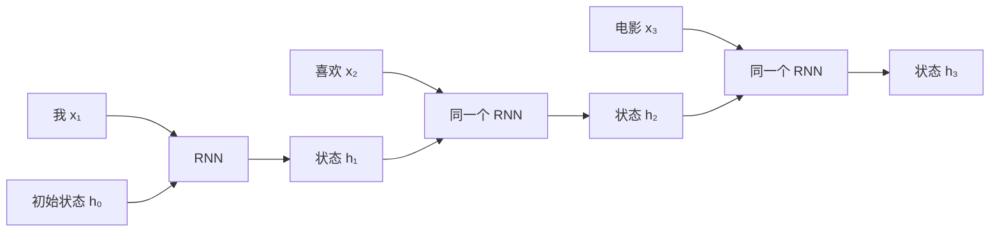
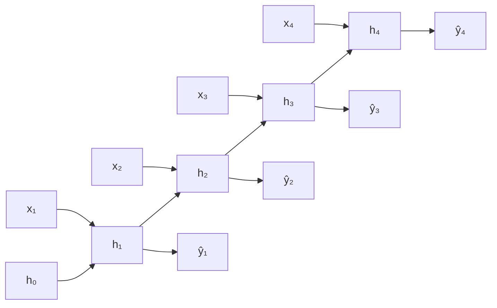

# 简单理解 RNN：神经网络如何记住前文

> [!abstract] 一句话先记住
> 普通神经网络只处理“当前输入”，RNN 则把上一步形成的**隐状态**带到下一步。它不是拥有一块可以无限保存信息的内存，而是在每一步都重新压缩“当前输入 + 过去摘要”。

## 1. 为什么序列需要记忆

判断一张图片是什么，通常只看当前图片就够了。但处理一句话时，当前词的含义往往依赖前文。

例如依次读到：

> 我 / 本来 / 很 / 喜欢 / 这部电影 / 但是……

看到“但是”时，我们会预期后面可能出现转折。这个判断不是由“但是”一个词独立完成的，而是来自前面整段话形成的上下文。

普通的前馈神经网络把每个输入单独映射到输出：

$$
\hat y_t=f(x_t)
$$

如果输入只包含当前词 $x_t$，模型就不知道之前发生了什么。RNN（Recurrent Neural Network，循环神经网络）的核心改动很小：除了当前输入，再把上一步的状态 $h_{t-1}$ 传进来。

图里画了三个 RNN 方块，但它们共享同一组参数。RNN 的“循环”不是神经元原地打转，而是同一个计算单元沿时间反复使用。

## 2. RNN 每一步到底做了什么

最简单的 Elman RNN 可以写成：

$$
h_t=\tanh(W_xx_t+W_hh_{t-1}+b_h)
$$

$$
\hat y_t=g(W_yh_t+b_y)
$$

其中：

- $x_t$ 是第 $t$ 步的输入，例如当前词的向量；
- $h_{t-1}$ 是读完前文后留下的旧状态；
- $h_t$ 是合并当前输入与旧状态后得到的新状态；
- $\hat y_t$ 是当前输出，$g$ 可以是用于分类的 softmax；
- $W_x$、$W_h$、$W_y$ 在所有时间步共享。

可以把 $h_t$ 理解成一张不断改写的便签。每读入一个新词，模型都根据“新词是什么”和“便签上原来写了什么”生成一张新便签。它保存的不是原文，而是对当前任务有用的压缩表示。

共享参数非常重要。无论序列有 5 步还是 500 步，模型学习的都是同一种状态更新规则：

$$
\text{旧状态}+\text{当前输入}\longrightarrow\text{新状态}
$$

因此，RNN 可以处理不同长度的序列，而不需要为每一个位置训练一套新的参数。

## 3. 一个 RNN 可以产生哪几类输出

RNN 不是只用于“下一个词预测”。按照输入和输出的组织方式，常见任务可以分成几类：

| 形式 | 例子 | 怎样使用状态 |
|---|---|---|
| 多对一 | 情感分类、序列分类 | 读完整段序列后，用最终状态分类 |
| 多对多（等长） | 词性标注、逐帧预测 | 每一步都输出一个结果 |
| 一对多 | 根据一个条件生成一段序列 | 用初始条件启动循环，再逐步生成 |
| 多对多（不等长） | 机器翻译、摘要 | Encoder 压缩输入，Decoder 逐步输出 |

双向 RNN 还会分别从左到右、从右到左读取序列，再合并两个方向的状态。它适合已经拿到完整输入的编码任务，但不能直接用于只允许看到过去的在线预测。

## 4. RNN 是怎么训练的

训练时，可以把循环沿时间展开成一条很深的计算链：

展开以后，它看起来像一个层数等于序列长度的前馈网络。模型先累计各时间步的损失：

$$
\mathcal L=\sum_{t=1}^{T}\mathcal L_t
$$

再让梯度从后往前穿过整条时间链。这就是 BPTT（Backpropagation Through Time，随时间反向传播）。实际训练长序列时，常用截断 BPTT，只向前回传固定数量的时间步，以控制显存和计算量。

## 5. 为什么普通 RNN 很难记住很久以前的信息

如果第 $T$ 步的损失依赖第 1 步的状态，梯度就要连续穿过很多次状态变换。链式法则会产生一连串雅可比矩阵的乘积：

$$
\frac{\partial h_T}{\partial h_1}
=
\prod_{t=2}^{T}
\frac{\partial h_t}{\partial h_{t-1}}
$$

当这些局部梯度的尺度大多小于 1，连乘结果会快速趋近于 0，早期信息几乎得不到学习信号，这就是**梯度消失**；当尺度持续大于 1，梯度可能迅速增大，形成**梯度爆炸**。

梯度裁剪可以缓解爆炸，却不能从根本上解决消失。更关键的是，即使计算图可以无限展开，固定维度的 $h_t$ 仍然是一种有限容量的压缩：序列越长，模型越容易在不断改写中丢掉早期细节。

## 6. LSTM 和 GRU 改进了什么

LSTM 与 GRU 仍然属于 RNN。它们没有取消递归，而是在状态更新中加入可学习的“门”，让模型决定：

- 哪些旧信息应该保留；
- 哪些旧信息应该遗忘；
- 哪些新信息应该写入；
- 哪些状态应该暴露给当前输出。

LSTM 显式维护隐藏状态 $h_t$ 和细胞状态 $c_t$；GRU 把结构压缩到一份主要状态中，门的数量也更少。二者都让重要信息和梯度更容易跨越较长时间，但并不意味着模型真的拥有无限记忆。

## 7. 学懂 RNN，真正应该带走什么

RNN 最重要的不是某一组公式，而是三个思想：

1. **状态**：当前判断可以依赖过去形成的摘要；
2. **参数共享**：同一条更新规则可以在任意时间步重复使用；
3. **时间展开**：一个循环程序在训练时可以展开成计算图，并通过 BPTT 学习。

它的主要代价也来自同一个结构：$h_t$ 必须等待 $h_{t-1}$，所以时间步之间难以并行；远距离信息必须经过一条很长的状态传递路径。理解这一点之后，再看 [[论文解读：Attention Is All You Need]] 就会更清楚：Transformer 改变的不是“序列是否有顺序”，而是序列中信息的传递方式。

## 参考资料

- Jeffrey L. Elman, [Finding Structure in Time](https://jeffelman.ucsd.edu/research/publications/), 1990。
- Sepp Hochreiter and Jürgen Schmidhuber, [Long Short-Term Memory](https://doi.org/10.1162/neco.1997.9.8.1735), 1997。
- Kyunghyun Cho et al., [Learning Phrase Representations using RNN Encoder–Decoder for Statistical Machine Translation](https://aclanthology.org/D14-1179/), 2014。

