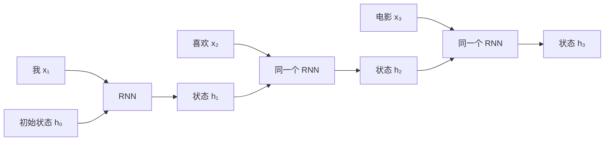
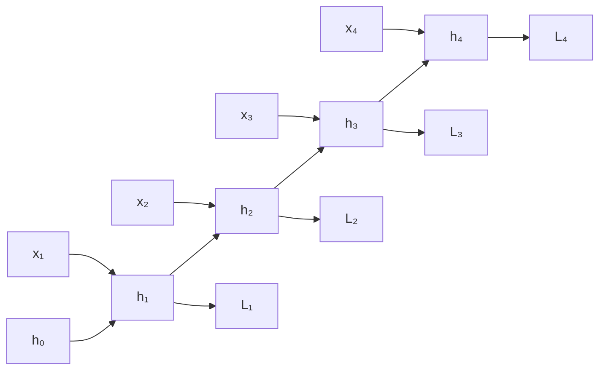
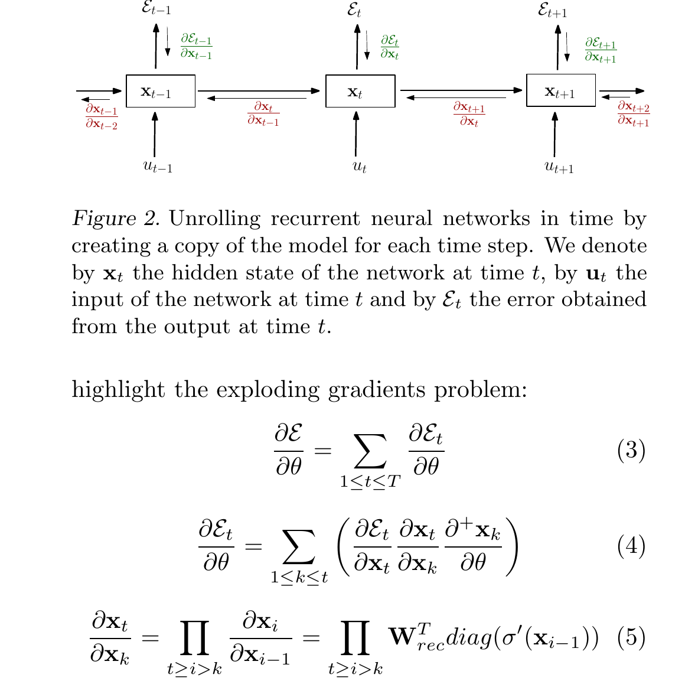

# 简单理解 RNN：神经网络如何记住前文

> [!abstract] 一句话先记住
> 普通神经网络只处理“当前输入”，RNN 则把上一步形成的**隐状态**带到下一步。它不是拥有一块可以无限保存信息的内存，而是在每一步都重新压缩“当前输入 + 过去摘要”。

这篇文章可以分三条路线阅读：只想建立直觉，读第 1-3 节；想真正看懂 BPTT，重点读第 4 节的误差递推和参数梯度；想理解 RNN 为什么难训练，再读第 5-6 节的雅可比连乘、截断 BPTT 与门控结构。

## 1. 为什么序列需要记忆

判断一张图片是什么，通常只看当前图片就够了。但处理一句话时，当前词的含义往往依赖前文。

例如依次读到：

> 我 / 本来 / 很 / 喜欢 / 这部电影 / 但是……

看到“但是”时，我们会预期后面可能出现转折。这个判断不是由“但是”一个词独立完成的，而是来自前面整段话形成的上下文。

普通的前馈神经网络把每个输入单独映射到输出：

$$
\hat y_t=f(x_t)
$$

如果输入只包含当前词 $x_t$，模型就不知道之前发生了什么。RNN（Recurrent Neural Network，循环神经网络）的核心改动很小：除了当前输入，再把上一步的状态 $h_{t-1}$ 传进来。

图里画了三个 RNN 方块，但它们共享同一组参数。RNN 的“循环”不是神经元原地打转，而是同一个计算单元沿时间反复使用。

## 2. RNN 每一步到底做了什么

最简单的 Elman RNN 可以写成：

$$
h_t=\tanh(W_xx_t+W_hh_{t-1}+b_h)
$$

$$
\hat y_t=g(W_yh_t+b_y)
$$

其中：

- $x_t$ 是第 $t$ 步的输入，例如当前词的向量；
- $h_{t-1}$ 是读完前文后留下的旧状态；
- $h_t$ 是合并当前输入与旧状态后得到的新状态；
- $\hat y_t$ 是当前输出，$g$ 可以是用于分类的 softmax；
- $W_x$、$W_h$、$W_y$ 在所有时间步共享。

可以把 $h_t$ 理解成一张不断改写的便签。每读入一个新词，模型都根据“新词是什么”和“便签上原来写了什么”生成一张新便签。它保存的不是原文，而是对当前任务有用的压缩表示。

共享参数非常重要。无论序列有 5 步还是 500 步，模型学习的都是同一种状态更新规则：

$$
\text{旧状态}+\text{当前输入}\longrightarrow\text{新状态}
$$

因此，RNN 可以处理不同长度的序列，而不需要为每一个位置训练一套新的参数。

## 3. 一个 RNN 可以产生哪几类输出

RNN 不是只用于“下一个词预测”。按照输入和输出的组织方式，常见任务可以分成几类：

| 形式 | 例子 | 怎样使用状态 |
|---|---|---|
| 多对一 | 情感分类、序列分类 | 读完整段序列后，用最终状态分类 |
| 多对多（等长） | 词性标注、逐帧预测 | 每一步都输出一个结果 |
| 一对多 | 根据一个条件生成一段序列 | 用初始条件启动循环，再逐步生成 |
| 多对多（不等长） | 机器翻译、摘要 | Encoder 压缩输入，Decoder 逐步输出 |

双向 RNN 还会分别从左到右、从右到左读取序列，再合并两个方向的状态。它适合已经拿到完整输入的编码任务，但不能直接用于只允许看到过去的在线预测。

## 4. BPTT 到底在反向传播什么

BPTT（Backpropagation Through Time，随时间反向传播）并不是一种与普通反向传播完全不同的算法。它只做了一件事：**先把循环沿时间展开成一个共享参数的深层计算图，再对这张图应用链式法则。**

### 4.1 先把一个时间步拆完整

为了看清每一项从哪里来，把第 $t$ 步写成四层计算。以下向量都按列向量处理：

$$
a_t=W_xx_t+W_hh_{t-1}+b_h
$$

$$
h_t=\tanh(a_t)
$$

$$
o_t=W_yh_t+b_y
$$

$$
\hat y_t=\operatorname{softmax}(o_t)
$$

$a_t$ 是进入激活函数前的值，$h_t$ 是新的隐状态，$o_t$ 是分类 logits。假设每一步都做分类，总损失为：

$$
\mathcal L
=
\sum_{t=1}^{T}\mathcal L_t
=
-\sum_{t=1}^{T}\sum_c y_{t,c}\log \hat y_{t,c}
$$

如果任务只在最后一步分类，可以把 $t<T$ 时的 $\mathcal L_t$ 看成 0，后面的推导不需要改变。

### 4.2 时间展开后，参数没有复制

图里像是有四层网络，实际却只有一组 $W_x$、$W_h$、$W_y$。展开只是把同一组参数在四个时间步的使用位置画出来。因此，某个参数的最终梯度必须把它在所有时间步造成的影响相加。

*原论文 Figure 2 与 equations (3)-(5) 局部裁剪：RNN 展开后，每个时刻既接收当前损失，也接收未来状态传回的误差；总参数梯度是各时间贡献之和。原图的状态 $x_t$、输入 $u_t$、损失 $\mathcal E_t$，分别对应本文的 $h_t$、$x_t$、$\mathcal L_t$。来源：Pascanu、Mikolov 与 Bengio，[On the difficulty of training recurrent neural networks](https://proceedings.mlr.press/v28/pascanu13.html)，ICML 2013；本文于 2026-08-02 从原论文 PDF 第 2 页裁剪，未重绘。*

### 4.3 先求当前输出产生的误差

softmax 与交叉熵组合后，logits 上的梯度有一个很简洁的形式：

$$
e_t
\equiv
\frac{\partial \mathcal L_t}{\partial o_t}
=
\hat y_t-y_t
$$

这个 $e_t$ 只描述第 $t$ 步输出错了多少。它通过 $o_t=W_yh_t+b_y$ 传回隐状态，得到当前损失对 $h_t$ 的直接贡献：

$$
\left.\frac{\partial \mathcal L}{\partial h_t}\right|_{\text{当前输出}}
=
W_y^Te_t
$$

但 $h_t$ 还会影响 $h_{t+1}$，进而影响后面所有损失，所以这里只算了一半。

### 4.4 隐状态误差为什么是一个反向递推

定义激活前误差：

$$
\delta_t
\equiv
\frac{\partial \mathcal L}{\partial a_t}
$$

$h_t$ 的总误差有两个来源：当前输出 $\mathcal L_t$，以及未来状态 $h_{t+1}$。由于

$$
a_{t+1}=W_xx_{t+1}+W_hh_t+b_h,
$$

未来误差传回 $h_t$ 时要乘 $W_h^T$：

$$
\frac{\partial \mathcal L}{\partial h_t}
=
W_y^Te_t
+
W_h^T\delta_{t+1}
$$

再穿过 $h_t=\tanh(a_t)$。因为 $\tanh'(a_t)=1-h_t^2$，得到 BPTT 最核心的递推式：

$$
\boxed{
\delta_t
=
\left(W_y^Te_t+W_h^T\delta_{t+1}\right)
\odot
\left(1-h_t\odot h_t\right)
}
$$

边界条件是 $\delta_{T+1}=0$。计算从 $t=T$ 开始向前走：先算 $\delta_T$，再算 $\delta_{T-1}$，直到 $\delta_1$。$\odot$ 表示逐元素乘法。

这个式子值得读成一句话：

> 第 $t$ 步收到的学习信号 = 当前输出的错误 + 未来传回的错误；两者合并后，再乘当前激活函数的局部导数。

### 4.5 共享参数的梯度为什么要沿时间求和

有了每一步的 $e_t$ 和 $\delta_t$，参数梯度只是“误差 × 当时输入”的外积，并在时间上累加：

$$
\boxed{
\begin{aligned}
\frac{\partial \mathcal L}{\partial W_y}
&=\sum_{t=1}^{T}e_th_t^T,
&\frac{\partial \mathcal L}{\partial b_y}
&=\sum_{t=1}^{T}e_t,\\
\frac{\partial \mathcal L}{\partial W_x}
&=\sum_{t=1}^{T}\delta_tx_t^T,
&\frac{\partial \mathcal L}{\partial b_h}
&=\sum_{t=1}^{T}\delta_t,\\
\frac{\partial \mathcal L}{\partial W_h}
&=\sum_{t=1}^{T}\delta_th_{t-1}^T.
\end{aligned}
}
$$

以三步 RNN 为例，循环权重的梯度是：

$$
\frac{\partial \mathcal L}{\partial W_h}
=
\delta_1h_0^T
+
\delta_2h_1^T
+
\delta_3h_2^T
$$

这就是“展开了计算图，但没有复制参数”的数学含义。自动微分框架会替我们执行这些加法，BPTT 的本质仍是这条误差递推和参数梯度求和。

## 5. 雅可比连乘为什么会导致梯度消失或爆炸

上面的递推式适合真正计算梯度；把它改写成雅可比连乘，则更容易分析长期依赖。

### 5.1 从第 $T$ 步回到第 $k$ 步

定义单步状态雅可比：

$$
J_t
\equiv
\frac{\partial h_t}{\partial h_{t-1}}
=
D_tW_h
$$

其中：

$$
D_t
=
\operatorname{diag}\left(1-h_t\odot h_t\right)
$$

如果只看终点损失 $\mathcal L_T$，令 $g_t=\partial\mathcal L_T/\partial h_t$，那么：

$$
g_k
=
J_{k+1}^T
J_{k+2}^T
\cdots
J_T^Tg_T
$$

取二范数并使用矩阵范数的次乘性：

$$
\|g_k\|_2
\le
\|g_T\|_2
\prod_{i=k+1}^{T}\|J_i\|_2
$$

如果沿途每个 $\|J_i\|_2\le\eta<1$，就有：

$$
\|g_k\|_2
\le
\eta^{T-k}\|g_T\|_2
$$

时间距离 $T-k$ 每增加一步，信号都再缩小一次，所以长期梯度会指数衰减。对于 tanh，$\|D_t\|_2\le1$；当 $h_t$ 接近 $-1$ 或 $1$ 的饱和区时，$1-h_t^2$ 接近 0，衰减会更严重。

反过来，如果一串雅可比持续在相近方向上把向量放大，连乘结果就可能指数增长，形成梯度爆炸。需要注意：单独看到 $\|W_h\|_2>1$ 并不能断言一定爆炸，因为激活导数、输入和各时刻的方向对齐都会影响最终乘积。

一个近似线性的标量例子最直观。设：

$$
h_t=\tanh(wh_{t-1})
$$

当状态接近 0 时，$\tanh'(\cdot)\approx1$，于是：

$$
\frac{\partial h_T}{\partial h_k}
\approx
w^{T-k}
$$

相隔 20 步时，$w=0.8$ 得到 $0.8^{20}\approx0.0115$；$w=1.2$ 则得到 $1.2^{20}\approx38.34$。同一个连乘结构，一边把远处信号压没，另一边把它放大到破坏优化。

### 5.2 梯度裁剪解决的是哪一半

梯度爆炸时，常按阈值 $\tau$ 缩放完整梯度 $g$：

$$
g
\leftarrow
\min\left(1,\frac{\tau}{\|g\|_2}\right)g
$$

当梯度范数不超过 $\tau$ 时不变；超过时只缩短长度，不改变方向。它可以防止一次更新步幅过大，但无法让已经衰减到接近 0 的长期梯度重新出现。因此，**梯度裁剪主要处理爆炸，不解决梯度消失。**

### 5.3 截断 BPTT 不只是“省一点显存”

完整 BPTT 会保存整段序列的中间状态，并让损失一直追溯到序列开头。对第 $t$ 步损失，更一般的参数梯度可以写成：

$$
\frac{\partial \mathcal L_t}{\partial \theta}
=
\sum_{k=1}^{t}
\frac{\partial \mathcal L_t}{\partial h_t}
\frac{\partial h_t}{\partial h_k}
\frac{\partial^+ h_k}{\partial \theta}
$$

$\partial^+ h_k/\partial\theta$ 表示只看第 $k$ 步直接使用参数造成的变化，暂时把 $h_{k-1}$ 当常量。

截断 BPTT 选择窗口长度 $K$，只保留最近 $K$ 步：

$$
\frac{\partial \mathcal L_t}{\partial \theta}
\approx
\sum_{k=\max(1,t-K+1)}^{t}
\frac{\partial \mathcal L_t}{\partial h_t}
\frac{\partial h_t}{\partial h_k}
\frac{\partial^+ h_k}{\partial \theta}
$$

工程上通常把上一窗口末尾的状态值继续传给下一窗口，但对它执行 `stop-gradient` 或 `detach`。也就是说：**前向记忆继续，反向因果链在窗口边界被切断。**

这样可以把隐状态激活的存储规模从随总长度 $T$ 增长，降为随窗口 $K$ 增长；代价是丢弃超过 $K$ 步的梯度贡献。截断 BPTT 因而是对完整梯度的有偏近似，不只是一个不改变数学目标的显存技巧。$K$ 越短，训练越省资源，但模型越难通过梯度学到更长的依赖。

更关键的是，即使计算图可以无限展开，固定维度的 $h_t$ 仍然是一种有限容量压缩：序列越长，模型越容易在不断改写中丢掉早期细节。优化问题和表示容量问题都会限制普通 RNN 的长期记忆。

## 6. LSTM 和 GRU 改进了什么

LSTM 与 GRU 仍然属于 RNN。它们没有取消递归，而是在状态更新中加入可学习的“门”，让模型决定：

- 哪些旧信息应该保留；
- 哪些旧信息应该遗忘；
- 哪些新信息应该写入；
- 哪些状态应该暴露给当前输出。

LSTM 显式维护隐藏状态 $h_t$ 和细胞状态 $c_t$；GRU 把结构压缩到一份主要状态中，门的数量也更少。二者都让重要信息和梯度更容易跨越较长时间，但并不意味着模型真的拥有无限记忆。

从 BPTT 的角度看，LSTM 最关键的变化是为细胞状态增加一条更直接的加法更新路径：

$$
c_t
=
f_t\odot c_{t-1}
+
i_t\odot \tilde c_t
$$

如果暂时固定门值，沿这条直接路径有：

$$
\frac{\partial c_t}{\partial c_{t-1}}
=
\operatorname{diag}(f_t)
$$

当遗忘门 $f_t$ 在重要维度上接近 1，误差信号就不必每一步都穿过普通 RNN 的“循环矩阵 + tanh 导数”连乘。门控结构不是取消 BPTT，而是在 BPTT 所经过的计算图中，提供更容易保留信息和梯度的路径。

## 7. 学懂 RNN，真正应该带走什么

RNN 最重要的不是某一组公式，而是三个思想：

1. **状态**：当前判断可以依赖过去形成的摘要；
2. **参数共享**：同一条更新规则可以在任意时间步重复使用；
3. **时间展开**：一个循环程序在训练时可以展开成计算图，并通过 BPTT 学习。

它的主要代价也来自同一个结构：$h_t$ 必须等待 $h_{t-1}$，所以时间步之间难以并行；远距离信息必须经过一条很长的状态传递路径。理解这一点之后，再看 [[论文解读：Attention Is All You Need]] 就会更清楚：Transformer 改变的不是“序列是否有顺序”，而是序列中信息的传递方式。

## 参考资料

- Jeffrey L. Elman, [Finding Structure in Time](https://jeffelman.ucsd.edu/research/publications/), 1990。
- Paul J. Werbos, [Backpropagation Through Time: What It Does and How to Do It](https://doi.org/10.1109/5.58337), 1990。
- Sepp Hochreiter and Jürgen Schmidhuber, [Long Short-Term Memory](https://doi.org/10.1162/neco.1997.9.8.1735), 1997。
- Razvan Pascanu, Tomas Mikolov, and Yoshua Bengio, [On the Difficulty of Training Recurrent Neural Networks](https://proceedings.mlr.press/v28/pascanu13.html), 2013。
- Kyunghyun Cho et al., [Learning Phrase Representations using RNN Encoder–Decoder for Statistical Machine Translation](https://aclanthology.org/D14-1179/), 2014。
