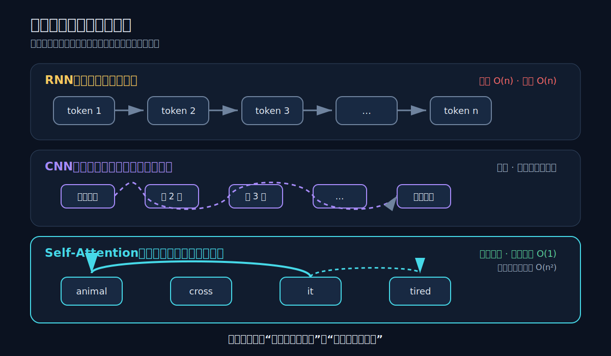
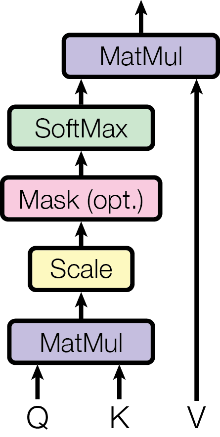
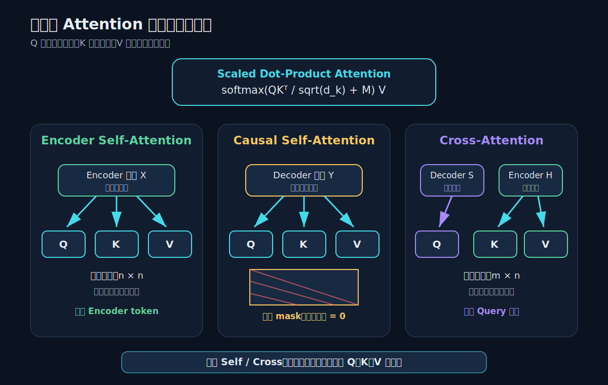
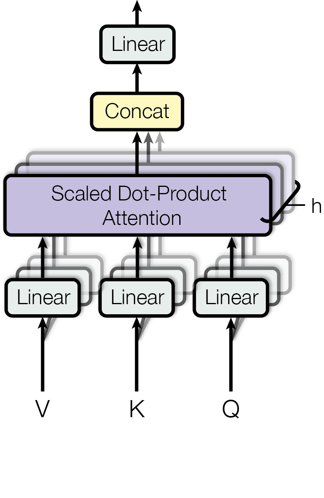
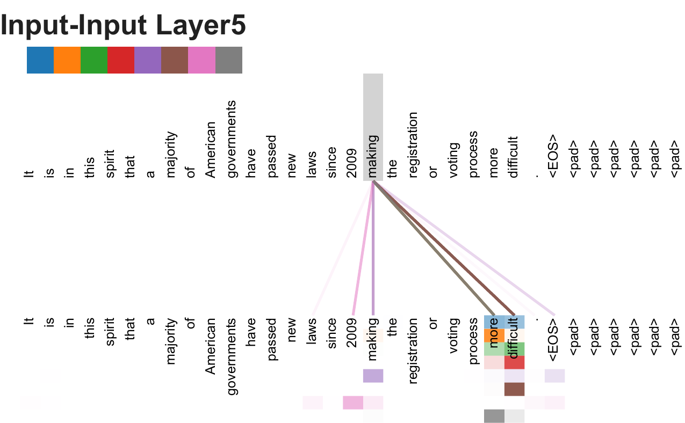
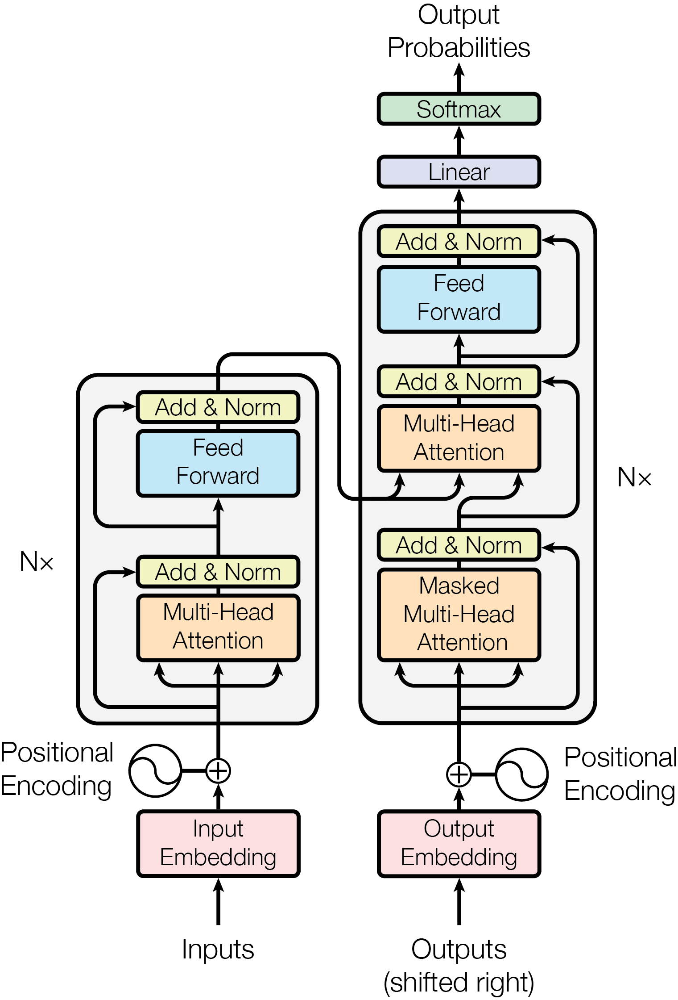
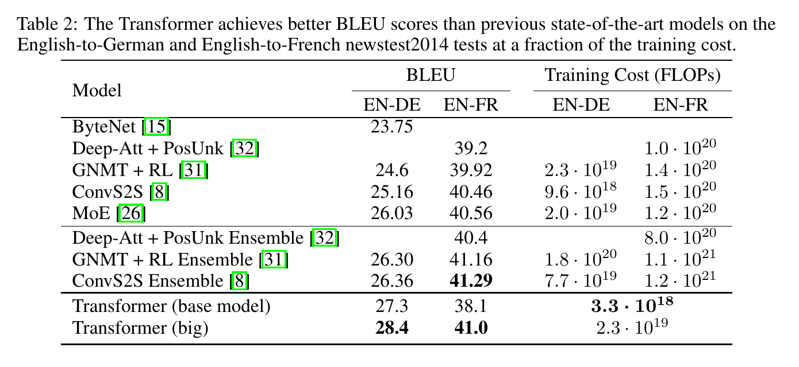
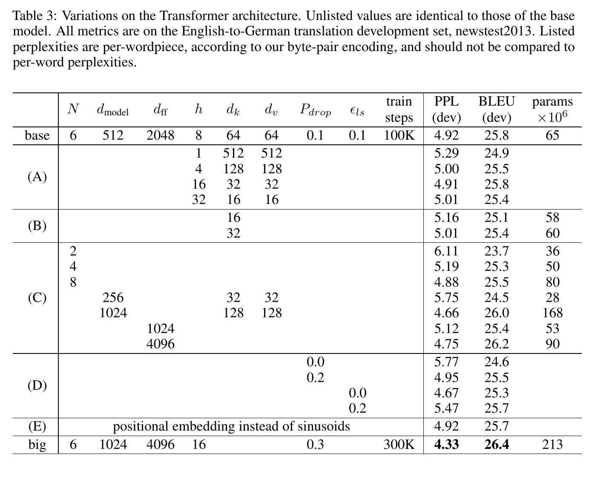
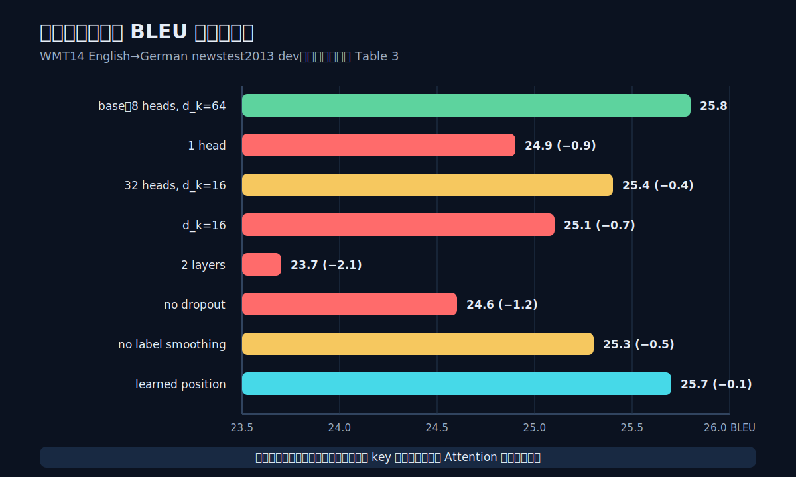

# 论文解读：Attention Is All You Need

> **核心判断：Transformer 没有让序列建模“不再有顺序”，而是把 token 间的信息路由从 RNN 的逐步状态传递、CNN 的逐层局部传播，移交给一次可并行计算的内容寻址。Self-Attention 与 Cross-Attention 不是两套算法：它们共享同一个 Q/K/V 算子，只是“谁提出问题、去哪里取信息”不同。**

论文：Ashish Vaswani et al., **Attention Is All You Need**, NIPS 2017。  
原始材料：[arXiv](https://arxiv.org/abs/1706.03762) · [NIPS 论文页](https://papers.neurips.cc/paper/7181-attention-is-all-you-need) · [NIPS 评审](https://papers.neurips.cc/paper_files/paper/2017/file/3f5ee243547dee91fbd053c1c4a845aa-Reviews.html) · [原始 Tensor2Tensor 代码库](https://github.com/tensorflow/tensor2tensor)

图表复用说明：论文 PDF 首页明确允许在注明出处的学术或新闻作品中复用表格和图片。下文原图均取自官方论文 source/PDF，保留原面板与数值，只裁去无关页边空白；解释性 SVG 会明确标为“本文重绘”。

本文面向能读懂矩阵乘法、softmax 和基本神经网络的读者，不预设已经掌握 Transformer。文章只用一套记号，把原论文中的三种 Attention 放进同一张地图：

1. Encoder Self-Attention：输入序列内部互相读取；
2. Decoder Causal Self-Attention：输出前缀内部互相读取，但不能看未来；
3. Encoder–Decoder Attention：Decoder 读取 Encoder；今天通常称为 Cross-Attention。

后来的 BERT、GPT、ViT、DiT、文生图和多模态模型都改造过这块底盘，但它们不是原论文的实验结论。本文会在最后明确区分：**2017 年论文直接验证了什么，后来系统只是如何复用它。**

## 一、先看真正的瓶颈：不是“记不住”，而是信息必须排队

假设要把英文句子：

> The animal did not cross the street because it was too tired.

翻译为：

> 那只动物没有穿过街道，因为它太累了。

生成“它”时，模型既要知道已经生成了“因为”，又要从源句判断 `it` 指向 `animal`，还要保留 `tired` 的语义。信息需要跨越多个位置。

2017 年主流序列模型通常用 RNN/LSTM 或 CNN：

- **RNN** 把第 $t$ 个位置的表示建立在 $h_{t-1}$ 上。训练一个句子时，$h_t$ 必须等 $h_{t-1}$，远距离信息要沿很多时间步传递；
- **CNN** 可以并行处理位置，但一个局部卷积核看不到整句。远位置必须通过加深网络、扩大卷积核或空洞卷积逐层接通；
- **传统 Encoder–Decoder Attention** 已经允许 Decoder 读取 Encoder，但 Encoder 和 Decoder 内部仍主要依赖 RNN 或 CNN。

Transformer 的关键责任迁移是：**不再让“位置邻接”决定信息先后经过谁，而让当前 token 的内容直接决定去读谁。**



*本文重绘 A：三种骨架接通远距离关系的路径。依据论文 Section 4 与 Table 1 绘制，不是论文原图。*

原论文用三个维度比较这一变化：

| 结构 | 每层复杂度 | 最少串行操作 | 任意两位置最大路径 |
|---|---:|---:|---:|
| Self-Attention | $O(n^2d)$ | $O(1)$ | $O(1)$ |
| Recurrent | $O(nd^2)$ | $O(n)$ | $O(n)$ |
| Convolutional | $O(knd^2)$ | $O(1)$ | $O(\log_k n)$ |
| Restricted Self-Attention | $O(rnd)$ | $O(1)$ | $O(n/r)$ |

这里 $n$ 是序列长度，$d$ 是表示维度，$k$ 是卷积核宽度，$r$ 是局部注意力窗口。

这张表不能被简化成“Attention 永远更快”：

- 当 $n<d$ 时，$n^2d<nd^2$，这正是论文所处的机器翻译常见区间；
- 当序列很长时，$O(n^2)$ 的注意力矩阵会成为时间和显存瓶颈；
- $O(1)$ 指一层内部所有位置可以并行计算，不代表自回归 Decoder 能一次生成完整答案；
- 路径短意味着信号不必经过很多中间位置，但不自动等于模型一定学会正确的长程关系。

因此更准确的说法是：

> Transformer 用二次的全连接位置交互，换来了训练时的位置并行和常数级的跨位置路径。

## 二、任务契约：原论文到底解决什么

| 项目 | 原始 Transformer |
|---|---|
| 输入 | 一条源语言 token 序列 $x_{1:n}$ |
| 输出 | 一条目标语言 token 序列 $y_{1:m}$ |
| 监督 | 平行语料中的完整源句—目标句对 |
| Encoder | 同时编码全部源 token |
| Decoder 训练 | 看到右移后的真实目标前缀，用 causal mask 并行预测各位置 |
| Decoder 推理 | 从起始符开始逐 token 自回归生成，论文使用 beam search |
| 主要任务 | WMT 2014 英德、英法机器翻译 |
| 额外验证 | arXiv 后续版本加入英语成分句法分析 |
| 不解决 | 非自回归生成、超长序列二次复杂度、图像/音频/视频任务、现代 LLM 训练配方 |

论文的问题不是“Attention 有没有用”。Bahdanau 等人的 [Neural Machine Translation by Jointly Learning to Align and Translate](https://arxiv.org/abs/1409.0473) 已把 Attention 用于 RNN Encoder–Decoder，self-attention 也已在阅读理解、摘要、文本蕴含和句子表示中出现。

原论文更窄也更大胆的问题是：

> **序列转导模型能不能彻底移除按位置递归的 RNN 和局部传播的 CNN，只靠 Attention 加逐位置前馈网络完成编码与解码？**

按作者的文献判断，Transformer 是首个完全依赖 self-attention 来计算输入、输出表示，不再使用 sequence-aligned RNN 或 CNN 的序列转导模型。这个“组合成完整骨架”的贡献，比把某一个局部公式说成凭空发明更准确。

## 三、先把 Attention 看成一次“内容寻址”

Attention 接收三组向量：

- **Query（Q）**：当前位置想找什么；
- **Key（K）**：每个候选位置用什么特征接受匹配；
- **Value（V）**：一旦被选中，真正把什么内容取回来。

读原图从下往上走：先用 $QK^\top$ 计算所有查询—键匹配，再缩放并选择性加 mask，经 softmax 得到路由权重，最后与 $V$ 相乘取回内容。右侧旁路说明 $V$ 不参与匹配，但参与最终聚合。



*论文原图 Figure 2（左），来源：[Vaswani et al., Attention Is All You Need](https://arxiv.org/abs/1706.03762)。它直接支持 scaled dot-product attention 的运算顺序，以及 mask 位于 softmax 之前；它是算子结构图，不证明每个注意力权重都可被解释为人类语义或因果归因。*

对一个 query $q_i$ 和一组 $(k_j,v_j)$，先计算匹配分数：

$$
s_{ij}=\frac{q_i^\top k_j}{\sqrt{d_k}}
$$

再对所有候选 key 做 softmax：

$$
\alpha_{ij}
=
\frac{\exp(s_{ij})}
{\sum_{t=1}^{n_k}\exp(s_{it})}
$$

最后按权重混合 value：

$$
o_i=\sum_{j=1}^{n_k}\alpha_{ij}v_j
$$

把全部 query 堆成矩阵，就得到论文最核心的公式：

$$
\operatorname{Attention}(Q,K,V)
=
\operatorname{softmax}
\left(
\frac{QK^\top}{\sqrt{d_k}}
\right)V
$$

若加入 mask，可写成更通用的形式：

$$
\operatorname{Attention}(Q,K,V;M)
=
\operatorname{softmax}
\left(
\frac{QK^\top}{\sqrt{d_k}}+M
\right)V
$$

其中允许读取的位置令 $M_{ij}=0$，禁止读取的位置令 $M_{ij}=-\infty$。softmax 后，非法连接的权重变成 0。

### 3.1 为什么必须同时有 Q、K、V

Q/K/V 最容易被误记成三个并列的“内容副本”。它们其实把**路由**和**载荷**拆开：

- $q_i^\top k_j$ 只负责“第 $i$ 个位置该不该读第 $j$ 个位置”；
- $v_j$ 负责“读到以后，传回什么表示”；
- 同一个 token 可以用一组特征参与匹配，用另一组特征传递内容。

若直接拿原向量既匹配又传值，模型的“可检索特征”和“有效载荷”被绑死。学习矩阵 $W^Q,W^K,W^V$ 给了模型三套不同坐标系。

设输入表示为 $X\in\mathbb R^{n\times d_{\text{model}}}$：

$$
Q=XW^Q,\qquad
K=XW^K,\qquad
V=XW^V
$$

原论文 base 模型中 $d_{\text{model}}=512$，8 个 head 各自使用 $d_k=d_v=64$。

### 3.2 为什么除以 $\sqrt{d_k}$

论文给出的直觉是：若 $q$、$k$ 各维独立、均值为 0、方差为 1，则

$$
q^\top k=\sum_{\ell=1}^{d_k}q_\ell k_\ell
$$

的方差随 $d_k$ 增长到 $d_k$。维度越高，logit 越容易绝对值很大，把 softmax 推进近似 one-hot 的饱和区，梯度会很小。

除以 $\sqrt{d_k}$ 后，缩放后点积的方差回到约 1：

$$
\operatorname{Var}
\left(
\frac{q^\top k}{\sqrt{d_k}}
\right)
\approx 1
$$

这不是为了让权重“更平均”，而是为了让 softmax 的温度不随 head 维度失控。实际网络中的向量不严格满足独立同分布假设，但这个尺度校正仍是稳定计算的合理基准。

### 3.3 Attention 的输出长度由谁决定

若

$$
Q\in\mathbb R^{n_q\times d_k},\quad
K\in\mathbb R^{n_k\times d_k},\quad
V\in\mathbb R^{n_k\times d_v},
$$

则

$$
QK^\top\in\mathbb R^{n_q\times n_k},
\qquad
O\in\mathbb R^{n_q\times d_v}.
$$

所以输出有 $n_q$ 个位置：**谁提供 Query，谁保留位置骨架；K/V 只提供可读取的记忆。**

这一条是理解 Cross-Attention 的钥匙。图像 token 向文本做 Cross-Attention，输出仍是一组图像位置；Decoder token 向 Encoder 做 Cross-Attention，输出仍是一组 Decoder 位置。

## 四、Self-Attention 与 Cross-Attention：同一算子，三种接线



*本文重绘 B：Self / Cross 的差异不在公式，而在张量来源与合法通信边。依据论文 Section 3.2.3 绘制，不是论文原图。*

| 类型 | Query 来源 | Key/Value 来源 | 分数矩阵 | 典型 mask | 作用 |
|---|---|---|---:|---|---|
| Encoder Self-Attention | Encoder 当前序列 | 同一 Encoder 序列 | $n\times n$ | padding | 让每个源 token 汇聚全句上下文 |
| Decoder Causal Self-Attention | Decoder 当前序列 | 同一 Decoder 序列 | $m\times m$ | causal + padding | 只从目标前缀构造当前位置 |
| Cross-Attention | Decoder 当前状态 | Encoder 最终输出 | $m\times n$ | 源端 padding | 每个目标位置按需读取源句 |

### 4.1 Encoder Self-Attention：同一批 token 互相改写

给定上一层 Encoder 表示 $X$：

$$
Q=XW^Q,\qquad K=XW^K,\qquad V=XW^V
$$

Q、K、V 都来自同一个 $X$，所以叫 Self-Attention。

但“self”不意味着一个 token 只看自己。恰恰相反，它表示**查询集合与被查询集合是同一组位置**。对“animal”这个 token，输出不再只是词向量，而是融合了 `did not cross`、`street`、`it`、`tired` 等全句信息后的上下文表示。

在 Encoder 中没有未来概念，任何源位置都可以读任何源位置。实际实现还会屏蔽 padding，但原论文最核心的结构区别是“全可见”。

### 4.2 Decoder Causal Self-Attention：同源，但未来被封死

Decoder 的 Q/K/V 同样来自目标序列表示，因此仍是 Self-Attention；但为了保持自回归分解：

$$
p(y_{1:m}\mid x)
=
\prod_{i=1}^{m}p(y_i\mid y_{<i},x),
$$

预测 $y_i$ 时不能读取 $y_{i+1:m}$。

对应 causal mask：

$$
M_{ij}=
\begin{cases}
0, & j\le i\\
-\infty, & j>i
\end{cases}
$$

训练时整条目标句已经在张量里，mask 负责阻断未来信息；目标 embedding 再整体右移一位，保证位置 $i$ 的输入只包含 $y_{<i}$。

这带来一个容易混淆的结论：

- **训练**可以一次计算所有目标位置，因为依赖约束由矩阵 mask 表达；
- **推理**仍必须先生成 $y_1$，再生成 $y_2$，直到结束。

Transformer 消除了层内沿 token 的循环，不等于消除了自回归生成的时间顺序。

### 4.3 Cross-Attention：Query 在一边，K/V 在另一边

原论文称它为 **encoder–decoder attention**，后来通常叫 Cross-Attention。

设 Encoder 的最终输出为

$$
H\in\mathbb R^{n\times d_{\text{model}}},
$$

Decoder 在 Cross-Attention 前的状态为

$$
S\in\mathbb R^{m\times d_{\text{model}}}.
$$

则

$$
Q=SW^Q,\qquad
K=HW^K,\qquad
V=HW^V.
$$

于是

$$
\operatorname{CrossAttn}(S,H)
=
\operatorname{softmax}
\left(
\frac{(SW^Q)(HW^K)^\top}{\sqrt{d_k}}
\right)
(HW^V).
$$

对翻译例子，生成中文“它”时：

- Query 表达 Decoder 当前的需求：“在已有中文前缀下，我现在需要什么源语义？”
- Key 让英文源 token 可被匹配；
- Value 把被选中源位置的语义送回“它”这个 Decoder 位置。

Cross-Attention 不是简单“把两组特征拼在一起”。它是一种有方向的读取：

> Decoder 向 Encoder 提问；Encoder 提供索引和内容；更新的是 Decoder。

若把方向换成图像读文本，则 Q 来自图像、K/V 来自文本，更新的是图像 token。算子不变，信息流方向变了。

### 4.4 Self 与 Cross 的最小判别法

不要根据模块名字判断，直接追踪张量来源：

```text
Q、K、V 来自同一组状态        → Self-Attention
Q 来自 A，K/V 来自 B          → A 对 B 的 Cross-Attention
Self-Attention 再加上三角 mask → Causal Self-Attention
```

是否多头、是否使用 FlashAttention、是否加 RoPE，都不改变这个判别。

## 五、Multi-Head Attention：不是重复八遍，而是并行学习八套路由坐标

单头 Attention 只有一套匹配空间和一套 value 子空间。论文认为，一次加权平均会把不同关系混在一起，因此把 $d_{\text{model}}$ 投影到 $h$ 组较小子空间：

读原图先看底部三组线性投影如何复制成 $h$ 组 Q/K/V，再看中间每组独立执行 scaled dot-product attention，最后才是 concat 与输出线性层。多头发生在“不同投影子空间并行路由”，而不是把同一个注意力结果复制八次。



*论文原图 Figure 2（右），来源：[Attention Is All You Need](https://arxiv.org/abs/1706.03762)。它支持多头的结构定义：每个 head 有独立投影，结果拼接后再映射回模型维度；它不能证明不同 head 必然学习互不重复、稳定可命名的人类关系。*

$$
\operatorname{head}_i
=
\operatorname{Attention}
\left(
QW_i^Q,\,
KW_i^K,\,
VW_i^V
\right)
$$

再拼接并投影：

$$
\operatorname{MultiHead}(Q,K,V)
=
\operatorname{Concat}
\left(
\operatorname{head}_1,\ldots,\operatorname{head}_h
\right)W^O
$$

base 模型：

$$
d_{\text{model}}=512,\qquad
h=8,\qquad
d_k=d_v=64.
$$

所以每个 head 输出 64 维，8 个 head 拼回 512 维。由于 head 维度按 $d_{\text{model}}/h$ 缩小，总计算量与一个 512 维单头 Attention 同量级，而不是凭空放大 8 倍。

### 5.1 多头到底“买”了什么

更准确的直觉是：

- 不同 head 有不同的 $W_i^Q,W_i^K,W_i^V$；
- 同一对 token 在不同 head 中可以得到不同匹配分数；
- 一个 head 可偏向局部或句法关系，另一个可偏向指代或远距离关系；
- 拼接保留多组结果，避免过早压成一次平均。

原论文附录展示了某些 head 对长距离短语、指代和句法结构的清晰注意模式。下面这张原图应从左侧 query `making` 开始读：不同颜色对应不同 attention head，连线越深表示权重越高；若干 head 把 `making` 与远处的 `more`、`difficult` 连起来。



*论文原图 Figure 3，来源：[论文 PDF](https://arxiv.org/pdf/1706.03762)。它表明至少在这个被选出的句子与层中，某些 head 的注意模式与可解释的远距离短语关系一致。这只是定性个案，不证明每个 head 都有稳定、唯一的人类语义，也不证明这些高权重连线是模型预测的因果理由。*

### 5.2 多头没有解决什么

- 每个 head 仍产生 $n_q\times n_k$ 的分数；
- 标准全局 Multi-Head Attention 仍是 $O(n^2)$；
- head 更多不保证更好：子空间太窄时，匹配能力会下降；
- 不同 head 可能冗余，论文没有证明八个 head 是普适最优值。

## 六、Attention 不是完整的 Transformer

“Attention Is All You Need”是一个有传播力的标题，但原模型至少还依赖：

1. token embedding；
2. positional encoding；
3. residual connection；
4. layer normalization；
5. position-wise FFN；
6. dropout 与 label smoothing；
7. 输出线性层与 softmax；
8. 自回归目标、数据、优化器和解码策略。

删掉这些，剩下的 Attention 算子并不能单独构成论文里的 Transformer。

读完整架构图时先分清左右两条栈：Encoder 只有 self-attention 与 FFN；Decoder 多一层读取 Encoder 输出的 cross-attention，并在底部 masked self-attention 中阻止看到未来 token。最后留意每个子层外都有残差与 Add & Norm。



*论文原图 Figure 1，来源：[Attention Is All You Need](https://arxiv.org/abs/1706.03762)。它直接支持原始模型由 Encoder、masked Decoder、Cross-Attention、FFN、残差归一化与位置编码共同组成；它不支持把 2017 年的 post-norm、正弦位置编码或 Encoder–Decoder 形态视为后来所有 Transformer 的固定定义。*

### 6.1 原始 Encoder block

原论文使用今天常说的 **post-norm**：

$$
\tilde X
=
\operatorname{LayerNorm}
\left(
X+\operatorname{MultiHeadSelfAttn}(X)
\right)
$$

$$
X'
=
\operatorname{LayerNorm}
\left(
\tilde X+\operatorname{FFN}(\tilde X)
\right)
$$

Encoder 堆叠 $N=6$ 层。

### 6.2 原始 Decoder block

Decoder 每层有三个子层：

$$
\tilde Y
=
\operatorname{LayerNorm}
\left(
Y+\operatorname{MaskedSelfAttn}(Y)
\right)
$$

$$
\hat Y
=
\operatorname{LayerNorm}
\left(
\tilde Y+\operatorname{CrossAttn}(\tilde Y,H)
\right)
$$

$$
Y'
=
\operatorname{LayerNorm}
\left(
\hat Y+\operatorname{FFN}(\hat Y)
\right)
$$

其中 $H$ 是 Encoder 最终输出。Decoder 也堆叠 6 层。

后来很多大模型使用 pre-norm、RMSNorm、SwiGLU、RoPE、GQA/MQA 或去掉 Encoder。这些是后续演进，不能倒过来说成 2017 年原结构。

### 6.3 Attention 负责跨位置通信，FFN 负责逐位置加工

论文的 FFN 对每个位置独立使用同一组参数：

$$
\operatorname{FFN}(x)
=
\max(0,xW_1+b_1)W_2+b_2.
$$

base 模型的通道变化是：

$$
512\rightarrow 2048\rightarrow 512.
$$

可以把两类子层的职责记为：

- Attention：决定“从哪些位置取回哪些信息”；
- FFN：决定“在当前 token 内怎样重组通道特征”。

Residual connection 保留原表示并提供短梯度路径，LayerNorm 稳定每层数值。Transformer 的能力来自这套交替堆叠，而不是一张注意力矩阵孤立工作。

## 七、没有 RNN 以后，顺序从哪里来

Self-Attention 本身对位置排列是置换等变的：把 token 的顺序和输出顺序一起置换，算子不会知道谁原来在第一位。模型必须显式注入位置信息。

原论文把位置编码加到 Encoder 和 Decoder 最底部的 token embedding：

$$
\operatorname{PE}_{(pos,2i)}
=
\sin
\left(
\frac{pos}{10000^{2i/d_{\text{model}}}}
\right)
$$

$$
\operatorname{PE}_{(pos,2i+1)}
=
\cos
\left(
\frac{pos}{10000^{2i/d_{\text{model}}}}
\right).
$$

不同维度对应不同波长。作者选择正弦/余弦，是因为他们**假设**固定偏移 $k$ 下的 $\operatorname{PE}_{pos+k}$ 可由 $\operatorname{PE}_{pos}$ 的线性变换表达，可能便于模型学习相对位置；同时固定函数可能外推到训练长度以外。

但论文自己的实验只支持一个更克制的结论：

- 正弦位置编码：25.8 dev BLEU；
- learned positional embedding：25.7 dev BLEU。

两者在该实验里几乎相同。论文没有直接证明正弦编码拥有更强的长度外推。

## 八、训练与推理：最容易被混为一谈的地方

### 8.1 训练时为什么能并行

训练样本同时提供完整源句 $x_{1:n}$ 和目标句 $y_{1:m}$：

1. Encoder 一次编码全部 $x_{1:n}$；
2. Decoder 输入右移后的目标序列；
3. causal mask 保证位置 $i$ 只能读 $y_{<i}$；
4. Cross-Attention 允许每个目标位置读取完整 Encoder 输出；
5. 所有目标位置的 logits 在一次前向中算出；
6. 用带 label smoothing 的交叉熵训练。

并行来自“所有位置的依赖关系可以写进矩阵”，不是来自取消因果约束。

### 8.2 推理时为什么仍然逐 token

推理没有真实目标句，只能：

```text
<BOS>
<BOS> 那
<BOS> 那 只
<BOS> 那 只 动物
...
```

每得到一个新 token，才有下一步的输入。原论文使用 beam size 4、length penalty $\alpha=0.6$。现代实现会缓存历史 K/V，避免重复计算全部前缀，但生成步之间的串行依赖仍在。

这也是论文结论中把“让生成更少串行”列为未来工作的原因。

### 8.3 原始训练配方

base 模型的关键设置：

| 项目 | 设置 |
|---|---|
| Encoder / Decoder 层数 | 各 6 层 |
| $d_{\text{model}}$ | 512 |
| $d_{\text{ff}}$ | 2048 |
| head 数 | 8 |
| 参数量 | 约 65M |
| 优化器 | Adam，$\beta_1=0.9,\beta_2=0.98,\epsilon=10^{-9}$ |
| warmup | 4000 steps |
| dropout | 0.1 |
| label smoothing | 0.1 |
| 训练 | 100K steps，8 张 P100，约 12 小时 |

学习率日程：

$$
\operatorname{lrate}
=
d_{\text{model}}^{-0.5}
\cdot
\min
\left(
\operatorname{step}^{-0.5},
\operatorname{step}\cdot
\operatorname{warmup}^{-1.5}
\right).
$$

它先线性 warmup，再按 step 的平方根倒数衰减。这个配方后来影响深远，但论文的核心因果证据并没有逐项隔离 Adam 参数、warmup 和模型结构的交互。

## 九、证据：论文证明了什么，哪一块证据最硬

### 9.1 能力证据：翻译质量与训练成本

先看原表最下方两行，再向上与 single model 和 ensemble 比较。粗体同时编码了两个不同结论：Transformer big 在 EN–DE、EN–FR 获得 28.4、41.0 BLEU；Transformer base 的 EN–DE 估算训练成本是表中最低的 $3.3\times10^{18}$ FLOPs。



*论文原表 Table 2，来源：[NIPS 2017 conference PDF](https://papers.neurips.cc/paper_files/paper/2017/file/3f5ee243547dee91fbd053c1c4a845aa-Paper.pdf)。它直接支持完整 Transformer 的翻译质量与估算训练成本结论；它不是只改变 Attention、其余条件完全相同的受控实验，因此不能单凭这张表把全部提升归因于 Self-Attention 或 Cross-Attention。*

为便于检索关键比较，固定以 NIPS 2017 conference PDF 为准摘录如下：

| 模型 | WMT14 EN–DE BLEU | WMT14 EN–FR BLEU | EN–DE 训练 FLOPs |
|---|---:|---:|---:|
| ConvS2S single | 25.16 | 40.46 | $9.6\times10^{18}$ |
| MoE single | 26.03 | 40.56 | $2.0\times10^{19}$ |
| ConvS2S ensemble | 26.36 | 41.29 | $7.7\times10^{19}$ |
| Transformer base | 27.3 | 38.1 | $3.3\times10^{18}$ |
| Transformer big | **28.4** | **41.0** | $2.3\times10^{19}$ |

可以得出：

- EN–DE 上，Transformer big 比当时最强的 ConvS2S ensemble 高 **2.04 BLEU**；
- Transformer base 已达到 27.3 BLEU，同时其估算训练 FLOPs 约为 ConvS2S single 的 **34%**；
- EN–FR 上，conference 版本的 41.0 高于既有 single model，但低于表中的 ConvS2S ensemble 41.29；
- big 模型训练 3.5 天、使用 8 张 P100；base 模型约 12 小时。

arXiv 后续版本把 EN–FR 主结果更新为 **41.8**，并加入 92.7 F1 的半监督英语成分句法分析结果。版本之间不能混表比较；本文用 conference 数字判断 2017 年正式发表时的主证据，用 arXiv 更新只说明后续版本变化。

这些结果是强能力证据：完整 Transformer 在两个大规模翻译任务上可行、质量强、训练并行性有现实收益。

但它还不是严格的结构因果证明。不同系统的数据处理、参数量、训练配方、硬件利用率和搜索策略并不完全相同；论文中的 FLOPs 也是由训练时间、GPU 数量与估计吞吐相乘得到。

### 9.2 组件证据：消融到底支持什么

Table 3 才是判断组件作用的主要入口。按横线分成 A–E 五组读：A 改 head 数并近似保持计算量，B 改 key 维度，C 改深度与宽度，D 改 dropout 和 label smoothing，E 比较 learned 与 sinusoidal position embedding；空白单元格沿用 base 配置。



*论文原表 Table 3，来源：[NIPS 2017 conference PDF](https://papers.neurips.cc/paper_files/paper/2017/file/3f5ee243547dee91fbd053c1c4a845aa-Paper.pdf)。它直接显示单头、过小 key、过浅网络和去掉 dropout 等变体的开发集结果；但没有“删除全部 Self-Attention”或“删除 Cross-Attention”的可解对照，也没有把 Encoder Self-Attention、Decoder Self-Attention 与 Cross-Attention 的贡献分别隔离。*

下面的重绘只放大原表中最能回答机制问题的几组效果量，不能替代完整原表：



*本文重绘 C：Table 3 关键变体的效果量。横轴从 23.5 开始以放大差异，数值标签给出完整 BLEU，不能把条长误读为从零开始的比例。*

关键变体均来自 Table 3 的 newstest2013 dev BLEU：

| 变体 | BLEU | 相对 base |
|---|---:|---:|
| base：6 层、8 heads、$d_k=64$ | 25.8 | — |
| 1 head，$d_k=512$ | 24.9 | -0.9 |
| 32 heads，$d_k=16$ | 25.4 | -0.4 |
| $d_k=16$ | 25.1 | -0.7 |
| 2 层 | 23.7 | -2.1 |
| 无 dropout | 24.6 | -1.2 |
| 无 label smoothing | 25.3 | -0.5 |
| learned position embedding | 25.7 | -0.1 |

这些实验支持：

1. 单头在近似固定计算量下明显弱于合适的多头设置；
2. key 维度太小会伤害匹配质量；
3. 深度、模型容量和正则化同样重要；
4. 正弦位置编码不是主结果的决定性来源。

它们没有直接支持：

1. “每个 head 都学到不同且可解释的语言规则”；
2. “8 heads 在所有任务上最优”；
3. “Cross-Attention 的当前接法优于所有跨序列融合方式”；
4. “只要保留 Attention，就可以删掉 FFN、Residual 或 LayerNorm”；
5. “Self-Attention 是主结果唯一原因”。

论文没有给出“移除全部 Self-Attention”“移除全部 Encoder–Decoder Attention”这类仍保持任务可解的对照。最硬的机制证据来自多头数、key 维度、深度和正则化变体，而不是一次完全隔离的 Attention 因果实验。

### 9.3 路径长度是机制论据，不是直接测量

Table 1 的 $O(1)$ 最大路径是结构分析：任意两个位置经过一层全局 Self-Attention 可直接建立连接。它解释了为什么长程依赖可能更容易学习。

附录又展示个别 head 对 `making ... more difficult` 等远距离关系的注意图。这是与机制一致的定性证据。

但论文没有按依赖距离分桶报告准确率，也没有证明路径长度缩短就是 BLEU 提升的唯一原因。更强的结论应标为**推导解释**，而不是论文直接测量。

## 十、边界与今天仍然容易说错的地方

### 10.1 论文明确暴露的边界

**长序列二次复杂度。** 原论文已经指出，长输入可考虑 restricted self-attention；因为全局分数矩阵是 $n\times n$。

**生成仍然串行。** Encoder 和训练时 Decoder 可并行，自回归推理仍逐 token。论文把减少生成串行性列为未来工作。

**顺序不是免费获得。** 移除 RNN/CNN 后必须额外注入位置编码。

**任务证据范围有限。** 主要证据来自机器翻译；后续 arXiv 版本增加句法分析。论文只计划扩展到图像、音频和视频，没有实际验证这些模态。

### 10.2 从证据推导、原论文没有回答

**Attention 权重是否等于解释？** 原论文只展示选定 head 的可视化，没有做因果干预或系统性解释评测。把一张注意力热力图直接当成模型理由，超出了它的证据。

**究竟是哪一部分带来主增益？** Transformer 同时改变了信息路径、并行方式、模型容量、优化配方和正则化。Table 3 提供局部线索，但没有完全拆开全部因素。

**极长上下文是否仍占优势？** 当 $n\gg d$，二次注意力的成本反转为主要瓶颈。2017 年句子长度下的效率结论不能原样外推到百万 token。

**更短路径是否必然更好优化？** $O(1)$ 只计算图上的层数距离；实际学习还受 softmax 路由、残差、归一化、数据和目标影响。

**Cross-Attention 是否总是最好的条件注入？** 原论文只在机器翻译 Encoder–Decoder 结构中使用它。后来的 AdaLN、FiLM、拼接 token、联合 Attention 等路线不在论文比较范围内。

### 10.3 标题最容易制造的误解

论文并没有证明“只需要 Attention”。更精确的标题应当是：

> 对 2017 年的序列转导任务，不再需要 sequence-aligned recurrence 和 convolution；Multi-Head Attention、FFN、Residual、Normalization 与位置编码可以组成更并行的完整骨架。

这并不削弱论文，反而把真正突破说得更清楚：**它重写的是序列位置之间的通信协议。**

## 十一、放回今天的知识库：哪些是论文事实，哪些是后来的迁移

| 后续模型 | Q 来自哪里 | K/V 来自哪里 | 对原始底盘的改造 |
|---|---|---|---|
| BERT 类 Encoder | 文本 token | 同一文本 token | 双向 Encoder Self-Attention |
| GPT 类 Decoder | 文本前缀 token | 同一文本前缀 token | 只保留 causal Decoder Self-Attention |
| ViT / DiT | 图像或 latent patch | 同一组 patch | 把序列位置换成二维 patch |
| 文本条件扩散 | 图像/latent 特征 | 文本 token | 图像向文本做 Cross-Attention |
| 音频驱动动作模型 | motion token | audio token | motion 向 audio 做 Cross-Attention |

这张表只是用统一 Q/K/V 语言做的后续映射，不是《Attention Is All You Need》的实验结果。

在本知识库中：

- [[论文解读：Scalable Diffusion Models with Transformers]] 把 Self-Attention 用在 VAE latent patch 上；原始 DiT 用 adaLN-Zero 注入时间和类别，而不是把所有条件都交给 Cross-Attention；
- [[努力做一个可以让人记住的Diffusion推导]] 中，Stable Diffusion 的 U-Net 让图像 latent 作为 Query、文本 token 作为 K/V；
- [[论文解读：StreamingTalker: Audio-driven 3D Facial Animation with Autoregressive Diffusion Model]] 中，causal self-attention 管历史运动，audio–motion cross-attention 管语音条件。

三者算子相同，真正变化的是：

1. token 代表什么；
2. Q 与 K/V 从哪里来；
3. mask 允许哪些位置通信；
4. Attention 外围使用什么目标函数、位置编码、条件机制与网络骨架。

## 十二、一周后应该记住什么

### 1. Attention 是内容寻址

$$
\boxed{
\operatorname{softmax}
\left(
\frac{QK^\top}{\sqrt{d_k}}+M
\right)V
}
$$

Q 表达需求，K 负责匹配，V 携带内容，mask 定义合法通信边。

### 2. Self 与 Cross 只差张量来源

$$
\boxed{
\begin{aligned}
\text{Self: }&Q,K,V\leftarrow X\\
\text{Cross: }&Q\leftarrow A,\quad K,V\leftarrow B
\end{aligned}
}
$$

输出位置数跟 Q 走；谁提供 Q，谁被更新。

### 3. Transformer 的真正贡献是改写信息路径

它把 RNN 的 $O(n)$ 串行位置链，换成训练时可并行、任意两位置一跳可达的全局路由；代价是 $O(n^2)$ 的注意力矩阵，并且自回归推理仍逐 token。

### 4. 原论文的证据要克制地读

翻译 BLEU、训练成本和部分消融证明完整 Transformer 骨架成立；它们没有证明 Attention 是唯一贡献，也没有证明每个 attention map 都是解释。

## 参考资料

- Vaswani et al., [Attention Is All You Need](https://arxiv.org/abs/1706.03762), arXiv:1706.03762, first submitted 2017-06-12.
- Vaswani et al., [NIPS 2017 paper and metadata](https://papers.neurips.cc/paper/7181-attention-is-all-you-need).
- NIPS, [official reviews for Attention Is All You Need](https://papers.neurips.cc/paper_files/paper/2017/file/3f5ee243547dee91fbd053c1c4a845aa-Reviews.html).
- Bahdanau, Cho, Bengio, [Neural Machine Translation by Jointly Learning to Align and Translate](https://arxiv.org/abs/1409.0473).
- Gehring et al., [Convolutional Sequence to Sequence Learning](https://arxiv.org/abs/1705.03122).
- TensorFlow, [Tensor2Tensor](https://github.com/tensorflow/tensor2tensor), the codebase linked by the paper.
