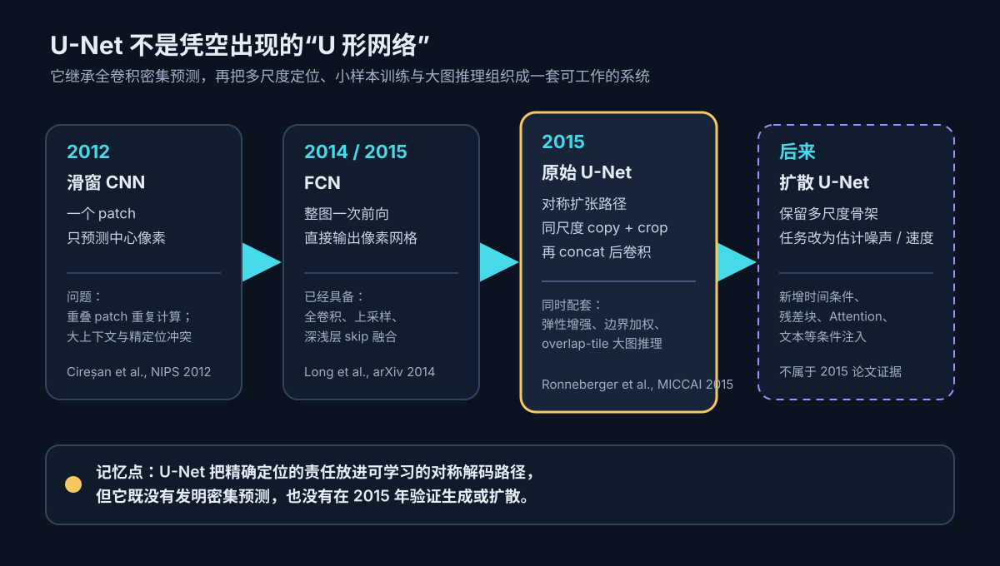
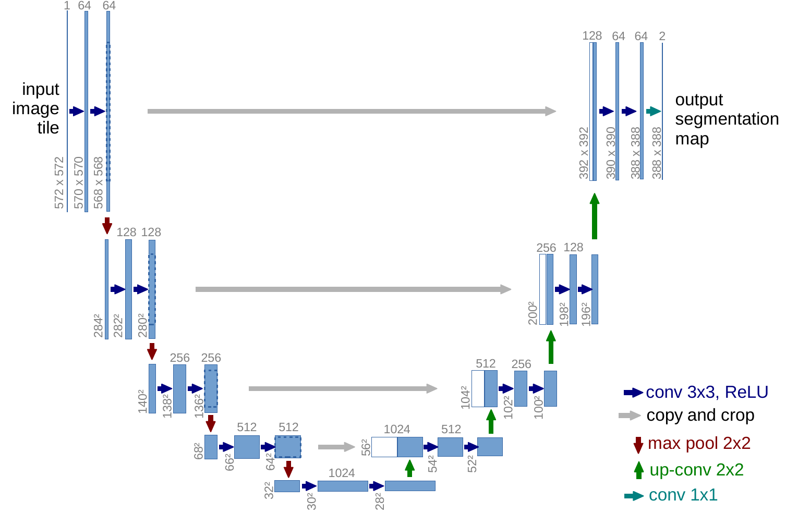
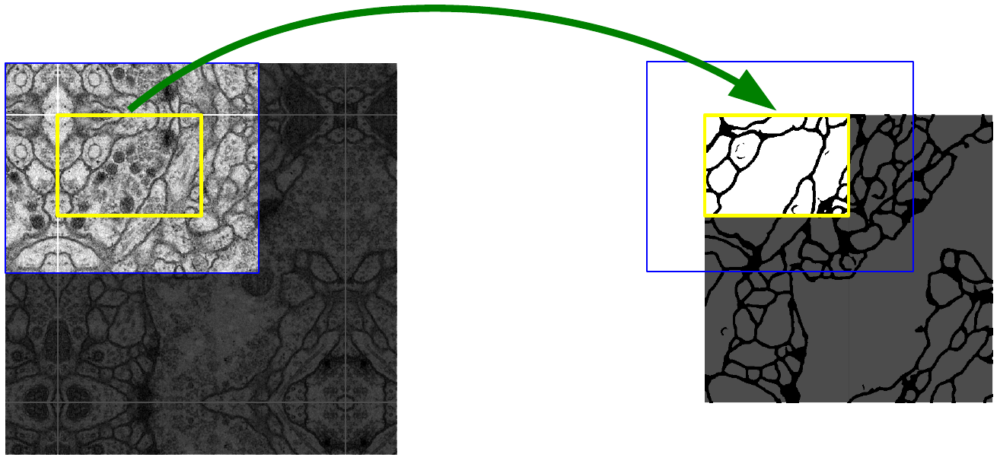
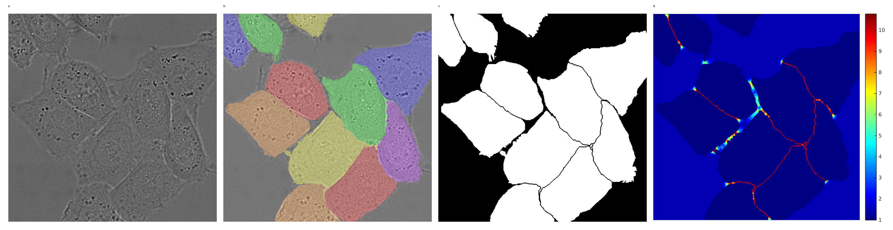
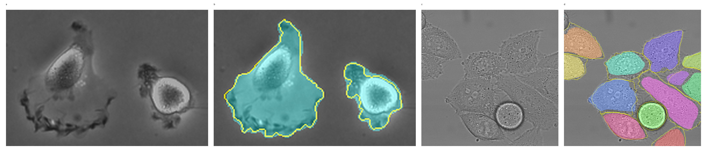

# 论文解读：U-Net: Convolutional Networks for Biomedical Image Segmentation

> **核心判断：U-Net 没有发明全卷积密集预测，也不只是画出一个好看的 U。它把“看清全局语境”和“找准像素边界”分给下采样、上采样两条路径，再用同尺度特征拼接让二者会合；真正让它在小型生物医学数据上成立的，是架构、弹性增强、边界加权与大图切片推理的组合。最关键的能力证据是两组细胞数据上相对第二名分别高出 9.03 和 31.56 个 IoU 百分点；但论文没有组件消融，所以不能据此断言其中某一项单独造成了提升。**

论文：Olaf Ronneberger, Philipp Fischer, Thomas Brox, **U-Net: Convolutional Networks for Biomedical Image Segmentation**。  
发表：[arXiv:1505.04597](https://arxiv.org/abs/1505.04597)，2015-05-18 提交；MICCAI 2015；[Springer](https://doi.org/10.1007/978-3-319-24574-4_28) 于 2015-11-18 首次在线。  
官方材料：[作者项目页与 2015 Caffe 发布包](https://lmb.informatik.uni-freiburg.de/people/ronneber/u-net/)。

图表复用说明：Springer 页面标注论文版权为 © 2015 Springer International Publishing Switzerland，arXiv 使用的是非独占分发许可而非 CC 许可。下文仅保留评论和教学所必需的原图，完整标注 Figure 编号和一手来源，不主张图片版权；处理与哈希记录保存在同目录 `assets/unet-paper/sources.md`，作为 Vault 内审计文件，不构成公开正文依赖。

一周后只需留下一个画面：**左边不断缩小的特征图负责扩大视野，右边不断放大的特征图负责恢复位置；横向连接把“这里原来长什么样”送回解码器。**

## 1　先看一个会失败的场景：两枚挨在一起的细胞

假设显微图中有两枚几乎贴住的细胞。我们不只想知道“这张图里有细胞”，而是要给每个像素一个标签：细胞、背景，最好还能保住两枚细胞之间只有几像素宽的缝。

这件事同时需要两种看似冲突的信息：

1. **大范围语境**：一块灰色纹理究竟属于细胞内部、细胞膜还是背景，要看周围相当大的区域。
2. **精确位置**：两枚细胞之间那条极窄边界，不能在连续池化后被抹掉。

2012 年的强基线把网络当成像素分类器：围绕一个像素裁一个 patch，网络只预测中心像素。它确实能利用局部上下文，但整张图里相邻 patch 高度重叠，相同卷积被反复计算；想看更大范围又通常要堆更多池化，定位随之变粗。[Cireșan et al., NIPS 2012](https://papers.nips.cc/paper/4741-deep-neural-networks-segment-neuronalmembranes-in-electron-microscopy-images)

U-Net 要回答的不是泛泛的“怎样分割图片”，而是：

> **能不能只用很少的标注图像，一次前向得到整块像素级输出，同时既有足够大的上下文，又保住细胞边界？**

## 2　任务契约：这篇八页论文到底解决什么

| 项目 | 原论文设定 |
|---|---|
| 输入 | 2D 灰度生物医学图像或图像 tile |
| 输出 | 比输入更小的逐像素类别概率图；原图示例为 2 类 |
| 监督 | 像素级语义标签；细胞数据只有部分标注训练图 |
| 网络 | 23 个卷积层、无全连接层的 2D 全卷积网络 |
| 优化 | Caffe 中的 SGD；像素 softmax + 加权交叉熵 |
| 小样本策略 | 平移、旋转、灰度变化，尤其是随机弹性形变 |
| 大图推理 | overlap-tile；边缘缺失上下文用镜像外推 |
| 论文没有解决 | 3D 体分割、跨医院泛化、不确定性、实例级匹配、生成建模 |

这里的“小样本”也要具体化：EM 数据只有 **30 张 512×512 训练图**；PhC-U373 有 **35 张部分标注训练图**；DIC-HeLa 有 **20 张部分标注训练图**。这远少于当时 ImageNet 的百万级图像，但并不等于“随便给一两张图就能泛化到任何医学场景”。

## 3　U-Net 之前已经有 FCN：真正的新意不能画错时间线

U-Net 论文明确写着它“build upon” Fully Convolutional Network。FCN 已经完成三件关键工作：

- 把分类网络的全连接层改成卷积，让网络接受任意尺寸输入并产生空间输出；
- 用上采样把粗糙预测拉回高分辨率；
- 用 skip architecture 融合深层语义和浅层外观。

[Long、Shelhamer、Darrell 的 FCN](https://arxiv.org/abs/1411.4038) 在 2014 年 11 月已提交 arXiv，后发表于 CVPR 2015。因此，“U-Net 发明了 encoder-decoder”“U-Net 第一次使用 skip connection”都不准确。

U-Net 的贡献更像一套针对生物医学小数据和精细边界的系统重组：

1. 把扩张路径做得近似收缩路径的镜像，并在高分辨率端保留大量通道；
2. 每次上采样后，拼接对应尺度的编码器特征，再用卷积学习如何重建精确输出；
3. 使用 `valid` 卷积，只输出拥有完整上下文的像素；
4. 用弹性形变扩充少量标注，用边界加权逼网络学习接触细胞之间的缝；
5. 用重叠切片把有限显存内的网络应用到任意大图。

*本文重绘：U-Net 在密集预测时间线中的位置。一手依据为 [Cireșan et al. 2012](https://papers.nips.cc/paper/4741-deep-neural-networks-segment-neuronalmembranes-in-electron-microscopy-images)、[FCN](https://arxiv.org/abs/1411.4038) 与 [U-Net](https://arxiv.org/abs/1505.04597)。*

所以更精确的论文主线是：

> **旧瓶颈是“上下文”和“定位”被迫在同一条不断池化的路径里竞争；U-Net 把精确定位的恢复交给对称扩张路径，并让编码器的高分辨率证据绕过瓶颈直接抵达对应尺度。**

## 4　核心机制：U 的两边各负责什么

先读原图，不要急着背层数。重点看三件事：

1. 蓝色特征图从左上向下缩小、通道增加，说明空间分辨率被换成了更大语境和更多抽象特征；
2. 右侧绿色上卷积逐步放大特征图；
3. 灰色横箭头不是数值相加，而是把左侧特征图裁剪后复制到右侧，与上采样特征按通道拼接。

*论文原图 Figure 1；来源：[Ronneberger et al., U-Net](https://arxiv.org/abs/1505.04597)。它定义了网络的数据流和尺寸，但单凭结构图不能证明横向拼接或对称解码器带来了多少性能提升。*

把网络写成黑盒，它学习的是

$$
f_\theta:
\mathbb{R}^{H\times W\times C}
\rightarrow
[0,1]^{H'\times W'\times K},
$$

其中 $K$ 是类别数。原始图里 $H=W=572$，$H'=W'=388$。输出变小不是示意图画错，而是连续使用不补零的 `valid` 3×3 卷积造成的。

### 4.1　收缩路径：用空间精度换上下文

每个尺度执行两次

$$
\operatorname{Conv}_{3\times3}^{\text{valid}}
\rightarrow \operatorname{ReLU},
$$

然后用 2×2、stride 2 的 max pooling 下采样；每下采样一次，通道数翻倍：

$$
64\rightarrow128\rightarrow256\rightarrow512\rightarrow1024.
$$

两次 3×3 `valid` 卷积会让边长各减少 4。池化再把边长减半。连续进行后，单个深层位置能“看见”更大的输入区域，适合判断局部纹理处在什么结构里；代价是准确坐标越来越粗。

### 4.2　扩张路径：先放大，再请回高分辨率证据

右侧每一级执行：

1. 上采样；
2. 2×2 `up-convolution`，把通道数减半；
3. 从左侧同尺度特征图中心裁出匹配大小；
4. 沿通道维拼接；
5. 再做两次 3×3 `valid` 卷积 + ReLU。

若上采样特征为 $U_s$，裁剪后的编码器特征为 $C(E_s)$，则融合不是

$$
U_s + C(E_s),
$$

而是

$$
F_s=\operatorname{Concat}\left[U_s,\ C(E_s)\right].
$$

拼接保留了两套特征，后续卷积再决定怎样组合。可以把它理解成：

- $U_s$ 带着深层语境回答“这大概是什么”；
- $C(E_s)$ 带着原尺度细节回答“边界具体在哪里”；
- 后续卷积把语义和位置重新对齐。

这条捷径还有优化上的好处：浅层信息不必全部压过最窄瓶颈再恢复。但要严格说，**2015 论文没有去掉这条连接做消融**，所以“它一定缓解梯度消失”“它单独贡献了多少”都是合理解释，不是论文实测结论。

### 4.3　为什么要 crop：原版 U-Net 和现代常见实现不同

原始 U-Net 不给 3×3 卷积补零。卷积只在完整 3×3 邻域存在的位置产生输出，因此编码器特征会比右侧上采样特征大。拼接前必须从编码器特征中心裁剪：

$$
C(E_s)=\operatorname{CenterCrop}(E_s,\operatorname{shape}(U_s)).
$$

于是原始尺寸链大致是：

| 阶段 | 空间边长 | 主要操作 |
|---|---:|---|
| 输入 | 572 | 原始 tile |
| 第一尺度 | 568 | 两次 3×3 valid conv |
| 池化后逐层缩小 | 284→140→68→32 | 2×2 max pool |
| 瓶颈 | 28 | 两次 3×3 valid conv |
| 扩张后逐层放大 | 52→100→196→388 | up-conv、concat、两次 valid conv |
| 输出 | 388 | 1×1 conv 映射到类别 |

现代代码里常见 `padding=1`，让输入输出同尺寸，也常加入 BatchNorm、残差块、注意力或不同上采样方式。它们属于 **U-Net 家族**，不等于论文 Figure 1 的逐层复刻。

## 5　`valid` 卷积怎样处理任意大图：overlap-tile

输出 388×388 需要输入 572×572 的上下文。若直接把输出块首尾相接，边缘像素缺少邻域，就会出现接缝。论文的办法是让相邻输入 tile 重叠：每个 tile 只贡献中心那块拥有完整上下文的预测。

先看图中黄色和蓝色框：黄色是要交付的输出区域，蓝色是为它额外读取的输入上下文。图像外边界没有真实像素时，用镜像反射补足。

*论文原图 Figure 2；来源：[Ronneberger et al., U-Net](https://arxiv.org/abs/1505.04597)。它说明原版如何绕开 GPU 显存对整图尺寸的限制；它不是训练数据增强，也不是后来的滑窗 patch 分类。*

这里容易混淆两种“滑动”：

- 旧方法对每个中心像素重复跑一次 patch 分类器，卷积大量重复；
- U-Net 对一个较大 tile 一次输出整块中心区域，tile 之间只保留获得完整上下文所需的重叠。

论文还要求选择合适的输入 tile 大小，使每次 2×2 pooling 前的宽高为偶数。这个约束来自四次二分下采样和 `valid` 卷积的尺寸算术，不是 U 形拓扑的抽象必然。

## 6　真正让小数据可训练的，不只有架构

### 6.1　像素 softmax 与加权交叉熵

最后的 1×1 卷积把每个 64 维特征映射为 $K$ 个类别 logit。位置 $\mathbf{x}$、类别 $k$ 的概率为

$$
p_k(\mathbf{x})
=
\frac{\exp(a_k(\mathbf{x}))}
{\sum_{k'=1}^{K}\exp(a_{k'}(\mathbf{x}))}.
$$

为便于与常见“最小化损失”写法对齐，可以把论文目标写成

$$
\mathcal{L}
=
-\sum_{\mathbf{x}\in\Omega}
w(\mathbf{x})
\log p_{\ell(\mathbf{x})}(\mathbf{x}),
$$

其中 $\ell(\mathbf{x})$ 是真值类别，$w(\mathbf{x})$ 决定某个像素的错误有多贵。原论文排版出的 $E=\sum w\log p$ 没有负号；若按损失最小化理解，需要像上式加入负号，或等价地最大化原式。

### 6.2　接触细胞之间的缝，必须比普通背景更贵

普通类别平衡只能让稀有类别更受重视，却不会特别照顾“两枚细胞之间那条窄缝”。论文把权重定义为

$$
w(\mathbf{x})
=
w_c(\mathbf{x})
+
w_0
\exp\left(
-\frac{(d_1(\mathbf{x})+d_2(\mathbf{x}))^2}
{2\sigma^2}
\right),
$$

其中：

- $w_c$ 补偿类别频率不平衡；
- $d_1$ 是像素到最近细胞边界的距离；
- $d_2$ 是到第二近细胞边界的距离；
- 实验使用 $w_0=10$、$\sigma\approx5$ 像素。

两枚细胞之间的狭缝同时靠近两个边界，所以 $d_1+d_2$ 小，指数项大；普通背景只靠近一个细胞时，第二近边界更远，权重自然下降。

先看 Figure 3 的四栏：原始 DIC 图、实例着色真值、二值训练 mask，以及红黄高权重线。最亮的区域恰好落在接触细胞之间。

*论文原图 Figure 3，a–d；按论文面板顺序组合自作者提交的原始素材，来源：[arXiv source](https://arxiv.org/abs/1505.04597)。它说明监督如何强调分离边界，但论文没有提供“去掉权重图”的对照数值。*

这也揭示一个常见误解：原始 U-Net 的输出头仍是像素分类，不是天然带实例 ID 的实例分割器。边界加权让后续分离接触对象更容易；论文官方发布包还包含独立的贪心跟踪算法。不能把整个 cell tracking 管线都算成 U-Net 网络本身。

### 6.3　弹性形变不是装饰性 augmentation

训练样本少时，网络很容易记住有限的细胞形状。论文重点使用随机弹性形变：

1. 在粗糙的 3×3 网格上采样位移向量；
2. 位移来自标准差 10 像素的高斯分布；
3. 用双三次插值生成逐像素平滑位移场；
4. 同步形变图像和标签。

作者把它称为小样本训练的“key concept”，因为组织和细胞的真实变化经常表现为平滑形变。训练还包含平移、旋转、灰度变化，并在收缩路径末端使用 dropout。

但证据措辞仍要克制：论文没有报告“无弹性增强”的 IoU，也没有比较不同形变强度。因此，**它是作者明确强调的训练机制，却不是被消融隔离出的因果贡献。**

### 6.4　原版优化细节

- 大 tile 比大 batch 更能利用显存，因此 batch size 设为 1；
- 为让当前更新仍受此前样本影响，momentum 设为 0.99；
- 卷积 + ReLU 使用标准差 $\sqrt{2/N}$ 的初始化，其中 $N$ 是单个神经元的输入连接数；
- 论文报告在 6 GB NVIDIA Titan GPU 上训练约 10 小时。

这些细节共同构成“少量标注也能训”的条件。把结论缩成“U 形结构天然不需要数据”，会抹掉论文一半的工程贡献。

## 7　训练与推理不要混在一起

| 阶段 | 网络看到什么 | 额外机制 | 交付什么 |
|---|---|---|---|
| 训练 | 大图裁出的输入 tile 与像素标签 | 同步弹性形变、灰度变化、边界权重、SGD | 更新同一个 U-Net 参数 |
| 常规推理 | 未标注图像 tile | softmax | 中心有效区域的类别概率 |
| 任意大图推理 | 相互重叠的 tile | 镜像边界、overlap-tile 拼接 | 无缝整图概率图 |
| EM 论文提交 | 同一图像的 7 个旋转版本 | 预测平均 | 挑战赛概率图 |
| Cell Tracking 发布包 | 分割结果 | 网络外的贪心跟踪 | 细胞 mask 与轨迹 |

论文摘要所说“512×512 图像少于一秒”描述的是当时 GPU 上的分割推理，不包含训练，也不能直接外推到今天任意 U-Net 变体、任意图像分辨率或完整临床流水线。

## 8　实验究竟证明了什么

### 8.1　EM 神经元膜分割：赢了主指标，但不是所有指标都第一

ISBI EM 数据有 30 张 512×512 训练图和同规模隐藏测试集。U-Net 对 7 个旋转版本取平均，没有其他前后处理。

| 方法 | Warping error ↓ | Rand error ↓ | Pixel error ↓ |
|---|---:|---:|---:|
| 人类参考 | 0.000005 | 0.0021 | 0.0010 |
| **U-Net** | **0.000353** | 0.0382 | 0.0611 |
| DIVE-SCI | 0.000355 | 0.0305 | 0.0584 |
| IDSIA 滑窗 CNN | 0.000420 | 0.0504 | 0.0613 |
| DIVE | 0.000430 | 0.0545 | **0.0582** |

相对论文强调的 IDSIA 滑窗 CNN：

- warping error 从 0.000420 降到 0.000353，绝对降低 0.000067，约 **16.0% 相对下降**；
- Rand error 从 0.0504 降到 0.0382，绝对降低 0.0122，约 **24.2% 相对下降**；
- pixel error 只从 0.0613 降到 0.0611，差异很小。

更重要的是，U-Net 只在按 warping error 排序时第一；DIVE-SCI 的 Rand error 更低，DIVE 的 pixel error 更低。论文证明的是多项指标上的强结果和新最佳 warping error，不是“所有衡量方式全面碾压”，更远未达到人类参考。

### 8.2　细胞分割：最有冲击力的数字来自 DIC-HeLa

| 数据集 | 训练标注 | U-Net IoU ↑ | 2015 第二名 IoU ↑ | 绝对提升 |
|---|---:|---:|---:|---:|
| PhC-U373 | 35 张部分标注图 | **0.9203** | 0.83 | **+0.0903** |
| DIC-HeLa | 20 张部分标注图 | **0.7756** | 0.46 | **+0.3156** |

DIC-HeLa 的 31.56 个百分点最能支撑“小数据下仍能做精确细胞分割”的能力主张。PhC-U373 的 9.03 个百分点同样明显。

定性图要看黄色人工边界与彩色预测 mask 的贴合，也要注意它只展示成功样例，没有系统呈现失败案例。

*论文原图 Figure 4，a–d；按论文顺序组合自作者提交的原始素材，来源：[arXiv source](https://arxiv.org/abs/1505.04597)。它提供定性能力证据，但不能替代全测试集统计，也不能证明具体组件的因果贡献。*

### 8.3　一张证据梯子：哪些话可以说，哪些不能

| 证据类型 | 论文提供了什么 | 可以支持 | 不能支持 |
|---|---|---|---|
| 能力证据 | 3 个任务、挑战赛表格与定性结果 | 完整系统在这些小型生物医学基准上很强 | 任意医学模态、任意医院都泛化 |
| 因果证据 | 几乎没有组件消融 | 架构与训练方案作为整体有效 | skip、弹性增强或权重图各自贡献多少 |
| 鲁棒性证据 | EM、相差显微、DIC 三类输入 | 跨几种显微成像条件仍有效 | 3D、CT、MRI、自然图像或分布外鲁棒性 |
| 边界证据 | 人类参考仍明显更好；不同指标冠军不同 | 结果并非解决所有误差 | “达到人类水平”或“全面最优” |

## 9　原论文最值得批判性记住的五个边界

### 9.1　没有架构消融

论文没有分别去掉横向拼接、减少扩张通道、替换弹性增强或取消边界权重。最终成绩属于整套系统，不能被后人随意拆分归功。

### 9.2　比较预算没有完全配平

U-Net 的 EM 结果平均了 7 个旋转输入。不同挑战提交还可能带有数据集特定后处理和不同调参预算。它胜过滑窗基线是事实，但不是“只改架构、其他变量完全相同”的实验。

### 9.3　训练集小，不等于评价覆盖广

三项任务都来自生物医学显微成像，样本数和机构来源有限；论文没有外部医院、设备迁移、跨域校准或置信区间。今天讨论临床可用性时，必须重新验证。

### 9.4　指标会讲不同故事

Warping error 更关注拓扑变形，Rand error 比较像素对的一致性，pixel error 统计逐像素错误。U-Net 在三者中的相对位置不同，说明“边界、拓扑、像素准确率”不能被压成一个模糊的“分割好”。

### 9.5　论文没有证明扩散生成

2015 U-Net 的函数是图像 $\rightarrow$ 像素标签。它没有噪声时间步、没有文本条件、没有反向扩散，也没有生成实验。后来的扩散 U-Net 借用了多尺度编码—解码与 skip 骨架，但任务和模块都发生了改变。

## 10　原始 U-Net 和扩散 U-Net 不是同一个任务

把两者对齐最容易看清继承关系。

| 维度 | 2015 分割 U-Net | 现代扩散 U-Net |
|---|---|---|
| 输入 | 干净生物医学图像 | 带噪图像或 latent $x_t/z_t$ |
| 额外条件 | 无 | 时间步 $t$，可加类别、文本、图像等条件 |
| 输出 | 每像素类别概率 | 噪声、score、velocity 或相关参数 |
| 训练目标 | 加权像素交叉熵 | 常见为噪声/速度回归或变分相关目标 |
| 主干块 | plain conv + ReLU + pooling/up-conv | 常见为 ResBlock、时间调制、Attention/Cross-Attention |
| 共同骨架 | 多尺度收缩—扩张路径与同尺度 skip | 多尺度收缩—扩张路径与同尺度 skip |

所以在 [[努力做一个可以让人记住的Diffusion推导]] 里，`epsilon_model` 可以由 U-Net 实现，指的是“把多尺度 U 形骨架改造成带时间条件的去噪器”；而 [[论文解读：Scalable Diffusion Models with Transformers]] 所说 DiT 替换 U-Net，替换的是扩散系统里的去噪主干，不是把医学分割输出头换成 Transformer。

这一桥接也解释了 U-Net 为什么能跨到生成领域：它最可迁移的不是二分类 head，而是**让全局语境和高分辨率局部证据在多个尺度反复会合的信息组织方式**。

## 11　如果今天复现，先决定你要复现“论文”还是“U-Net 家族”

严格复现论文应保留：

- 572×572 输入与 388×388 有效输出；
- 3×3 `valid` conv、中心 crop、concat；
- 2×2 max pooling 与 2×2 up-convolution；
- 原始通道表和 23 个卷积层；
- batch size 1、momentum 0.99；
- 弹性形变、边界权重与 overlap-tile。

做现代工程实现则可以按任务选择 same padding、归一化、残差块、Dice/IoU 类损失、混合精度或不同 encoder，但应明确写成“U-Net 变体”。否则，代码能跑并不代表复现了论文结论。

一个最小检查表是：

1. 输入输出尺寸是否与标签对齐？
2. skip 是 concat 还是 add？
3. 上采样是可学习转置卷积、插值后卷积还是别的方法？
4. 接触实例的边界由什么监督？
5. 推理边缘如何补上下文？
6. 评价是像素、区域、边界还是拓扑指标？

## 12　一周后应该记住什么

1. **U 的左边回答“是什么”，右边回答“在哪里”，横向拼接让语义和定位在同一尺度会合。**
2. **小数据成功来自完整系统：弹性增强、边界加权、有效卷积和重叠切片与架构同样重要。**
3. **论文证明了 2015 年三个生物医学分割任务上的强能力，没有用消融证明单一组件，也没有证明后来的扩散生成。**

## 参考资料

- Ronneberger, Fischer, Brox, [U-Net: Convolutional Networks for Biomedical Image Segmentation](https://arxiv.org/abs/1505.04597), arXiv 2015；[Springer / MICCAI 2015](https://doi.org/10.1007/978-3-319-24574-4_28)。
- University of Freiburg, [U-Net 官方项目页、Caffe 实现与训练模型](https://lmb.informatik.uni-freiburg.de/people/ronneber/u-net/)。
- Long, Shelhamer, Darrell, [Fully Convolutional Networks for Semantic Segmentation](https://arxiv.org/abs/1411.4038), arXiv 2014 / CVPR 2015。
- Cireșan, Giusti, Gambardella, Schmidhuber, [Deep Neural Networks Segment Neuronal Membranes in Electron Microscopy Images](https://papers.nips.cc/paper/4741-deep-neural-networks-segment-neuronalmembranes-in-electron-microscopy-images), NIPS 2012。
- He, Zhang, Ren, Sun, [Delving Deep into Rectifiers](https://arxiv.org/abs/1502.01852), 2015。
