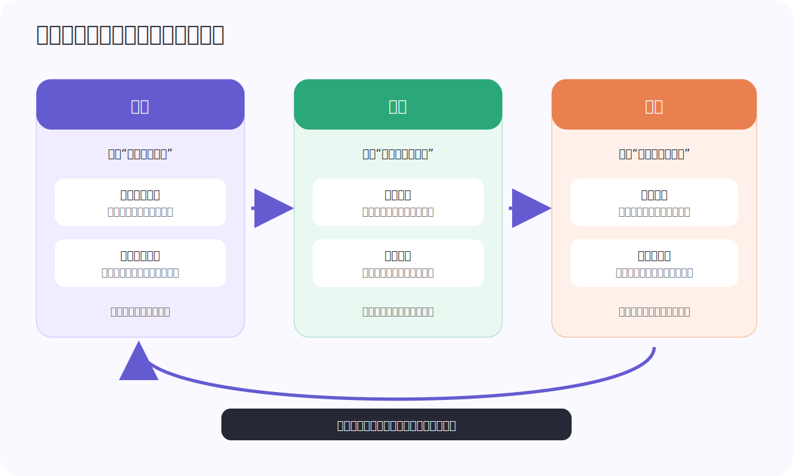
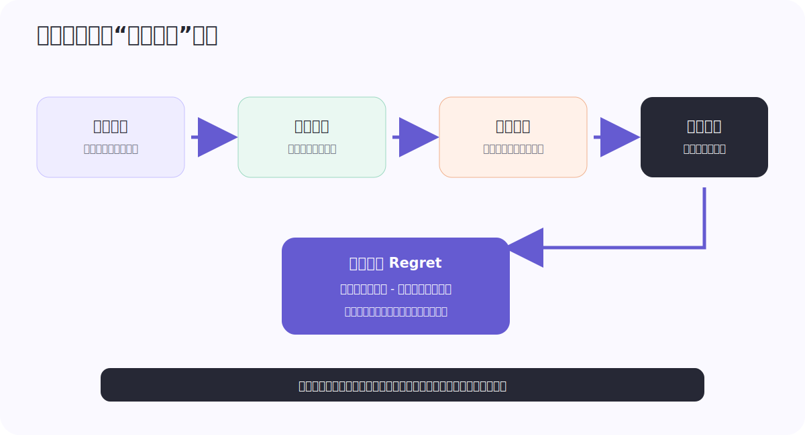
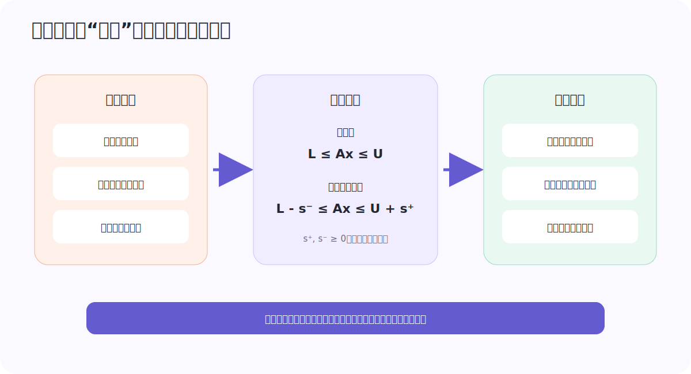
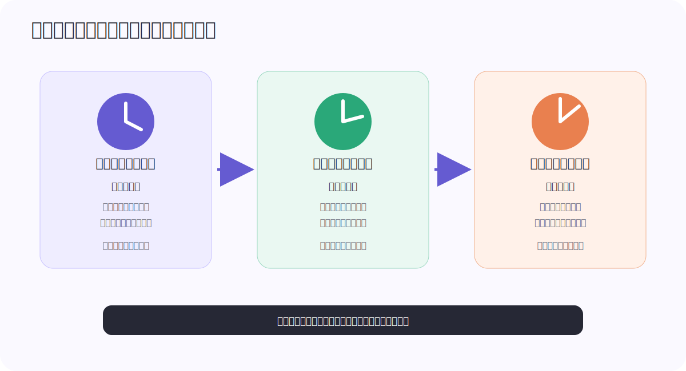

> **脱敏说明**：本文复盘的是一套真实运行过的大型流量分配系统。组织名称、业务名称、具体流量入口与去向、绝对规模、内部平台、人员、仓库地址和精确实验数字均已删除或抽象。文中的符号、图和例子用于解释可迁移的方法，不对应原系统接口。

流量分配乍看像一道排序题：给每个候选单元打分，然后把机会交给分数最高者。但一旦系统同时面对总量预算、多方约束、未来供给变化、延迟反馈和在线竞争，这个理解就不够了。

真正的问题更接近自动驾驶：系统先要看清环境，再规划一条可行轨迹，最后通过高频控制让真实执行贴住轨迹。任何一层单独做得漂亮，都不能保证车辆到达目的地。

这也是这个项目最值得复盘的地方。它没有把“智能”寄托在某一个模型上，而是把流量分配组织成了一个完整的 **感知 - 运筹 - 控制** 闭环。

## 一、先把问题看对：流量分配不是静态排序

把一个共享流量池分给多个候选单元，至少有四个动态特征。

第一，**机会会随时间到达**。今天剩余多少、下一时段会来多少、峰值会在哪里，都不是常数。现在用掉一份资源，也就放弃了未来可能更高价值的机会。

第二，**价值并不完全可见**。系统看到的往往只是响应概率、容量上界和竞争强度的估计。最终结果可能延迟出现，也可能被后续链路改变。

第三，**动作会改变观测**。某个单元得到更多机会后，我们才会看到更多关于它的数据；被压低的单元则越来越难被准确估计。这不是普通的独立同分布预测，而是一个带选择偏差的反馈系统。

第四，**目标不止一个**。总价值、最低保障、最大消耗、平滑性、稳定性、公平性和风险边界经常同时存在。局部效率最高的动作，未必是全局可执行的动作。

因此，系统真正要做的是：在不完全观测、未来不确定和多重约束下，持续选择动作，使整个周期的累积价值最大，同时不越过安全边界。

用控制论语言表达，可以写成：

$$
x_{t+1}=f(x_t,u_t,w_t), \qquad y_t=h(x_t)+v_t
$$

其中，$x_t$ 是不可完全观测的环境状态，$u_t$ 是分配动作，$w_t$ 是外部扰动，$y_t$ 是系统真正看到的指标。感知层从 $y_t$ 推断 $x_t$；运筹层根据状态选择 $u_t$；控制层观察执行结果，再把误差送回系统。

这个视角带来一个重要变化：**算法的输出不再是一次性的答案，而是一条需要被跟踪、修正和审计的轨迹。**

## 二、自动驾驶类比到底对应什么

这个类比并不是为了好听，而是因为两个系统具有相似的职责边界。

| 自动驾驶 | 流量分配系统 | 失败时会发生什么 |
|---|---|---|
| 感知道路、车辆与障碍物 | 估计到达、容量、价值、竞争与未来变化 | 在错误的环境模型上求“最优解” |
| 规划可行轨迹 | 在预算与约束下求目标分配轨迹 | 局部高效但全局超限，或方案根本无解 |
| 转向、制动与油门控制 | 调节在线执行变量，追踪目标轨迹 | 计划与真实消耗分离，产生超调或震荡 |
| 安全员与最小风险状态 | 人工干预、限幅、熔断和规则回退 | 异常被算法放大，无法及时止损 |

自动驾驶不会让路径规划器直接控制方向盘；同样，流量系统也不应让一个低频求解器直接承担每次在线扰动。规划和控制的分离，是系统能够稳定运行的前提。

## 三、感知：不是预测一个数，而是建立可决策的环境模型

### 3.1 两类感知必须同时存在

感知层可以分为截面估计和时序预测。

**截面估计**回答“现在怎样”：不同候选单元当前的响应水平、可用容量、竞争状态和执行概率是多少。它更像自动驾驶在当前帧里识别车道和障碍物。

**时序预测**回答“接下来会怎样”：剩余周期的到达量、价值曲线、容量上界、周期峰谷和异常事件会怎样演化。它更像对其他车辆运动轨迹的预测。

只有截面估计，系统会贪心地把资源用在眼前；只有时序预测，又会忽略刚刚发生的环境变化。两者需要共同输出供运筹层使用的状态：

$$
\hat{s}_{i,t}=\left(\hat{c}_{i,t},\hat{v}_{i,t},\hat{p}_{i,t},\hat{\sigma}_{i,t}\right)
$$

$\hat{c}$ 表示可分配容量，$\hat{v}$ 表示单位价值，$\hat{p}$ 表示执行或实现概率，$\hat{\sigma}$ 表示不确定性。最后一项很关键：工业系统不能只知道“预计是多少”，还要知道“有多不确定”。

### 3.2 应预测响应曲线，而不是单点 KPI

分配量本身会影响效率。对同一个候选单元，先拿到的机会和继续扩量后的边际机会通常不是同质的。因此更合理的对象不是一个固定分数，而是响应曲线：

$$
V_{i,t}(a)=\int_0^a q_{i,t}(z)\,\mathrm{d}z
$$

$a$ 是分配量，$q(z)$ 是第 $z$ 单位流量的边际价值。若边际价值递减，继续扩量就会逐渐变贵。运筹层拿到这条曲线后，才能比较“把下一单位分给谁”以及“是否值得留给未来”。

实际系统很难完整观测这条曲线。一个可行办法是保留小比例、受保护的探索流量，在不同控制档位采样容量和价值。这里的探索不是为了追求模型新颖，而是为了避免闭环系统把自己困在既有判断里。

### 3.3 小样本时，结构先验比盲目堆模型更重要

许多候选单元历史短、样本稀疏，却又共享明显的周期、趋势或层级结构。把每条序列独立训练，容易过拟合；把所有序列粗暴合并，又会抹掉个体差异。

更稳妥的路径是先按形态、周期和上下文对序列分组，再在组内共享参数，并给异常序列保留单独通道。分组可以使用动态时间规整等相似度，也可以引入候选单元属性作为先验。其本质是用结构换样本：让相似序列互相借数据，同时不强迫所有对象服从同一个模式。

### 3.4 预测误差必须按决策后果加权

普通的 MAPE 或 RMSE 会把各时刻误差平均看待，但对下游运筹而言，误差高度不对称：

- 峰值附近的高估，可能诱使系统过度预留资源；
- 容量下界附近的低估，可能导致过早消耗；
- 远离约束边界的误差，可能几乎不改变最终动作；
- 两个数值相同、方向相反的误差，造成的业务后果也可能完全不同。

所以，预测模型不能只在预测任务里闭环验收。更合理的方法是把预测送入真实运筹模型做历史回放，再比较产生的决策价值。

定义完美信息下的最优价值为 $J^*$，使用预测模型 $M$ 得到的动作在真实环境中取得的价值为 $J(M)$，则决策遗憾为：

$$
\operatorname{Regret}(M)=J^*-J(M)
$$

这项指标把“预测准不准”改写成“预测是否足以支持正确行动”。它通常比单纯的平均误差更接近系统目标。

## 四、运筹：把商业意图翻译成可求解的轨迹

### 4.1 一个通用化模型

设 $a_{i,t}$ 表示时段 $t$ 给候选单元 $i$ 的分配量，$V_{i,t}(a_{i,t})$ 是感知层给出的价值曲线。一个简化模型可以写成：

$$
\max_{a}\quad
\sum_{t}\sum_i V_{i,t}(a_{i,t})
-\lambda\sum_t\lVert a_t-a_{t-1}\rVert_1
-\kappa\sum_{t}\sum_i \sigma_{i,t}a_{i,t}
$$

$$
\begin{aligned}
&\sum_i a_{i,t}\le B_t, \\
&0\le a_{i,t}\le \hat{c}_{i,t}, \\
&L_{g,t}\le \sum_{i\in g}a_{i,t}\le U_{g,t}, \\
&|a_{i,t}-a_{i,t-1}|\le R_i.
\end{aligned}
$$

三项分别代表预期价值、动作波动惩罚和不确定性惩罚。约束则表达总量、单元容量、分组上下界和单次变化速度。

这里最重要的不是公式形式，而是接口分工：感知层负责给出可校准的价值、容量和不确定性；业务方负责确认目标优先级与边界；运筹层负责在这些信息之间做一致的全局权衡。

### 4.2 为什么“每个单元单独调好”仍然不是全局最优

单独提高一个候选单元的效率，可能挤占另一个单元的必要资源；单独满足每个下界，加起来可能超过总供给；每个局部控制器都追赶自己的目标，还可能共同造成系统震荡。

这说明局部策略缺少一个“拉格朗日价格”：当共享资源越来越紧张时，每多占一单位都应承担机会成本。全局运筹的价值，就是把这种跨单元、跨时段的机会成本显式化。

在可微、规模适中时，可以使用线性、整数或非线性规划；当响应曲线复杂、变量规模大且缺少梯度时，可以采用分组协同进化等全局搜索。分组的依据不应只有统计相关性，还可以加入同源资源、共同约束和历史联动等结构先验，以缩小搜索空间。

### 4.3 软约束不是妥协，而是生产系统的生存机制

真实系统迟早会遇到不可行问题：总供给下降，但多个最低目标没有同步下调；预测链路异常，却仍沿用旧约束；人工配置的愿望彼此冲突。若求解器此时只返回“无解”，整条在线链路就失去了动作。

解决办法是把一部分约束软化。对原约束

$$
L_g\le \sum_{i\in g}a_i\le U_g
$$

引入松弛变量 $s_g^-,s_g^+\ge 0$：

$$
L_g-s_g^-\le \sum_{i\in g}a_i\le U_g+s_g^+
$$

并在目标函数中加入不同优先级的惩罚：

$$
-\sum_g\left(\rho_g^-s_g^-+\rho_g^+s_g^+\right)
$$

这样，系统在冲突发生时仍能返回代价最小的可执行方案，同时明确记录哪条约束被放松、放松多少、为什么。

并非所有约束都适合软化。合规红线、技术容量和安全上限必须保持硬约束；经营偏好、期望下界和舒适区间才可以按优先级退让。软约束的关键不是“什么都能违反”，而是事先定义故障时的牺牲顺序。

## 五、控制：为什么算出最优解还远远不够

运筹层输出的是目标轨迹，在线系统执行的却是会受到竞争、延迟、模型偏差和外部扰动影响的真实过程。计划分配十个单位，不代表最终一定消耗十个单位。

设截至时刻 $t$ 的目标累计量为 $r_t$，真实累计量为 $y_t$，跟踪误差为：

$$
e_t=r_t-y_t
$$

控制器不直接重做全局规划，而是在安全范围内微调执行变量。例如一个离散 PI 控制器可以写成：

$$
\Delta u_t=K_p(e_t-e_{t-1})+K_i e_t
$$

比例项快速响应新误差，积分项消除长期偏差。但在流量系统中直接套用 PID 很容易出问题：执行变量有上下限，反馈有延迟，环境还会突然跳变。工程上至少需要四层保护。

1. **限幅与变化率限制**：单次动作不能过大，避免把观测噪声放大成在线震荡。
2. **积分抗饱和**：执行变量已经顶到边界时停止积分，避免恢复后出现巨大反向超调。
3. **死区与滞回**：小误差不频繁动作，减少控制器在阈值附近来回抖动。
4. **分段或模糊控制**：大误差时快速拉回，小误差时用更温和的参数精调。

还有一个常被忽略的问题：控制器只能修正执行误差，不能修复错误目标。如果感知已经失真、约束本身冲突，控制器越努力，反而可能越快把系统推向错误方向。因此控制层必须具备识别上游异常并降级的能力，而不是盲目追踪。

## 六、三个时钟如何接成一个闭环

单一频率无法同时满足全局性和响应速度。这个系统采用的关键思想，是让不同层运行在不同时间尺度上。

### 6.1 慢时钟：建立全局基线

慢时钟面向完整周期，使用相对稳定的数据求解总量、分组和时段级目标。它重视全局一致性、可解释性和约束完整性，不追求对每次扰动即时响应。

### 6.2 中时钟：滚动地重算剩余问题

随着真实消耗发生，系统定期更新“还剩多少资源、还剩多少时间、未来环境怎样”，并只对剩余窗口重做优化。这相当于模型预测控制中的 receding horizon：每次只执行当前一步，随后用新观测重新规划。

### 6.3 快时钟：把执行拉回轨迹

快时钟只处理短期跟踪误差。它动作频繁但幅度有限，受硬边界保护。若误差超过控制器能力，问题应上抛给中时钟重规划，而不是继续放大控制量。

三层之间的职责边界可以概括为：

- 感知变化但目标仍可行：中时钟重规划；
- 目标合理但执行暂时偏离：快时钟纠偏；
- 数据失真、约束冲突或安全边界触发：停止正常闭环，进入降级模式。

这种设计避免了两个极端：既不让低频计划僵化地执行到底，也不让高频反馈在缺少全局视野时接管系统。

## 七、如何证明系统真的更好

一个闭环系统不能只报告最终价值指标。至少要分别验证感知、运筹和控制。

### 7.1 感知层

- 点预测误差与分位数覆盖率；
- 峰值、拐点和约束边界附近的误差；
- 不同时间跨度与不同数据稀疏度下的校准；
- 分布漂移和异常事件时的退化速度。

### 7.2 运筹层

- 相对完美信息上界的决策遗憾；
- 硬约束违规率与软约束松弛量；
- 解的稳定性、求解时延和失败率；
- 输入扰动下的敏感性与最坏情形表现。

### 7.3 控制层

- 累计跟踪误差；
- 超调量、稳定时间和动作频率；
- 是否存在持续振荡；
- 饱和、延迟和断流后的恢复表现。

上线流程也应分层推进：历史回放先验证方向，影子运行验证实时链路，小比例实验检查因果增益，再逐步扩大范围。每一步都保留规则基线和一键回退路径。

值得强调的是，历史回放不是完整的反事实。旧策略没有选择过的动作，其真实结果无法直接观察。回放结果应与受控探索、在线实验和不确定性分析结合，而不能被包装成确定答案。

## 八、产品化才是算法真正进入生产的那一刻

这个项目后期最重要的变化，不是又增加一个模型，而是把算法能力沉淀为可运营的决策产品。

一个可长期运行的平台至少需要：

- **版本化输入**：每次决策使用了哪版数据、模型、目标和约束；
- **决策解释**：为什么某个单元得到更多或更少资源，哪条约束在起作用；
- **冲突诊断**：无解或软约束触发时，指出最小冲突集合和牺牲顺序；
- **全链路回放**：能够重放当时可见信息，而不是偷看未来；
- **人机协同**：人修改的是目标、边界和优先级，不是在线手拧大量阈值；
- **最小风险状态**：数据断流、预测漂移、求解超时或控制异常时，自动回到保守规则。

这里可以再次借用自动驾驶：一个演示模型可以在晴天道路上跑起来，但量产系统必须解释传感器失效时怎么办、规划超时怎么办、执行器饱和怎么办，以及谁有权接管。流量分配系统也一样。

## 九、这次项目留下的六条经验

### 1. 预测精度不是终点，正确行动才是

模型的价值应通过下游决策遗憾和约束表现衡量。一个平均误差更低的模型，完全可能产生更差的资源分配。

### 2. 最优解必须包含“可执行”三个字

忽略执行概率、控制延迟和动作边界的最优解，只是纸面最优。运筹模型要从一开始就与在线控制接口共同设计。

### 3. 软约束是韧性设计，不是数学补丁

生产环境一定会出现冲突。提前定义哪些可以退让、退让代价多少、如何解释，比事后人工救火可靠得多。

### 4. 多时间尺度比单个复杂算法更重要

慢规划、中频滚动和快控制各自解决不同问题。用一个超复杂模型覆盖所有频率，通常会同时失去全局性、实时性和稳定性。

### 5. 人应该控制意图，而不是替机器执行

人最适合决定目标优先级、风险偏好和特殊事件；机器最适合重复求解、监测偏差和执行纠偏。把大量阈值长期交给人工维护，会让系统重新退回经验驱动。

### 6. 闭环系统首先是一套安全系统

反馈会放大正确判断，也会放大错误判断。任何增益机制都必须配套限幅、监控、熔断、回退和审计。

## 结语

回头看，这个项目最有价值的产物并不是某个具体模型或某次指标提升，而是一种解决复杂分配问题的工程范式：

> 用感知建立环境模型，用运筹表达全局意图，用控制抵抗真实世界的偏差，再用产品化把每次决策变得可解释、可干预、可回退。

当流量、算力、库存、运力或能源分配开始同时面对未来不确定性、共享约束和在线扰动时，这套范式都可以复用。它真正模仿的不是自动驾驶的外观，而是自动驾驶背后的系统思想：**没有单点智能，只有闭环智能。**
