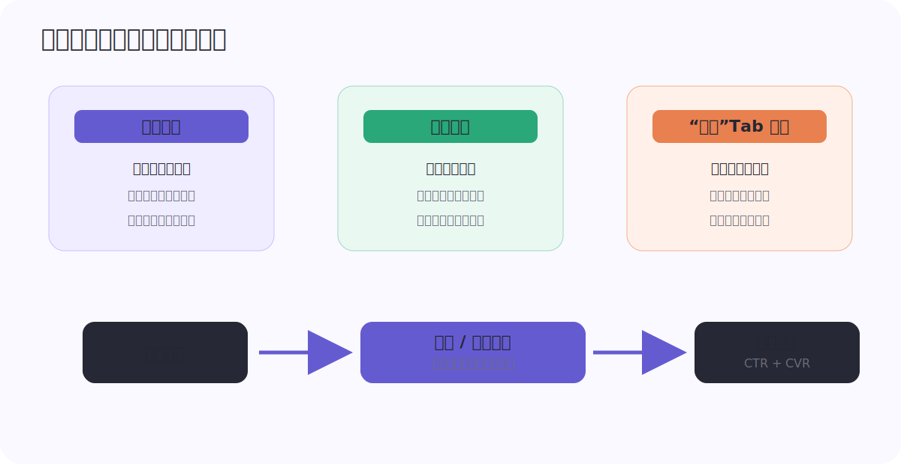
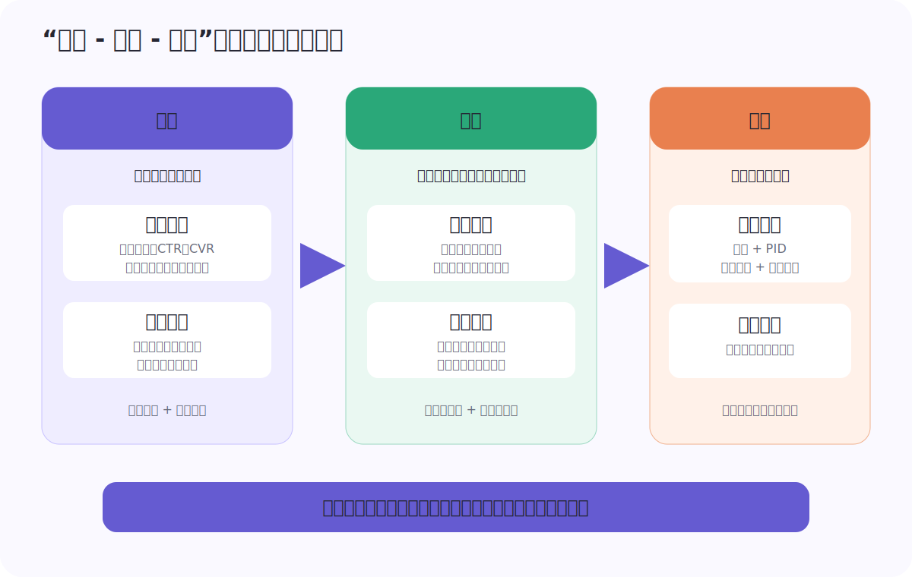
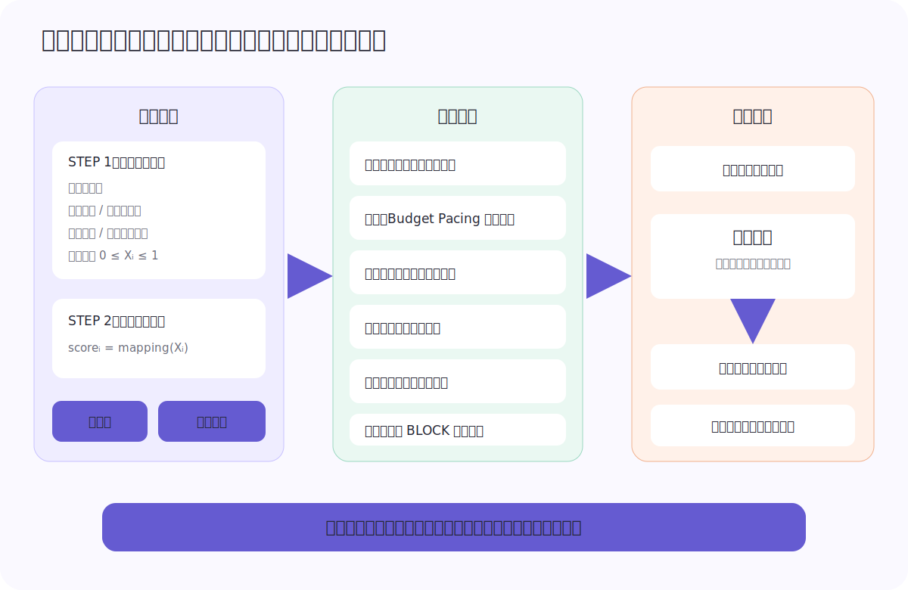
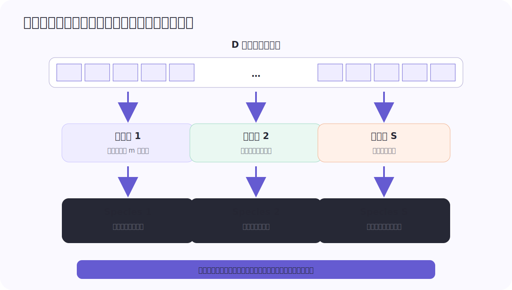
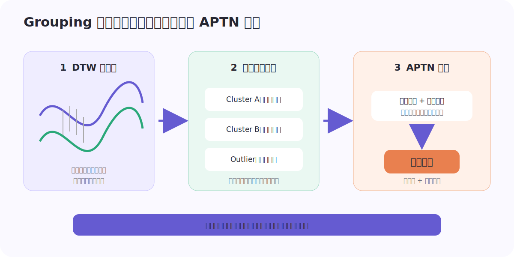
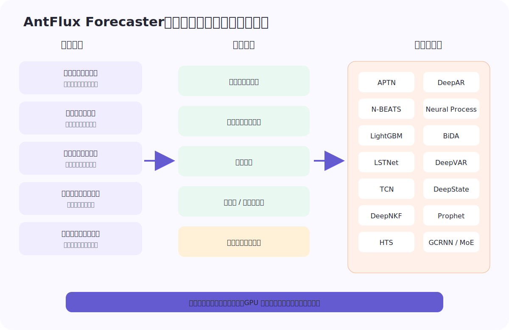
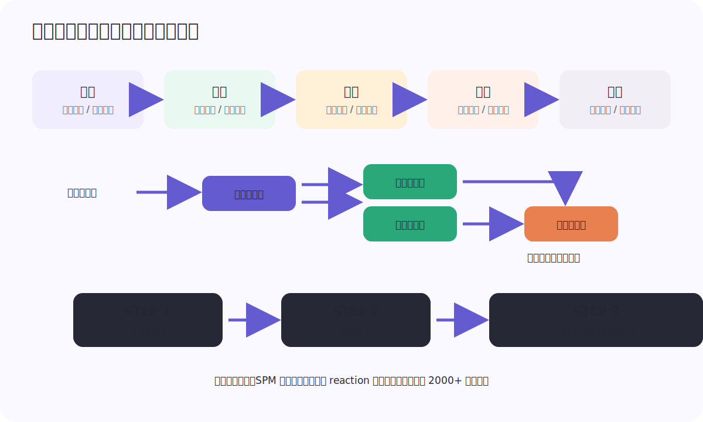
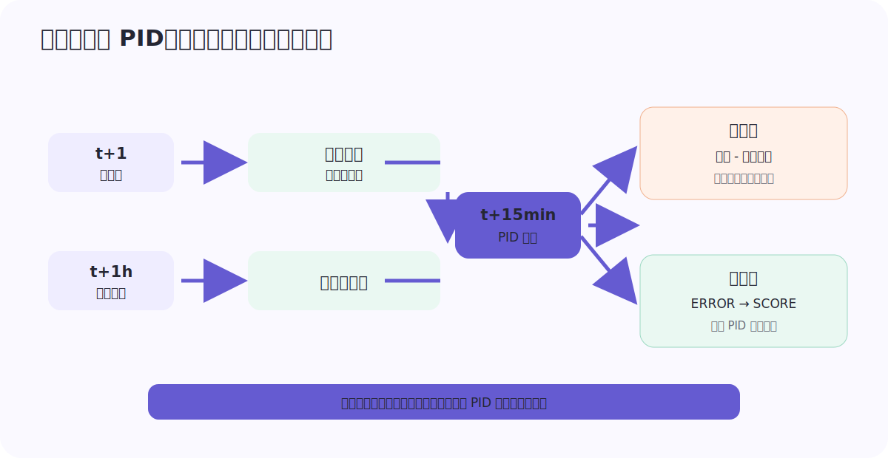
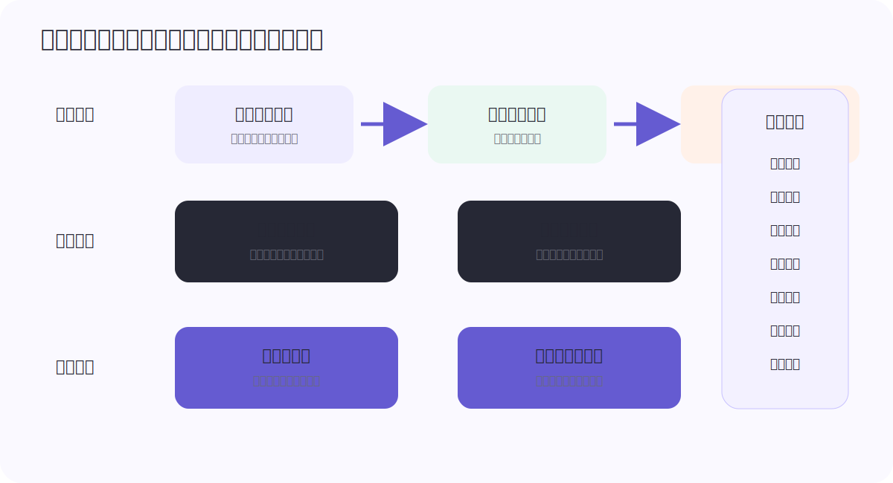
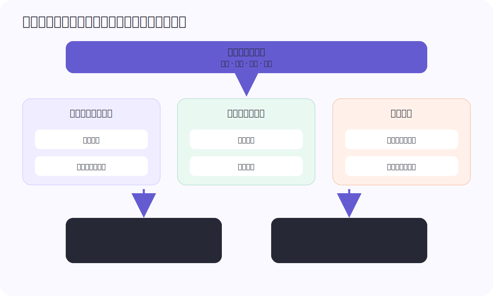

<div class="cover">
  <div class="eyebrow">PUBLIC TRAFFIC · OPERATIONS RESEARCH · 2022</div>
  <h1>蚂蚁应用：<br>公域流量运筹</h1>
  <div class="subtitle">数金公域流量预算制下，从感知、决策、控制到时序预测、用户心智与产品化的智能决策体系</div>
  <div class="rule"></div>
</div>

> **重建说明**　本文根据 21 张连续拍照页恢复。相邻照片存在大量重叠，已按正文顺序合并去重；正文、表格和公式均重建为可编辑文本，原稿中的算法与产品结构图重绘为矢量图。源文标题为《数金公域流量-智能决策算法优化2022》。公开版省略了原稿中的内部仓库地址与个人名单。

## 1　业务背景

### 1.1 公域展位与预算制

支付宝端内广告位为内部服务提供大流量营销入口，从而帮助各业务完成增长。本文中的公域展位特指支付宝首页腰封、宫格角标与“我的”Tab 红点；以上三个展位联合执行主站预算制。



通过主站自上而下的预算分发，每个业务按月获取对应预算，并综合预算使用情况与主站排序机制完成最终广告曝光。简化来看，该链路分为三个模块：

1. **供给生产（数金）**：生成面向不同人群和场景的业务供给；
2. **预算 / 召回控制（数金）**：决定各投放单元可使用的预算与召回范围；
3. **精排（主站）**：综合 CTR 与 CVR 等信号完成最终排序。

本文重点是数金在预算控制阶段的算法技术优化。

#### 从手工截断分到智能决策

数金平台侧包含财富、保险、花呗、借呗、信用卡等业务。各业务对于预算分配、广告排序和可调整性存在普遍诉求。早期方案由算法同学基于实时数据与业务要求，手动调整每个投放单元的截断分范围；线上系统将截断分与 serving 模型对该用户的打分进行比较，以判断是否过滤本次预算使用。

对于实际高效的投放单元，降低截断分可以扩大影响用户；反之则提高截断分。对于单次用户来访，被截断的投放单元越多，在精排中胜出曝光的概率越低。手工方案曾取得较大提效，但也暴露出三类问题：

- 强依赖专家经验，难以在不同业务之间传承和复用；
- 很难及时响应环境变化，尤其是非数金投放的变化；
- 局部阈值调整难以形成全局最优的决策方案。

因此，团队开始建设统一的智能决策系统。

## 2　基于“感知 - 决策 - 控制”的智能决策框架

团队构建了“感知 - 决策 - 控制”的流量分发智能决策框架。



### 2.1 感知层

感知层为合理决策提供依据，主要感知当前流量在各维度的预估值，包括 CTR / CVR 模型打分、曝光概率（预算与竞争）、流失概率等。预估结果进入后续决策模块，用于在线流量分配。

感知同时包括两个尺度：

- **截面感知**：给出当前时刻尽可能准确的曝光、转化与流失估计；
- **时序预测**：针对本月 / 本日剩余时间，预测曝光能力、来访、竞争环境与流量效率，帮助决策层完成全局预算分配。

### 2.2 决策层

决策层完成全月全局最优的预算分配，主要通过运筹求解与最优化实现。能力从初始的整数线性规划，逐步扩展到多目标、非线性、柔性约束和大规模进化算法。

在实际运转中，决策过程分成离线和近线两部分：

1. **离线运筹**首先求解每日、单元、人群级别的预算分配结果。在已知各单元预算消耗上限的前提下，确定每个单元当天应分配的预算；该结果提供可解释性，也通过交互接口支持约束和目标调整。
2. **近线博弈**叠加在离线结果之上，使用小时级预测和实时变量完成更细粒度的动态分配。

平台模板可抽象为以下形式，其中 `Xᵢ` 表示投放单元的截断变量，`PVᵢ` 是流量规模，`gᵢ(Xᵢ)` 是效用函数：

```text
maximize  Σᵢ∈BU (1 - Xᵢ) · PVᵢ · gᵢ(Xᵢ)

subject to
  0 ≤ Xᵢ ≤ 1
  Σᵢ∈BU (1 - Xᵢ) · PVᵢ ≤ ASG                         # 预算约束
  PV̲_bizline ≤ Σᵢ∈bizline (1 - Xᵢ) · PVᵢ ≤ PV̄_bizline  # 业务线约束
  PV̲_campaign ≤ Σᵢ∈campaign (1 - Xᵢ) · PVᵢ ≤ PV̄_campaign # 计划约束

scoreᵢ = mapping(Xᵢ)                                  # 映射为最终截断分
```



同一平台模板在不同垂类中逐渐演化：保险引入多目标与大规模进化；芝麻引入 Budget Pacing 约束做实时矫正；花呗侧重多目标、预算增量和柔性约束；财富处理大促与日常调控以及转化稀疏；借呗探索专项和核心人群快速定向；网商探索数据 BLOCK 与外部协作模式。

### 2.3 控制层

控制层负责实时纠偏，保证离线决策的各投放单元预算分配量与在线执行保持一致。控制由规则、PID、模糊控制和专家经验组合完成。

### 2.4 系统要求

在上游供给生产和下游主站精排都存在不确定性的前提下，系统需同时满足：

1. **鲁棒**：依靠 Ray 资源和大规模计算保障求解稳定，使用实时数据保证响应及时；
2. **可解释**：离线与近线分层运转，对各子模块提供分层透视和自动化评估；
3. **可调整**：将多目标权重、保量和预算约束等需要人工决策的部分暴露在前端。

## 3　智能决策算法模块重点

### 3.1 运筹算法优化

#### 3.1.1 大规模分组进化算法

初期，中等规模的整数线性规划足以解决问题；随着业务发展，实际生效的投放单元和决策变量逐渐增多，建模中也引入了更多非线性，传统求解器难以继续应对。

进化算法属于全局搜索算法，不需要梯度信息，容易并行化。方案使用分组协同进化算法求解大规模问题。

一般的 Differential Grouping 基于统计信息判断变量之间是否关联，再将关联变量放入同一组迭代。Fast Interdependency Identification（FII）在此基础上先区分可分变量与不可分变量，再对不可分变量进一步分组，以提升效率。Delta Grouping 则以每轮迭代中的 Improvement Interval 衡量各维度目标提升空间，并据此动态分组。



本方案的关键改进，是引入每个决策变量的先验知识，例如投放单元属性与历史投放数据，帮助算法更快地把相关变量放入同一组，加快收敛并减少搜索空间。

在保险业务中，公域三渠道整体取得：

- 点击率提升 **3.40%**；
- 曝光转化率提升 **4.14%**；
- 单 PV 实收保费提升 **3.15%**。

相关工作还形成了论文与专利沉淀。

##### 与 QRS-C 2022 论文如何对应

系统文档中的 $X_i$ 是“截断比例”，因此真正放行并消耗预算的比例是

$$
q_i=1-X_i.
$$

代回前面的预算约束，就得到

$$
\sum_i q_iPV_i\leq ASG,
$$

这正是 QRS-C 2022 论文采用的预算分配形式。两者在符号方向上看似相反，实际描述的是同一个决策：一个变量表示“截掉多少”，另一个变量表示“放行多少”。当竞争、排序和转化响应无法写成彼此独立的 $g_i(q_i)$ 时，可以把整体收益统一看成非可分黑盒函数 $f(\mathbf q)$。

论文进一步把“为什么要分组”拆成了一个可检验的问题：如果改变 $q_i$ 的收益会随 $q_j$ 的取值而变化，两个变量就存在交互，不应被拆入互相独立的子问题。Differential Grouping 用四次黑盒评估构造二阶有限差分，近似检测这种交互；协同进化则在固定其他子组件上下文的条件下，逐组优化高维决策向量。

论文的离线证据覆盖 4 个真实预算分配实例，变量数从 646 到 1772，并在统一的 NSGA-II 子优化器下比较 Half Grouping、Random Grouping、Dynamic Random Grouping 和 Differential Grouping。论文报告 DG 在四个实例上取得最高的平均目标值和相对较小的波动，并通常在 100–200 轮附近接近最优结果。

这里需要明确证据边界：论文隔离验证的是**分组策略对离线目标值与迭代收敛的影响**，没有报告等函数评估预算下的总耗时、统计显著性或线上 A/B。本文记录的“业务先验辅助分组”、Delta Grouping 和线上业务指标属于系统后续实践，不能倒推为论文已经验证的结论。

完整的问题建模、协同上下文评估、随机分组概率以及有限差分逐步推导，见 [[从全局黑盒到变量分组：分组协同进化求解广告预算分配]]。

#### 3.1.2 柔性约束与科学决策

运筹求解不仅要提效，还要确保稳定有解。以下情况可能导致无解：

1. 业务保量目标无法完成；
2. 上游数据失效或有误；
3. 人工设定目标不可达。

针对第一类问题，系统自动判断保量上限，在不可达时取最高曝光；针对第二类问题，增加数据监控并拉长数据周期；第三类问题常发生在使用 ε-constraint 限制点击率、竞争流量等指标时，需要通过柔性约束维持线上稳定。

柔性约束的原理是：当原问题无法求解时，引入松弛变量，把导致无解的约束加入目标函数并施加相应惩罚。

在花呗场景中，柔性约束使点击率从 **4.25% 提升到 4.75%**，相对提升约 **11%**，求解成功率稳定高于基准桶。

#### 3.1.3 未来优化方向

1. **从大规模到超大规模，从离线到在线运筹**：当前仍按投放单元求解截断分范围，粒度会带来损失；后续计划引入在线运筹，进行 UID 粒度求解，同时保持系统的可解释性和可调整性。
2. **算法辅助决策**：当前依赖人工寻找无法满足的约束，后续探索由算法辅助发现冲突、给出科学决策方案。

### 3.2 时序预测

流量运筹致力于解决数金公域预算在全月和全日范围内的最优分配。每天、每小时的最大曝光能力与流量效率不同，差异来自流量环境、自身供给、业务月 / 日周期性、事件与异常事件。

完成全月预测后，才能优化预算在各日之间的分配；完成全日预测后，才能优化预算在各小时之间的分配。时序预测与 decision making 已成为部分决策问题的处理范式。方案结合环境、投放、周期性和事件信息，分别预测全月每日、全日每小时在不同曝光档位下的流量效率与曝光量。

时序预测主要解决两个问题：

1. 在每日流量效率和曝光上限不同的条件下，如何把全月预算分配到每天；
2. 在每小时流量效率和曝光上限不同的条件下，如何把全日预算分配到每小时。

预测标签来自全投探针，即“预算全出”的小流量分流；在渠道粒度上，按小时 / 按日预测 10 档截断率对应的预算曝光上界、点击率和流量效率。

实际应用包含三个技术挑战：

1. 除传统预测指标外，如何结合下游场景离线评估预测效果；
2. 有效数据少、脏数据多且具有层级累加结构时如何建模；
3. 如何在训练阶段考虑下游决策和应用方式。

#### 3.2.1 面向业务决策的离线评估

传统时序指标不足以反映模型是否适合下游运筹。方案使用“上帝视角”回放：如果预测 100% 准确，转化数是多少；按某个模型预测时，转化数又是多少。通过长期保存各业务标准评测集，可以跨月比较效果。

预测误差对下游的影响并不对称：

- 对未来非次日波峰的漂移预测，未必显著影响次日运筹；但对极值点的高估会明显影响结果，尽管二者在传统准确率指标上可能相近。
- 高估和低估对准确率的影响可能一致，但低估更容易引发预算超花，对效率损伤更大。

模拟回测步骤为：

1. 使用本月真实曝光与效率统计作为 ground truth；
2. 根据模型 A / B 的逐日预测生成后续每日预算分配比例；
3. 比较最终业务转化，以及与“上帝视角”全局最优结果的差值。小时级评估同理。

每日或每时分配量可写为：

```text
maximize  Σ(now → rest_time) pvctr(xᵢⱼ) × expo_pv(xᵢⱼ)
subject to Σ(now → rest_time) expo_pv(xᵢⱼ) < budget
```

#### 3.2.2 Grouping 时序预测算法

有效数据少、序列具有层级累加结构时，可以通过序列 grouping 合并相似序列并采用同一模型训练，为模型加入先验知识，缓解过拟合。



算法分为三步：

1. 基于 DTW 的序列相似度计算；
2. 自动化分组挖掘；
3. 使用 APTN 完成时序预测。

Grouping + APTN 不仅离线精度较高，在下游运筹模拟中的表现也更好。

#### 3.2.3 基于决策场景的时序预测算法

为了让预测模型针对下游决策定制训练，原稿讨论了两类方向：

1. **端到端**：将决策过程直接输入模型，例如 OptNet 的思路。当前下游决策场景复杂，难以完整编码进网络，因此不适合直接落地。
2. **分阶段**：通过超参数控制训练侧重，获得不同权衡下的帕累托前沿，再由下游决策过程选择最合适的参数组合；进一步可用强化学习寻找更合适的超参数。

##### 特征效果验证

数据集为财富业务、渠道粒度、全投桶，时间范围 11 月 1 日至 11 月 15 日。

| 特征方案 | 曝光上限 MAPE t+1h | t+3h | t+24h | PVCTR MAPE t+1h | t+3h | t+24h | 距全局最优：腰封 | 距全局最优：我的 Tab |
|---|---:|---:|---:|---:|---:|---:|---:|---:|
| 仅时序特征 | 0.1519 | 0.1980 | 0.3330 | 0.2141 | 0.2531 | 0.3167 | -13.7% | -16.8% |
| + 投放信息特征 | 0.1479 | 0.1728 | 0.2907 | 0.1927 | 0.2321 | 0.3062 | -11.3% | -13.2% |
| + 环境刻画特征 | 0.1444 | 0.1632 | 0.3023 | 0.1832 | 0.2101 | 0.2785 | -11.7% | -13.8% |
| 综合全部特征 | **0.1421** | **0.1611** | 0.2909 | **0.1821** | 0.2222 | **0.2780** | **-10.9%** | **-12.3%** |

##### 模型方案对比

| 模型 | 曝光上限 MAPE t+1h | t+3h | t+24h | PVCTR MAPE t+1h | t+3h | t+24h | 距全局最优：腰封 | 距全局最优：我的 Tab |
|---|---:|---:|---:|---:|---:|---:|---:|---:|
| MA | 1.4219 | 1.4745 | 1.3443 | 0.2985 | 0.3061 | 0.3170 | -20.3% | -18.8% |
| DeepAR（原方案） | 0.1421 | 0.1611 | 0.2909 | 0.1821 | 0.2221 | 0.2780 | -10.9% | -12.3% |
| Grouping | 0.1112 | 0.1227 | **0.2231** | 0.1325 | 0.1798 | **0.2326** | -7.7% | -9.3% |
| HTS | 0.1239 | 0.1332 | 0.2572 | 0.1523 | 0.1818 | 0.2591 | -8.3% | -9.8% |
| 综合建模 | **0.1006** | **0.1229** | 0.2429 | **0.1321** | **0.1623** | 0.2498 | **-7.3%** | **-9.2%** |

##### 在线实验

1. **财富时序预测一期（小时级）**：实验桶相较非时序预测实验桶提升；单 PV 财百转化提升约 **3.4%**，单 PV 非财百转化提升约 **1.6%**，流量效率稳定正向，已全量上线。
2. **保险时序预测一期（小时级）**：实验桶使用 3,000 万预算，基准桶使用 3,500 万预算；实验桶转化从基准桶的 922 提升到 1,034，约 **+10%**，且预算消耗更少、流量效率稳定正向。

#### 3.2.4 时序预测算法开源与平台能力

数金时序预测代码基于 AntFlux，已支持多类经典模型，并计划持续补充 SOTA 能力以及 Grouping、HTS 等方法的标准化。平台支持配置式一站训练，包含特征解析、GPU 资源分配、通用模型 / Layer 调用和模型评估；还提供市场环境与公域环境变化等金融类时序特征。



原稿列出的模型包括 APTN、DeepAR、N-BEATS、Neural Process、LightGBM、BiDA、LSTNet、DeepVAR、TCN、DeepState、DeepNKF、LassoCV、Prophet、HTS、GCRNN、NPPs 与 MoE 等。

原稿另附内部工程仓库作为共建入口；公开版不保留仓库名和地址。

### 3.3 用户增长

#### 3.3.1 行为线索与用户心智地图

用户对于金融产品的心智并非一蹴而就，而是经历兴趣培养、探索、调研、决策、交易和管理等阶段。对不同阶段用户统一使用最终业务 KPI 运筹，存在明显优化空间。



方案基于用户行为判断心智阶段，对不同阶段采用不同投放策略，包括供给和投放目标，再结合运筹给出最优人货匹配，以用户价值最大化的方式实现中长期业务价值。

用户心智建模的关键，是对行为进行洞察和分析。团队使用 LIFT 方法提取影响用户心智进阶的重要节点，即“行为线索”：如果用户在某个行为前后的窗口期内发生明显状态跃迁，该行为就被视为线索。

线索体系来自 SPM 曝点、账单行为、供给 reaction 和搜索行为，已抽取 **2000+** 个对心智进阶有关键影响的行为线索。随后合并相似线索，映射到用户阶段，再匹配供给与投放目标，形成用户心智地图。

心智地图具备三项特性：

- **跨域**：考虑不同业务域数据的共性与差异；
- **用户生命周期覆盖**：高置信度覆盖用户在数金的完整生命周期；
- **自动化生成**：专家知识与自动挖掘知识互相补充。

初期实验验证不同阶段对供给和目标加权后的效果；后续计划接入现有运筹体系，通过马尔科夫网构建用户长期价值。原稿记录该实验仍在观察中。

### 3.4 算法细节优化

#### 3.4.1 Budget Pacing 算法优化

Budget Pacing 根据实际线上情况矫正不准确的历史估计值，例如曝光上限与转化率，对 MAU、DAU 等点击主导目标业务有较大增益：

1. 控制预算使用，尤其应对环境变化和预算提前花完；
2. 选择最优 PV。

令 `Xᵢⱼ` 表示单元 `i`、人群 `j` 在当日剩余小时内的曝光量，`gᵢⱼ` 表示相应效用，可写成：

```text
maximize  Σᵢ,ⱼ Xᵢⱼ · gᵢⱼ

subject to
  0 ≤ Xᵢⱼ ≤ pvᵣₑₛₜ,ᵢⱼ
  0 ≤ Σⱼ Xᵢⱼ ≤ PVᵢ,  ∀i                # 取 min 处理单元预算花完
  pv̲ᵣₑₛₜ,ᵦ ≤ Σᵢ,ⱼ Xᵢⱼ ≤ pv̄ᵣₑₛₜ,ᵦ       # 业务总量上下界
  (1 - α)Xᵒʳᵍᵢⱼ ≤ Xᵢⱼ ≤ (1 + α)Xᵒʳᵍᵢⱼ  # 限制单次调幅
```

该方案应用于花呗与芝麻业务。

#### 3.4.2 PID 中引入模糊控制

误差过大时，PID 受固定调幅限制，难以满足调控需求。系统把误差映射为离散分数：大误差时使用模糊控制快速调节，小误差时依靠 PID 微调。



该方案已应用于全部业务。原稿另附内部工程仓库地址，公开版不予保留。

## 4　产品化



产品化平台为算法提供资源支持、调度支持、运筹求解、决策交互、过程展示、异常预警和预算制实验支持等能力。应用流程从离线运筹调度，经近线博弈调度到实时调控调度；决策侧提供人机交互接口和调控质量展示；策略侧则沉淀标准化能力。

本文所有算法优化均建立在该产品化基础上。

## 5　总结与展望



智能决策系统已经覆盖数金各业务的公域展位，但仍处于早期阶段。下一阶段重点包括：

### 5.1 基础能力打磨

1. 提升数据与算法链路稳定性；
2. 改善人机交互，提高人工调整的方便性与时效性；
3. 加强分层透视与可视化，增强业务体感；
4. 建立运筹合理性检验：当没有 AB 实验时如何证明决策合理，以及引入增量模型后如何评估。

### 5.2 深化核心课题

- **运筹算法**：从中等规模扩展到大规模、超大规模，从离线运筹走向在线运筹；
- **时序预测**：从工业应用视角解决下游决策场景中的时序预测优化；
- **用户增长**：仍处初期，通过实现用户价值进一步实现业务价值。

### 5.3 拓展理解与决策边界

1. 增强对人、货（供给）以及人货关系的理解，构建用户金融实体画像；
2. 拓宽 Scope，通过全局协同影响更多优化场景。
