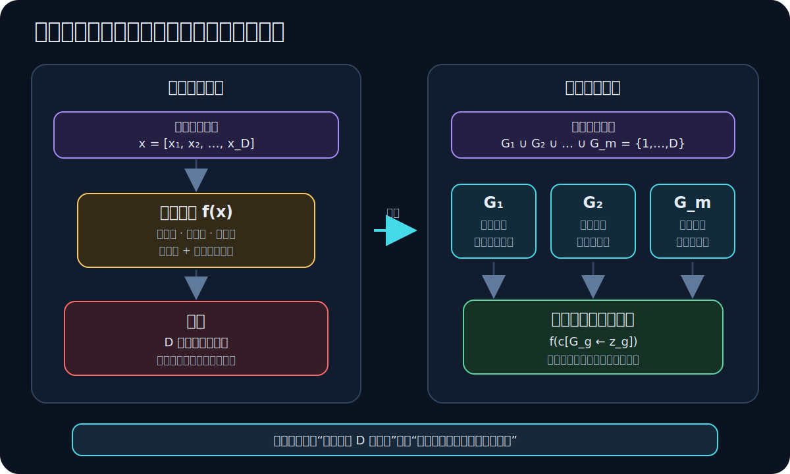
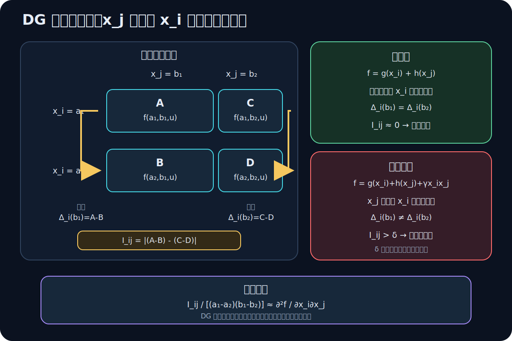
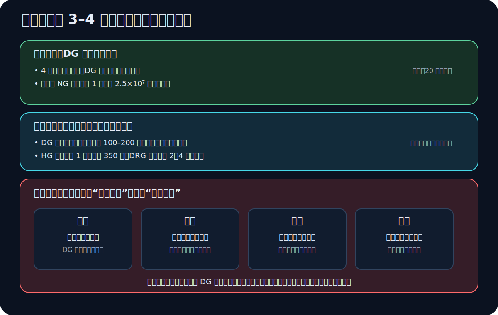

> [!abstract] 一句话先记住
> 这篇论文不是发明一个新的广告预算模型，而是研究一个更底层的求解问题：当收益函数是高维、黑盒且变量相互作用时，如何把决策变量拆成若干子组件，再协同求解。论文的核心判断是：**分组的价值不只在于降维，更在于别把强交互变量拆开；Differential Grouping（DG）用有限差分检查这种交互。**

## 这篇论文在我们早期工作中的位置

这是 [[像造自动驾驶一样做流量分配：感知、运筹与控制]] 第四部分“运筹”所对应的算法局部放大。两篇文章不是重复关系：

| 内容 | 本论文 | 运筹系统复盘 |
|---|---|---|
| 研究范围 | 决策层中的大规模黑盒求解 | 感知、运筹、控制与产品化全链路 |
| 核心变量 | 每个产品的曝光比例 $x_i$ | 从预测状态到离线轨迹、近线矫正与实时控制 |
| 核心问题 | 如何分组才能让协同进化收敛得更好 | 如何让“算出来的最优解”变成稳定可执行的系统 |
| 证据 | 4 个脱敏真实数据集上的离线对比 | 脱敏后的系统架构、方法与工程边界复盘 |

因此，这篇论文可以看成那套运筹系统中的一张“算法局部放大图”。它证明了分组策略会显著影响求解过程，但没有覆盖柔性约束、时序预测、Budget Pacing 或反馈控制。

> [!info] 来源与证据标记
> 主要来源是 [论文公开预印本](https://arxiv.org/pdf/2211.09155)，正式 DOI 为 [10.1109/QRS-C57518.2022.00098](https://doi.org/10.1109/QRS-C57518.2022.00098)。下文将“论文直接陈述或测量的结果”称为**论文事实**，将为了帮助理解而补出的数学过程称为**推导解释**，论文未提供证据的部分会标成**开放问题**。

## 1. 先把问题说清楚：究竟在优化什么

### 1.1 输入、输出与黑盒

论文把每个广告产品看成一个决策维度。假设共有 $D$ 个产品：

- $PV_i$：产品 $i$ 的最大可曝光量，由线上探针实验估计；
- $x_i\in[0,1]$：决策系统分给产品 $i$ 的曝光比例；
- $e_i=x_iPV_i$：产品 $i$ 最终获得的曝光量；
- $ASG$：所有产品可用的总曝光预算；
- $S_c$：业务属性分组 $c$ 内的产品索引集；
- $PV_c$：属性分组 $c$ 可以使用的曝光上限；
- $f(\mathbf{x})$：给定完整分配向量后的预期广告收益。

论文给出的模型是（第 617 页，式 (1)）：

$$
\max_{\mathbf{x}}\quad f(\mathbf{x})
$$

$$
\begin{aligned}
\text{s.t.}\quad
&\sum_{i=1}^{D}x_iPV_i\le ASG,\\
&\sum_{i\in S_c}x_iPV_i\le PV_c,
\qquad c=1,2,\ldots,C,\\
&0\le x_i\le 1,
\qquad i=1,2,\ldots,D.
\end{aligned}
$$

从物理量上看，它非常直白：第一组约束限制总曝光，第二组约束限制某个业务分组的曝光，第三组约束保证分配比例在可行区间内。

这个任务没有通常机器学习意义上的“标签监督”。算法与环境交互的接口是：提交一个完整向量 $\mathbf{x}$，黑盒返回一个适应度 $f(\mathbf{x})$。论文还强调 $f$ 的计算成本较高，因此每次评估都应被看成有预算的资源。

### 1.2 难点不是“变量多”四个字

如果收益能写成完全可分的形式

$$
f(\mathbf{x})=\sum_{i=1}^{D}f_i(x_i),
$$

那么每个变量的边际价值只与自己有关。在函数线性或凸性足够好时，这类问题可以交给线性、凸或非线性规划求解器。

论文真正面对的是不可分黑盒：

$$
f(\mathbf{x})
\ne
\sum_{i=1}^{D}f_i(x_i).
$$

例如，两个产品之间存在竞争或协同：

$$
f(x_1,x_2)=v_1(x_1)+v_2(x_2)+\gamma x_1x_2.
$$

当 $\gamma\ne0$ 时，$x_1$ 的边际价值是

$$
\frac{\partial f}{\partial x_1}
=v_1'(x_1)+\gamma x_2.
$$

这表明“是否应该继续给产品 1 分曝光”依赖于产品 2 当前拿了多少。如果把 $x_1$ 和 $x_2$ 分到两个长时间独立演化的子问题里，每个子问题看到的都是一个不断变动的外部环境，局部适应度就容易失真。

### 1.3 用拉格朗日价格再看一遍

这不是论文直接给出的推导，但能帮助我们理解全局约束如何把各个变量联系起来。暂时忽略上下界，对总预算和分组预算引入乘子 $\lambda$ 与 $\mu_c$：

$$
\mathcal{L}(\mathbf{x},\lambda,\boldsymbol{\mu})
=f(\mathbf{x})
-\lambda\left(\sum_i x_iPV_i-ASG\right)
-\sum_c\mu_c\left(\sum_{i\in S_c}x_iPV_i-PV_c\right).
$$

若 $i$ 只属于某个组 $c(i)$，且内点最优解存在，一阶条件为：

$$
\frac{\partial f}{\partial x_i}
=PV_i\left(\lambda+\mu_{c(i)}\right).
$$

左边是多分一点比例带来的边际收益，右边是这个动作占用全局和局部预算的机会成本。这里有两层耦合：

1. $f$ 中的交互使得左边依赖于其他变量；
2. 共享预算使所有变量通过 $\lambda$ 和 $\mu_c$ 发生约束耦合。

论文的 DG 主要识别第一层——**目标函数中的交互**。它并不自动解决第二层——**共享约束造成的耦合**。这是后面评估论文边界时的一个关键点。

## 2. 协同进化究竟如何“协同”

### 2.1 先分解索引，而不是直接分解目标

设决策维度的索引集为

$$
\{1,2,\ldots,D\}
=G_1\cup G_2\cup\cdots\cup G_m,
$$

且不同 $G_g$ 之间不重叠。每个 $G_g$ 定义一个子组件。对第 $g$ 组，算法只产生这组变量的候选向量 $\mathbf{z}_g$。

问题是：$f$ 需要完整 $D$ 维输入，子向量 $\mathbf{z}_g$ 本身没法被评估。

### 2.2 上下文向量把局部候选补全

协同进化维护一个完整的上下文向量 $\mathbf{c}$，它由其他子组件当前的最优或非支配候选拼接而成。评估 $\mathbf{z}_g$ 时，用它覆盖 $\mathbf{c}$ 在 $G_g$ 上的坐标：

$$
\mathbf{c}[G_g\leftarrow\mathbf{z}_g].
$$

于是第 $g$ 组的局部适应度可以写成：

$$
\phi_g(\mathbf{z}_g;\mathbf{c})
=f\!\left(\mathbf{c}[G_g\leftarrow\mathbf{z}_g]\right).
$$

这个式子是协同进化的核心：**一个局部候选的好坏，是通过它与其他组当前最优候选组成的全局方案来判断的。**

论文采用 NSGA-II 演化每个子组件。把细节抽象后，一轮过程是：

1. 用分组策略产生 $G_1,\ldots,G_m$；
2. 选定一个子组件 $G_g$；
3. 对它的种群执行交叉和变异，产生 $\mathbf{z}_g$；
4. 将 $\mathbf{z}_g$ 注入上下文向量，计算完整方案的适应度；
5. 在子种群内选择更好的候选，并更新 $\mathbf{c}$；
6. 依次演化其他子组件，直到达到停止条件。

### 2.3 为什么错误分组会破坏局部评估

回到

$$
f(x_1,x_2)=v_1(x_1)+v_2(x_2)+\gamma x_1x_2.
$$

假设 $x_1$ 和 $x_2$ 被分开。当演化 $x_1$ 时，它看到的适应度是

$$
\phi_1(x_1;c_2)
=v_1(x_1)+v_2(c_2)+\gamma x_1c_2.
$$

候选 $x_1$ 的排序依赖于当前上下文 $c_2$。但 $c_2$ 也在另一个子种群中不断变化，因此 $x_1$ 的适应度景观不是静态的。两个子种群容易相互追逐，而不是联合朝更好的 $(x_1,x_2)$ 移动。

如果把它们放进同一子组件，局部候选就是 $(x_1,x_2)$，交互项可以被联合搜索。所以，分组本身不是一个中性的工程选项；它在决定算法看到的局部适应度是否稳定。

### 2.4 降维直觉要保留，但不要被 $2^D$ 误导

论文用二进制染色体的语言说，不分组时搜索空间是 $2^D$，对半分组后单组仍是 $2^{D/2}$。这能形象地表达维数灾难，但与式 (1) 中的连续变量 $x_i\in[0,1]$ 并不完全一致。

对连续问题，更严谨的理解是：分组将一次 $D$ 维搜索变成多次 $d_g$ 维搜索，改善了在有限种群和有限评估次数下的空间覆盖率。它并没有在数学上消灭全局复杂性，而是用问题结构换取更高的搜索效率。

## 3. 四种分组策略的差别

论文用 No Grouping（NG）作为不分组基线，再对比四种策略。

| 策略 | 如何分组 | 它试图解决什么 | 主要问题 |
|---|---|---|---|
| HG，Half Grouping | 按原顺序分成两个等大组 | 用最简单方式将 $D$ 维降为 $D/2$ 维 | 单组仍太大，不看任何变量交互 |
| RG，Random Grouping | 先打乱索引，再随机分成多组 | 通过随机性让相互作用的变量偶尔相遇 | 单次分组仍可能把交互变量拆开 |
| DRG，Dynamic Random Grouping | 每轮从 $T=\{5,10,25,50,100\}$ 随机选择子组件大小并重新分组 | 用多轮重组提高交互变量曾经同组的概率 | 频繁改变搜索坐标系，可能破坏已建立的收敛方向 |
| DG，Differential Grouping | 用函数有限差分测试变量间交互，把交互变量置于同组 | 直接估计问题内部结构 | 需额外黑盒评估，阈值、噪声与约束耦合会影响判断 |

### 3.1 随机分组的概率直觉

假设 $D$ 个变量被均匀分成 $m$ 组，每组大小为 $s=D/m$。已知 $x_i$ 的位置后，与它交互的 $x_j$ 在剩余 $D-1$ 个位置中有 $s-1$ 个位置会与 $x_i$ 同组，所以单轮同组概率为：

$$
p_{\text{same}}
=\frac{s-1}{D-1}
\approx\frac{1}{m}.
$$

如果每轮独立重新随机分组，$T$ 轮中至少同组一次的概率为：

$$
P(\text{at least once})
=1-(1-p_{\text{same}})^T.
$$

这解释了 DRG 的动机：多次洗牌能增加相关变量相遇的概率。但这只是“遇到过”的概率，不保证它们在需要联合精修时仍保持同组。论文中 DRG 的不稳定性，可以用这个“结构探索与搜索稳定性”的冲突来理解。

## 4. Differential Grouping 的有限差分推导

### 4.1 问题转换：看 $x_i$ 的效果是否受 $x_j$ 影响

如果 $x_i$ 和 $x_j$ 没有交互，将 $x_i$ 从 $a_2$ 改成 $a_1$ 带来的收益变化，不应该因为 $x_j$ 取 $b_1$ 还是 $b_2$ 而变化。

对同一个其他变量背景 $\mathbf{u}$，构造四次函数评估：

$$
\begin{aligned}
A&=f(x_i=a_1,x_j=b_1,\mathbf{u}),\\
B&=f(x_i=a_2,x_j=b_1,\mathbf{u}),\\
C&=f(x_i=a_1,x_j=b_2,\mathbf{u}),\\
D&=f(x_i=a_2,x_j=b_2,\mathbf{u}).
\end{aligned}
$$

> [!note] 论文原式与这里的写法
> 论文在第 618–619 页用 $\mathbf{x}$ 和对其余维度做置换后得到的 $\mathbf{x}'$ 书写测试。为了把交互判定的数学本体讲清楚，这里先把其他变量固定为同一背景 $\mathbf{u}$，写成标准的 $2\times2$ 有限差分。若工程实现会抽取多个背景，也应在每一个背景内保持其余变量一致，再汇总多次检验结果；否则背景变化本身会混入交互分数。

在 $x_j=b_1$ 时改变 $x_i$ 的效果是

$$
\Delta_i(b_1)=A-B,
$$

在 $x_j=b_2$ 时改变 $x_i$ 的效果是

$$
\Delta_i(b_2)=C-D.
$$

最后比较两个效果：

$$
I_{ij}
=\left|\Delta_i(b_1)-\Delta_i(b_2)\right|
=\left|(A-B)-(C-D)\right|.
$$

论文在第 618–619 页用符号 $\Delta(x_i,x_j)$ 表示对应差值，并与阈值 $\delta$ 比较。把符号改写为 $I_{ij}$ 只是为了让“交互强度”的含义更明确：

$$
I_{ij}\le\delta
\Rightarrow
\text{在当前数值精度下视为独立},
$$

$$
I_{ij}>\delta
\Rightarrow
\text{视为存在交互}.
$$

### 4.2 为什么可分函数的差值一定为零

设

$$
f(x_i,x_j,\mathbf{u})
=g(x_i,\mathbf{u})+h(x_j,\mathbf{u}).
$$

那么

$$
\begin{aligned}
\Delta_i(b_1)
&=g(a_1,\mathbf{u})+h(b_1,\mathbf{u})
-g(a_2,\mathbf{u})-h(b_1,\mathbf{u})\\
&=g(a_1,\mathbf{u})-g(a_2,\mathbf{u}).
\end{aligned}
$$

同理，

$$
\Delta_i(b_2)
=g(a_1,\mathbf{u})-g(a_2,\mathbf{u}).
$$

因此

$$
I_{ij}=0.
$$

这不需要知道 $g$ 和 $h$ 的函数形式，只需要能调用黑盒 $f$。这正是 DG 适合工业黑盒目标的原因。

### 4.3 一个能手算的交互例子

设

$$
f(x_i,x_j)=3x_i+2x_j+4x_ix_j,
$$

取 $a_1=1,a_2=0,b_1=0,b_2=1$。四个点的函数值是：

$$
\begin{aligned}
A=f(1,0)&=3,\\
B=f(0,0)&=0,\\
C=f(1,1)&=9,\\
D=f(0,1)&=2.
\end{aligned}
$$

于是

$$
\Delta_i(b_1)=3-0=3,
$$

$$
\Delta_i(b_2)=9-2=7,
$$

$$
I_{ij}=|3-7|=4.
$$

这个 4 完全来自交互项 $4x_ix_j$。若删除交互项，变成 $f=3x_i+2x_j$，则两个有限差分都是 3，$I_{ij}=0$。

### 4.4 它其实是一个离散的混合二阶导数

将上面的差值除以步长，有：

$$
\frac{(A-B)-(C-D)}{(a_1-a_2)(b_1-b_2)}
\approx
\frac{\partial^2 f}{\partial x_i\partial x_j}.
$$

混合二阶导数描述“$x_j$ 的改变是否改变了 $x_i$ 的边际效果”。DG 可以被理解为一个不需要显式导数的交互检验。

但这个理解也暴露了局限：

- 选择不同 $a_1,a_2,b_1,b_2$ 可能看到不同的局部交互；
- 当 $f$ 有噪声或计算误差时，$I_{ij}$ 不会精确为零，必须选择 $\delta$；
- 当交互只在很小区域内出现时，一组探测点可能漏检；
- 对数千变量进行完整两两检查需要 $O(D^2)$ 级别的检测。

论文实际使用 Fast Interaction Identification（FII），先分离可分与不可分变量，再识别直接和间接交互，避免完整的两两检查。但这篇 5 页短文没有给出 FII 的完整伪代码、探测点选择或 $\delta$ 的设置方法，因此仅靠本文无法完整复现分组阶段。

## 5. 实验到底证明了什么

### 5.1 数据与设置

四个数据集来自真实广告分配场景（论文第 619 页）：

| 数据集 | 产品数／决策维数 | 业务约束数 | 广告主数 | 预算 |
|---:|---:|---:|---:|---:|
| 1 | 695 | 4 | 15 | 150 万 |
| 2 | 722 | 4 | 15 | 150 万 |
| 3 | 646 | 4 | 15 | 250 万 |
| 4 | 1,772 | 4 | 32 | 400 万 |

每个策略在每个数据集上运行 20 次。协同进化的最大迭代数为 500，种群大小为 100；NSGA-II 变异率为 $1/100$，交叉率为 0.9，交叉分布指数为 20。代码基于 Geatpy，适应度在 100 台 Intel Xeon Platinum 8163 2.50 GHz、8 GB 内存的机器上并行评估。

### 5.2 结果要按“效果”和“收敛过程”分开读

**RQ1：最终找到的解好不好？**

- 四种分组策略在多数情况下优于不分组的 NG；
- DG 在四个数据集上都获得最高的平均目标值，标准差也相对较小；
- RG 在数据集 1 和 4 上略优于 HG；
- DRG 在数据集 2 和 4 上最不稳定，标准差最大。

**RQ2：在迭代轴上收敛得快不快？**

- DG 大致在 100–200 轮达到接近最终的目标值；
- 数据集 1 上，NG 收敛在约 $2.5\times10^7$ 的局部最优，HG 直到约 350 轮仍被困住；
- 数据集 4 上，DRG 在 200 轮前仍未收敛；
- HG 在数据集 1 和 4 上表现出最慢的收敛趋势。

### 5.3 最强的证据是什么

最强证据不是“DG 的一次结果更高”，而是三件事同时出现：

1. **最终值**：DG 在四个真实数据集上都有最高平均目标值；
2. **重复性**：20 次运行的箱线图显示 DG 的波动相对小；
3. **动态过程**：DG 的收敛曲线在多个数据集上更早进入高目标值区间。

它们共同支持一个相对克制的结论：**在这四个黑盒分配实例和给定实现下，利用交互信息的分组优于不看结构的分组。**

### 5.4 不能从这些实验直接推出什么

#### “高效”只在迭代数意义上被支持

论文将收敛曲线的横轴设为迭代数，没有报告墙钟时间、黑盒函数评估总次数或分组本身的成本。DG 要做额外的交互检测，不同策略又会产生不同数量的子组件。

因此，论文能支持“DG 需要的迭代更少”，但还不能严格证明“DG 的总计算成本或线上延迟更低”。

#### 公平的评估预算没有说清楚

论文给出了统一的 500 轮和种群 100，但没有说明“每轮”是指全部子组件完成一轮，还是某一子组件更新一次；也没有列出每个策略的实际适应度调用次数。如果子组件数越多，每轮获得的评估次数也越多，那么效果差异中会混入计算预算差异。

#### 统计证据不足以量化效应量

论文只提供箱线图，没有给出每组的完整数值表、显著性检验、置信区间或标准化改善幅度。所以我们可以说“图中 DG 最好”，却不应从图上伪造精确的百分比提升。

#### 没有完整的可复现性

数据来自一家公司的四个实例，并且出于数据保护在实验后销毁。论文没有开源数据、完整目标函数或可运行代码。这些结果有真实工业性，但缺乏外部独立复现。

#### 目标展示和优化器选择存在信息缺口

式 (1) 只写了单一收益目标 $f(\mathbf{x})$，实现却选择面向多目标的 NSGA-II，并提到“非支配”个体。论文没有交代是否存在未展示的多个目标，也没有说明约束违反如何进入 NSGA-II 的选择过程。这是从公开论文到可重建系统之间最大的实现缺口之一。

## 6. 将 DG 放回真实运筹系统

### 6.1 论文回答的是“如何搜”，不是“搜什么”

系统中的目标函数 $f$ 不是自然存在的。它需要感知层估计每个投放单元的曝光上限、预期价值、竞争与流失，也需要业务层定义预算、保量和目标优先级。DG 接收已经建好的黑盒，然后帮助进化算法更好地搜索。

如果 $f$ 的估计错了，DG 会更快地优化错误目标；如果约束不可行，DG 本身不会自动产生柔性约束；如果离线结果在线上执行偏离，DG 也不是控制器。这就是为什么后来的系统复盘必须把它放在“感知 - 决策 - 控制”闭环中。

### 6.2 论文中的 DG 不等于后续的业务先验分组

[[像造自动驾驶一样做流量分配：感知、运筹与控制]] 将分组协同进化放回完整闭环，并说明工程中还会利用同源资源、共同约束和历史联动等结构先验辅助分组。本论文的公开实验只对比 HG、RG、DRG 和基于 FII 的 DG；它没有直接测试“业务先验 + DG”，也没有报告线上 A/B 的业务指标。

所以更准确的时间线是：

1. 首先验证，真实广告预算分配中“如何分组”确实会改变协同进化的效果；
2. 实验显示结构感知的 DG 比朴素或随机分组更稳定；
3. 工程系统继续引入业务先验、柔性约束、时序感知和在线控制，把一个黑盒求解器变成可运行的运筹系统。

### 6.3 如果今天重做，至少要补齐这些对照

1. 用相同的黑盒评估总次数，而不只是相同迭代数；
2. 单独计量分组阶段、演化阶段和并行通信的墙钟时间；
3. 将违约处理、修复算子或柔性约束机制明确写入实现；
4. 对比“纯 DG”、“业务先验分组”和“先验 + DG”；
5. 对交互阈值 $\delta$、探测点、分组频率和噪声做敏感性实验；
6. 报告完整数值表、置信区间、配对统计检验与效应量；
7. 除最终目标值外，还要评估约束违反率、有解率与在线轨迹偏差。

## 7. 一周后应该记住的心智模型

### 第一层：问题

这是一个 $D=646\sim1{,}772$ 的连续黑盒预算分配问题。难点不只是高维，而是收益存在交互，每次评估又很贵。

### 第二层：机制

协同进化用当前其他组的最优值构造上下文，将局部候选补成全局向量后评估。所以，把交互变量分开会让局部适应度随上下文漂移。

### 第三层：判断

DG 问的只是：

> 当 $x_j$ 从 $b_1$ 改到 $b_2$ 时，“把 $x_i$ 从 $a_2$ 改到 $a_1$”的收益是否变了？

若变了，两者存在交互，应尽量同组。数学上，这是在黑盒上用二阶有限差分估计混合导数。

### 第四层：证据边界

论文证明了 DG 在四个真实离线实例上的目标值和迭代收敛更好；它没有证明总计算成本更低，也没有提供可复现数据、完整约束处理或线上 A/B 结果。

---

## 论文信息

- Yongfeng Gu, Yuxuan Zhou, Hao Ding, Fan Jia, Shiping Wang. *Exploring the Impact of Grouping Strategies on Cooperative Co-evolutionary Algorithms for Solving the Advertising Budget Allocation Problem*. QRS-C 2022, pp. 616–620.
- 公开预印本：[arXiv 2211.09155](https://arxiv.org/pdf/2211.09155)
- Vault 本地归档：`运筹学/assets/grouping-strategies-qrs-2022/paper.pdf`
- DOI：[10.1109/QRS-C57518.2022.00098](https://doi.org/10.1109/QRS-C57518.2022.00098)
- 对应系统复盘：[[像造自动驾驶一样做流量分配：感知、运筹与控制]]
